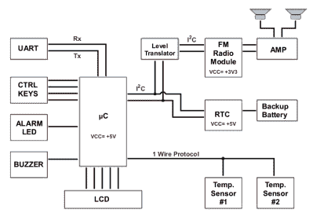

# IO 连接的收音机闹钟

> 原文：<https://hackaday.com/2022/12/19/io-connected-radio-alarm-clock/>

[CoreWeaver]创造了一个[闹钟](https://hackaday.io/project/188650-radio-alarm-clock)，它包含了人们在这样一个项目中可能期望的功能，包括 FM 收音机、贪睡按钮输入和显示器，但超出了基本功能，包括温度感应和 PC 连接，为可定制的功能开辟了道路。

主微控制器使用 Atmega328，通过 I2C 与 DS1307 实时时钟(RTC)和 TEA5767 FM 模块通信。主电源来自 9V 电源，LM317 和 LM7805 线性稳压器分别提供 3.3V 和 5V 电源轨。除 TEA5767 之外，大多数电子设备均采用 5V 供电，TEA5767 采用 3.3V 供电轨供电，其 I2C 通信电平从 5V 变为 3.3V。tea 5767 的音频输出直接馈入 TDA7052 音频放大器，以驱动扬声器。由于 RTC 有一个辅助的硬币电池供电，即使没有插上电源，闹钟也能保持准确的时间。

压电蜂鸣器用于发出更刺耳的警报，并使用 20×4 LCD 矩阵，同时[coreWeaver]创建自定义数字字体，为显示器创建大格式数字。两个 DS18B20 数字温度计用于温度检测，一个放置在室外，一个放置在室内，微控制器使用单线协议进行通信。定制的 3D 打印外壳，配有贪睡按钮和旋钮，为该项目提供了一个紧凑的外壳。

USB 到串行 UART 通信为完全可定制的报警时间表、无线电调谐或基于时间、温度或任何其他因素的其他操作开辟了道路。[CoreWeaver]在 [GitHub](https://github.com/coreWeaver/RAC-the.Radio.Alarm.Clock) 上提供了所有的设计文件和源代码，包括完整的材料清单(BOM)和原理图，为任何想要进一步扩展或定制项目的黑客提供了充足的机会。

闹钟是 Hack-a-Day 的支柱，我们的特色项目
从[数码管闹钟](https://hackaday.com/2022/12/10/retro-alarm-clock-with-nixies-is-thoroughly-modern-inside/)到[灯光闹钟](https://hackaday.com/2021/11/06/tiny-wake-up-light-is-hugely-bright/)。[CoreWeaver]已经开始了一个描述构建的视频系列，请务必在休息后查看视频！

 [https://www.youtube.com/embed/nwrcHMGG3TY?version=3&rel=1&showsearch=0&showinfo=1&iv_load_policy=1&fs=1&hl=en-US&autohide=2&wmode=transparent](https://www.youtube.com/embed/nwrcHMGG3TY?version=3&rel=1&showsearch=0&showinfo=1&iv_load_policy=1&fs=1&hl=en-US&autohide=2&wmode=transparent)

