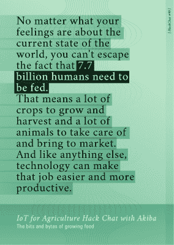

# 面向农业的物联网与秋叶黑客聊天

> 原文：<https://hackaday.com/2019/05/13/iot-for-agriculture-hack-chat-with-akiba/>

太平洋时间周三**下午 5:00 加入我们，与秋叶一起参加[物联网和农业黑客聊天](https://hackaday.io/event/165315-iot-for-agriculture-hack-chat-with-akiba)！**

请注意与我们通常的黑客聊天时段不同的时间！秋叶将从日本加入我们。

无论你对世界的现状有什么感觉，你都无法逃避每天有 77 亿人需要养活的事实。这意味着大量的农作物要种植和收获，大量的动物要照顾和带到市场。和其他事情一样，技术可以让工作变得更容易，更有效率。

 [ 在这个地方，从事农业相关项目的黑客可以来测试想法，并与其他人合作，通过对开源技术进行平易近人的实验来解决饥饿世界的问题。](https://hackaday.com/wp-content/uploads/2019/05/IoTForAgricultureHackChat.jpg)

我们的黑客聊天是在 [Hackaday.io 黑客聊天群发消息](https://hackaday.io/messages/room/2369)中的实时社区活动。本周我们将于太平洋时间 5 月 15 日星期三下午 5:00**坐下来。如果时区让你烦恼，我们有[一个方便的时区转换器](https://www.timeanddate.com/countdown/generic?iso=20190515T17&p0=224&msg=IoT+and+Agriculture+Hack+Chat+with+Akiba&font=cursive)。**

 **点击右边的那个发言气泡，你会被直接带到 Hackaday.io 上的黑客聊天群，不用等到周三；随时加入，你可以看到社区在谈论什么。**