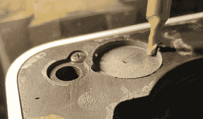

# IPod HiFi 获得新的高音

> 原文：<https://hackaday.com/2021/06/19/ipod-hifi-gains-new-high-notes/>

iPod HiFi 是苹果在 2000 年代中期为其 iPod 系列生产的立体声扬声器附件，这是一个 300 多美元的音箱，每个通道都有双驱动器，一个 iPod dock，aux 和 TOSLINK 接口。它引起了[杰克]的注意，特别是在 Reddit 上发布的一个帖子，该帖子有一套额外的高音喇叭来改善 HiFi 暗淡的高音。问题是，它可能是苹果的原型，但缺少了他自己的[【杰克】开始复制它](https://github.com/jake-b/iPod-HiFi-Tweeters)。

 他的工作质量很高。挡板首先经过 3D 扫描，然后铣出凹槽，这样高音喇叭就可以压入。他通过一个取自扬声器驱动器的简单 LC 分频电路驱动它们，并报告自己对结果感到满意。

不幸的是，我们仍然不知道 Reddit 最初的是否是苹果的原型。我们倾向于说它不是，并赞扬安装推特的改装者的技能，但如果它可能是，我们会指出一些可以提供一些线索的东西。iPod HiFi 没有使用无源分频器，而是有一个 DSP 和有源分频器，驱动四个 D 类放大器。如果你找到一个有高音喇叭的，它们通过一对额外的放大器从 DSP 驱动，然后把它放在易贝作为“罕见的谷仓发现苹果原型！”赚一大笔钱，否则只是坐下来享受前主人给它的额外三倍。

当然，有些人对苹果音箱的价格犹豫不决，于是[自己做了](https://www.instructables.com/IPod-Dock-3/)。