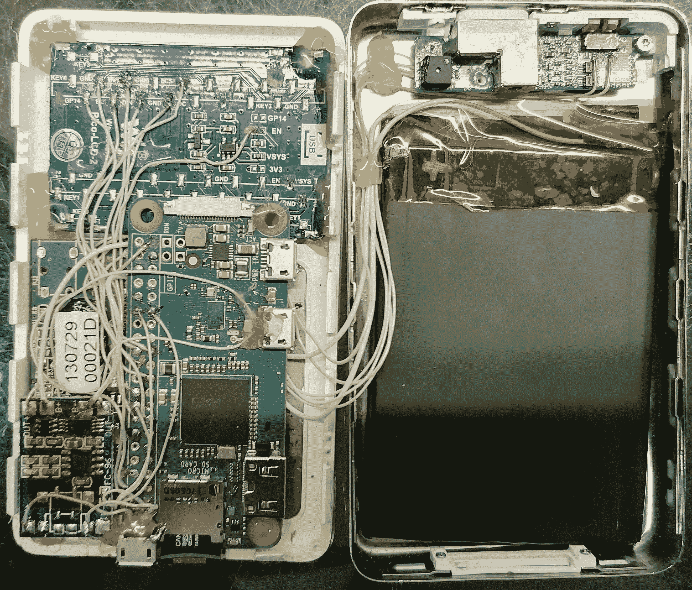

# IPod Mod 在新 Bod 中设置 Pi 为零

> 原文：<https://hackaday.com/2021/11/20/ipod-mod-puts-pi-zero-in-new-bod/>

我们当然希望看到设计精美的产品获得新生。就在新的 Raspberry Pi Zero 2 发布的时候，[生产]正在把一个原始的 RPi Zero 塞进一个旧 iPod 的盒子里。

[production]引用了几个以前的类似项目，展示了如何与点击轮，Waveshare 的完美契合的[彩色显示器，以及在 pi 上运行的名为](https://www.waveshare.com/pico-lcd-2.htm) [Rockbox](https://www.rockbox.org/wiki/UiSimulator) 的开源软件进行交互。我们都站在巨人的肩膀上。

一些不错的创新是 Pi Zero 的微型 SD 卡和微型 USB 充电端口，与 iPod 最初的 40 针连接器留下的大插槽对齐。在不打开外壳的情况下对卡进行充电和刷新似乎非常方便。还有一个大小不错的电池，不过我们想知道一个较小的电池和一个 Qi 充电器是否可以放在同一个空间内。查看[项目的 Hackaday.io](https://hackaday.io/project/182282-ipodrpi) 获取部件清单，查看 [GitHub](https://github.com/syproduction/ipodrpi) 获取软件方面的信息，以及所有你需要自己构建的参考链接。看起来[生产]已经计划将旧的 iPods 变成 Gameboy 的克隆产品，你可能想回来看看这方面的进展。

如果你只是想像 2004 年一样摇滚，有选择只是升级电池和容量，但也保留你的老式 iPod。

 [https://www.youtube.com/embed/mpBJcG3rq2I?version=3&rel=1&showsearch=0&showinfo=1&iv_load_policy=1&fs=1&hl=en-US&autohide=2&wmode=transparent](https://www.youtube.com/embed/mpBJcG3rq2I?version=3&rel=1&showsearch=0&showinfo=1&iv_load_policy=1&fs=1&hl=en-US&autohide=2&wmode=transparent)

