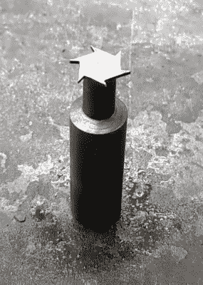

# 你口袋里是一台打字机还是你只是很高兴见到我？

> 原文：<https://hackaday.com/2022/12/02/is-that-a-typewriter-in-your-pocket-or-are-you-just-pleased-to-see-me/>

Don’t have the right milling tool? Just make one!

【Attoparsec】想知道如果你能把一台打字机放在口袋里会怎么样，然后 [照此办理，造了一台](https://www.youtube.com/watch?v=14WBiDV02DE) 。(视频，嵌在下面。)算是吧。计划是使用现有的一套撞杆，但不想破坏一台完美的打字机，他们意识到你可以很容易地找到易贝的撞杆。

第一个问题是撞杆的形状允许打字机操作，但这不利于紧凑的布局。在一个大虎钳中拉直一点后，在一个定制的夹具中钻孔，它们处于一个合适的状态，可以被安排在箱子里。外壳由一大块铝制成，配有一个漂亮的凹槽，用来放置浸墨毡垫。为了防止这个垫子在收藏时变干，并保持整个东西没有口袋里的棉绒，一个 U 形金属盖是从一些板材弯曲而成的。这滑入一组在边缘附近磨出的槽中，非常令人满意。这最后一点给他们带来了一点麻烦，所以专门为这项工作设计了一个定制的开槽工具。确实做得很好。最终的结果看起来就像你期待的手动“打字机”一样古怪，有点不稳定，但仍然很棒。

如果你有一台需要保养的旧打字机，这里有一个 [快速指南，可以帮你检查一下](https://hackaday.com/2020/05/04/time-enough-at-last-reviving-an-heirloom-typewriter/) 。你们中的一些人到了一定的年龄可能还记得电子打字机。他们死得很快，但是如果你还有一个潜伏的，你可以 [把它转换成一个 Linux 终端来享受一些怀旧的乐趣](https://hackaday.com/2022/08/04/converting-an-80s-typewriter-into-a-linux-terminal/) 。

 [https://www.youtube.com/embed/14WBiDV02DE?version=3&rel=1&showsearch=0&showinfo=1&iv_load_policy=1&fs=1&hl=en-US&autohide=2&wmode=transparent](https://www.youtube.com/embed/14WBiDV02DE?version=3&rel=1&showsearch=0&showinfo=1&iv_load_policy=1&fs=1&hl=en-US&autohide=2&wmode=transparent)

感谢[smellsobikes]的提示！