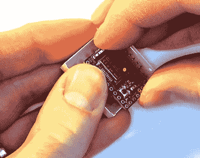

# 你口袋里是一个单词钟吗？

> 原文：<https://hackaday.com/2019/02/15/is-that-a-word-clock-in-your-pocket/>

单词钟是每个人都喜欢的项目之一。即使你对它们工作背后的技术不感兴趣，它们也有某种吸引人的美感。此外，你可以阅读时间，而不必担心那些讨厌的数字，更不用说那些在圆圈中旋转的奇怪的小手了。这是 21 世纪，谁有时间做这些？

[现在，多亏了【Gordon Williams】，这些绝对现代的时计变得更加触手可及](http://www.espruino.com/Tiny+Word+Clock)。他的单词钟不仅小到可以放在你的手掌里，而且是我们见过的最容易制作的。如果你曾经对这些小玩意感到好奇，但又不想花费时间和精力去打造一个完整的版本，那么这个小小的创意可能正是时间之父想要的。

诀窍是将微控制器直接连接到 8 x 8 LED 矩阵的背面。正如[Gordon]所展示的那样，支持蓝牙的 Espruino MDBT42Q 可以整齐地安装在成排的引脚之间，只需要最温和的劝说就可以对齐并焊接到位。由于时间可以通过蓝牙远程设置，甚至不需要额外的按钮。虽然不建议直接从微控制器的数字引脚驱动 led，但这种应用的特点(一次只有几个 led 亮，并且不会持续很长时间)意味着他可以做到这一点。

当然，这只会让你看到一排方形的发光二极管，你可以眨眼。如果没有，你知道，单词，那就不算是单词钟了。为此，[Gordon]提供了一种可以在标准喷墨打印机上打印的覆盖图。虽然这不是一个完美的效果，因为光线仍然通过墨水，但它足以很好地表达这一点。人们甚至可以说，灰色背景上的白色字母比单独点亮的字母更有助于提高可见度。

如果你不想买一个玩具屋大小的单词钟，不用担心。[我们不缺少](https://hackaday.com/2018/12/26/word-clock-dont-need-no-stencil-font/)[的成人尺寸版本](https://hackaday.com/2018/04/17/automating-the-design-of-word-clocks/)，这些受欢迎的时计供你观赏。

 [https://www.youtube.com/embed/NL0ehzrf1qQ?version=3&rel=1&showsearch=0&showinfo=1&iv_load_policy=1&fs=1&hl=en-US&autohide=2&wmode=transparent](https://www.youtube.com/embed/NL0ehzrf1qQ?version=3&rel=1&showsearch=0&showinfo=1&iv_load_policy=1&fs=1&hl=en-US&autohide=2&wmode=transparent)

