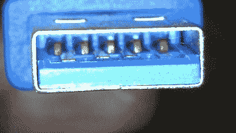

# 你的设备其实是 USB 3.0，还是连接器只是蓝色的？

> 原文：<https://hackaday.com/2022/04/03/is-your-device-actually-usb-3-0-or-is-the-connector-just-blue/>

折扣(甚至灰色市场)电子产品可以是完成工作的经济方式，但人们通常以其他方式支付。[Majenko]遇到了这种情况，当时需要捕获一些 HDMI 视频输出[，但结果比预期的少得多](https://majenko.co.uk/blog/our-blog-1/usb-3-0-blues-56)。

面对两种类似的折扣 HDMI 捕获设备选择，[Majenko]选择了看起来更花哨的 USB 3.0 版本，而不是更便宜的 USB 2.0 版本，理由是 USB 3.0 版本的可用带宽更高，可以避免通过更有限的 USB 2.0 连接传输高分辨率 HDMI 视频所需的压缩。

该设备工作正常，但[Majenko]很快注意到压缩伪像，用`lsusb -t`询问“USB 3.0”设备发现它没有以预期的速度运行。对连接器本身的一瞥揭示了一个可悲的事实:该设备根本不是 USB 3.0 它甚至没有正确的引脚数！

A normal USB 3.0 connector is blue inside, and has both sets of pins for backward compatibility (five in the rear, four in the front) like the one shown here.

USB 3.0 连接需要五根导线，连接器为蓝色。向后兼容性通常是通过包括四个额外的导体来提供的，如图所示。[Majenko]的“USB 3.0”HDMI 捕获设备上的连接器清楚地显示它不是 USB 3.0，它只是着色为蓝色。

我们大多数人都愿意处理偶尔出现的小故障或故障，以换取低价，但当一些东西不是(也永远不可能是)它所销售的那样时，那就是另一回事了。[Majenko]当然和其他人一样清楚这一点，他已经[拆开了一个有缺陷的电源模块，发现了一个相当严重的缺陷](https://hackaday.com/2021/10/05/investigating-a-defective-usb-power-bank-module/)。