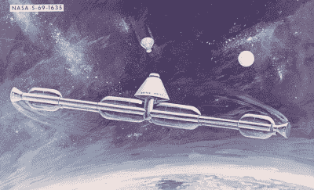
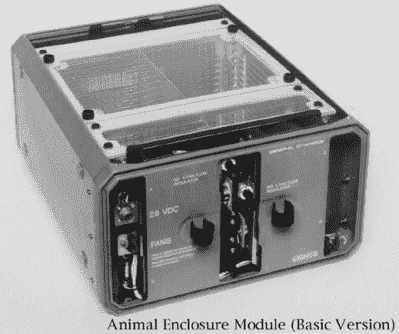
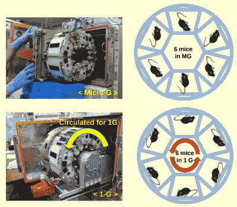

# 国际空间站人工重力研究显示了长期太空飞行的前景

> 原文：<https://hackaday.com/2021/06/08/iss-artificial-gravity-study-shows-promise-for-long-duration-spaceflight/>

国际空间站是人类最昂贵的健身房会员。

自从人类太空飞行的早期，人们就知道远离地球引力的长途旅行会对宇航员的身体产生有害影响。失重漂浮总是会导致肌肉质量显著下降，就像病人躺在床上时间太长会导致肌肉萎缩一样。由于没有不断对抗的重力，宇航员的腿部、背部和颈部肌肉将在短短一周内因废用而变弱。虽然这可能不会在太空飞行中造成直接的问题，但以这种身体虚弱的状态返回地球的宇航员有更高的受伤风险。

幸运的是，这个问题可以通过严格的锻炼得到很大程度的缓解，任何足以容纳人类数周或数月的轨道船都必须有足够的内部容积来配备基本的锻炼设备，如跑步机或阻力机。实际上，自 1971 年苏联的礼炮 1 号以来，每个空间站都为其乘员提供了一些在轨锻炼的方式。它不能代替在地球上，因为宇航员回家时仍然比离开时更虚弱，但它被证明是最实用的方法来对抗长时间太空飞行的衰弱方面。

Early NASA concept for creating artificial gravity.

当然，这有一个明显的问题:在太空中锻炼的每一个小时都可以更好地用于做研究或在航天器上进行维护。考虑到不仅仅是将一个人送入轨道，而是将他们长期留在那里的惊人成本，时间就是金钱。这让我们回到了我最初的观点:宇航员每天花两个多小时在国际空间站的各种锻炼设备上，只是为了防止肌肉流失，这使它成为世界上最昂贵的健身房会员。

据认为，理想的解决方案是设计未来的航天器，能够通过向心力向乘客施加一定程度的人造重力。这项技术非常简单:只需沿着它的轴旋转飞船，船员就会“粘”在船体内部。不幸的是，以这种方式模拟类似地球的重力将要求飞船要么比人类发射到太空的任何东西都大得多，要么以危险的高速旋转。对于一个最终只是理论的东西来说，要冒很大的风险。

但是日本筑波大学最近的一篇论文可能代表了在载人飞船上开发实用的人造重力系统的第一步。虽然他们的研究重点是老鼠而不是人类，但结果应该对编纂迄今为止主要是科幻小说的东西大有帮助。

## 不完美的比较

也许*“微重力和人造 1 g 机载环境下重力对小鼠骨骼肌影响的转录组分析”*最有趣的元素是，研究人员最初并没有开始研究人造重力本身。目标是在分子水平上简单地了解更多关于哺乳动物肌肉萎缩的知识，因为它与长期太空飞行有关。传统上，这种研究是通过将一组老鼠送到太空一两周，然后将它们的肌肉组织与留在地球上的一组对照组老鼠进行比较来完成的。但是研究小组很早就意识到这样的实验是有根本缺陷的。

The [Shuttle’s AEM gave mice a place to stay](https://lsda.jsc.nasa.gov/Hardware/hardw/133), but no gravity.

当有一个控制组和一个实验组时，想法是让两组都暴露在完全相同的条件下*,除了你想研究的那个*。这样，您可以合理地确定您观察到的任何变化都是由这一个缺失的元素引起的。但是用经典的方法研究太空中的啮齿动物，这是不可能的。

想一想我们的实验小鼠面临的旅程。首先，它们将被火箭送入轨道。对老鼠来说，这可不是每天都会发生的事。而在太空中，他们将生活在由飞船的生命支持系统人工维持的环境微观世界中，即使有屏蔽，也会暴露在一定程度的宇宙辐射中。在他们逗留结束时，他们被装回一艘返回的宇宙飞船，并被送往穿过大气层，只是结束了他们的苦难被灌进海洋。与此同时，对照组一直呆在某个实验室的笼子里。

这些经历很难相提并论。这些元素中的一部分当然可以在地球上为对照组进行模拟，但精确度不足以完全抵消它们。有太多的变量在起作用，不能排除它们影响实验结果的可能性。研究人员意识到，他们需要的是某种方法，让对照组经历与实验组相同的太空飞行，除了在微重力环境下度过的时间。

## 平整场地

他们的答案是多重人工重力研究系统(MARS)。通过利用一个小型离心机，国际空间站上的老鼠栖息地单元(MHU)能够将一半的老鼠旋转到足以接近地球重力的速度。其余的老鼠生活在这个单元的底部，除了它不旋转之外，其他方面都是一样的。通过这种方式，研究人员可以确定在没有重力的情况下，该单元中的所有小鼠都暴露在相同的环境条件下。

 即使如此，该文解释了这种比较并不完美。控制组仍然在微重力下度过一些时间，因为当他们乘坐 SpaceX Dragon 往返于国际空间站时，没有提供人工重力。当老鼠第一次到达时，在它们被从龙中取出并转移到 MHU 之前，也有一定的处理时间。

也就是说，控制组和实验组都经历了同样的过程。因此，虽然对照组暴露在相对短暂的微重力环境中，而他们在地球上不会经历这种情况，但这仍然是实验组共有的环境条件。

该实验实际上是在 2016 年进行的，其结果与科学家几十年来的信念完全一致:在国际空间站逗留期间，处于人工重力下的小鼠没有经历与微重力下相同的肌肉损失。此外，发现肌肉的基因表达在对照组和实验组的小鼠之间是不同的。这有力地表明，是重力的缺失导致了这种变化，而不是先前理论认为的空间辐射。

毫无疑问，在国际空间站上产生人造重力是可能的，而且它防止失重状态下退化的肌肉损失的事实也是可以预测的。然而，这个实验提供了科学方法所要求的具体证据。当然，需要更多的实验来进一步扩展我们在这一领域的知识，但目前来说，可以肯定地说，旋转航天器确实可以防止哺乳动物在太空长途旅行中肌肉流失。

## 探索新领域

虽然科学家可以使用离心机来研究地球上超过 1 g 的重力的影响，但没有办法在实验室中减少重力的影响。但是由于国际空间站在轨道上的位置，它已经经历了失重状态，[离心机可以用来产生 0 到 1 g 的人造重力。这使得火星处于一个非常独特的位置，因为它可以让研究人员模拟月球或火星上的重力，让我们一窥在这些物体上停留多长时间会对人类生理产生什么影响。](https://hackaday.com/2019/09/30/off-world-cement-tested-for-the-first-time/)

如果人类想要在月球上建立一个永久的前哨基地或者执行载人火星任务，这是非常重要的信息。我们对人类适应月球引力的唯一了解来自阿波罗计划期间相对短暂的表面停留，我们几乎不知道人体在火星表面几个月甚至几年后会有什么反应。

这项研究也可能对未来的空间站产生影响。如果你只需要模拟地球引力的一部分来防止肌肉萎缩会怎么样？确定减缓甚至停止长时间太空飞行的破坏性影响所需的最小重力量，可以使制造人造重力比目前想象的要容易得多。

在论文的结尾，研究人员暗示这正是他们希望在未来进行的那种实验:

> 尽管当前的研究是通过在国际空间站实施人工 1 g 机载环境的最先进设备实现的，但未来对哺乳动物的研究将验证在重力低于 1 g 的情况下长期居住的影响，这意味着模拟月球和火星的重力，即部分重力。随着空间生物学实验方法的不断发展，未来的研究可能会更确切地确定潜在的原因，并提供防止肌肉萎缩的策略。