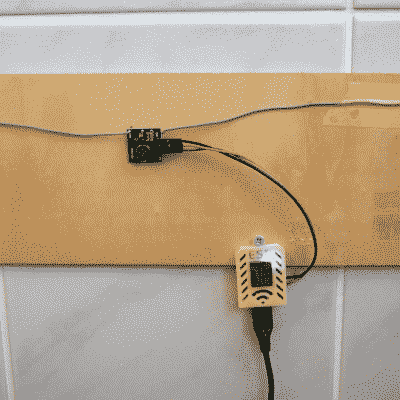

# 它没坏，但是我应该修理它吗？

> 原文：<https://hackaday.com/2021/02/20/it-aint-broke-but-should-i-fix-it/>

五年前，我写了一个关于开始使用你自己的基于 MQTT 的家庭信息/自动化网络的[系列。五年在黑客时代是很长的一段时间。当时，ESP8266 要新得多，8266 Arduino 端口还没有完全成形，启动和运行 MQTT 最简单的软件框架是 NodeMCU 这就是我在文章系列中使用的，因此，我家里的一些设备对基本的“hello world”进行了微小的修改，但做了一些有用的事情。](https://hackaday.com/tag/minimal-mqtt/)

从那时起，NodeMCU 已经改变了它的许多库，ESP32 已经取代了我的零件抽屉中的 ESP8266。如果您尝试运行我的代码，您会发现如果不为自己移植或编译 NodeMCU 的旧版本，它就无法在 ESP8266 上运行，并且根本无法在 ESP32 上运行。当[Chris Lott]试图遵循我的指导时，[他发现，在 2021 年](https://hackaday.com/2021/02/17/minimal-mqtt-with-micropython/)，Micropython 可能是更好的语言选择。为了最大限度地减少代码行，我同意，尽管 Arduino 和 Espressif 自己的原生 IDF 已经发展到这一工作中。简而言之，除了 NodeMCU。

Built in an hour, survived for five years.

但是我家自动化系统不管。那些小家伙 24/7 都在跑，翻来翻去好像还是 2016 年一样。温度计、光传感器和功率计在五年内没有太大变化，尽管从那时起我已经多次修改了数据库、显示器和用户控制，但使用固定的通信传输协议意味着它们仍然在说同一种语言。事实上，即使 NodeMCU 对我来说已经死了，我的原始系列的 MQTT 内容仍然有效，并且在 Raspberry Pi 上安装代理在这五年中变得更加容易。

所以我有一堆遗留代码在我自己家里运行，这让我很紧张。如果设备出现故障，或者当最终出现故障时*，这不会是“只需刷新另一个 ESP8266 并替换它”，因为即使我周围有一些古老的 NodeMCU 二进制文件，我也知道何时放弃。但是也没有什么好的理由把它们拆掉，重新刷一遍。除了它让我有点痒，只是知道有孤儿，死胡同代码在我周围运行。围绕着我。盯着我的黑客的内心深处。*

我知道最好不要拆除一个正在运行的系统，尽管我可以一次拆除一个设备，而且每个模块肯定是一个简单、独立的修复；尽管我很想找个借口在 ESP8266 上玩玩 Micropython 和它的 MQTT 实现，或者甚至用 ESP32s 替换其中的一些；尽管这些都是临时的快速攻击，但它们已经服务了五年(5！)年。我当然更清楚，对吧？(对吧？)

This article is part of the Hackaday.com newsletter, delivered every seven days for each of the last 200+ weeks. It also includes our favorite articles from the last seven days that you can see on [the web version of the newsletter](https://mailchi.mp/hackaday.com/hackaday-newsletter-649368). Want this type of article to hit your inbox every Friday morning? [You should sign up](http://eepurl.com/gTMxQf)!