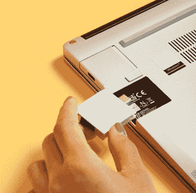

# 制造一台黑客的笔记本电脑需要很多东西

> 原文：<https://hackaday.com/2021/07/28/it-takes-a-lot-to-build-a-hackers-laptop/>

我们几乎所有人都会有的一个基本工具就是笔记本电脑。对于硬件和软件人员来说，它是我们的工作场所、娱乐设备、世界之窗等等。黑客和笔记本电脑的关系是同甘共苦的，所以选择一个新的是一项重要的任务。它会是一台可靠的二手 ThinkPad，苹果公司的最新目标，还是任何可以被回收并获得 GNU/Linux 发行版的废弃产品？从纸面上看，所有笔记本电脑都提供了基本相同的性能和便携性，但实际上，有太多的变量可以区分明星和普通人。在这种混合中出现了一个我们已经关注了一段时间的新来者，即[框架](https://frame.work/)。这款笔记本电脑看起来与市场上的许多其他笔记本电脑一样，具有所有规格，价格也与任何像样的笔记本电脑一样，但它有几个锦囊妙计，值得一看。

These USB-C based modules are a neat idea.

其中最明显的可能是，除了现成的模型，它还可以作为定制套件购买，用于自我组装。自带网络、内存或存储设备，以比大型制造商的标准更个性化的方式配置您的新笔记本电脑。我们喜欢所有的部分都有一个提供完整信息的 URL，但我们惊讶的是，对于以此为 USP 的笔记本电脑来说，没有预装开源操作系统作为选项。很少有读者会觉得安装 GNU/Linux 发行版是个问题，但这是一个明显的漏洞。

在背面是笔记本电脑的另一个聚会技巧，一个扩展卡系统，是带有 USB-C 接口的可对接模块。到目前为止，他们提供了 USB、显示器和存储接口，还将提供更多接口，包括 Arduino 模块，我们非常喜欢这个想法。

对一些功能和聚会技巧惊叹是很好的，但是定义黑客笔记本电脑的品质只有通过使用才能获得。它是否有一个永远耐用的键盘，它是否能在跌落后幸存下来，它的电子产品是否会被证明是脆弱的，这些问题都只能通过用户的口碑来回答。对于制造商来说，很容易犯这些错误——这是一个典型的喜怒无常和脆弱的戴尔——但如果他们能够经受住早期采用者的考验，并与竞争对手相匹配，他们就有可能成为赢家。