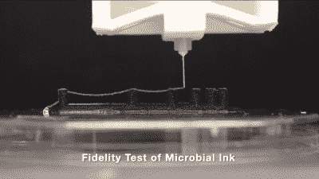

# 它是可打印的，可编程的，是大肠杆菌

> 原文：<https://hackaday.com/2021/12/27/its-printable-its-programmable-its-e-coli/>

你知道什么？看来大肠杆菌，这个到处都是莴苣和菠菜的克星，至少有一个实际用途。哈佛大学的研究人员创造了一种 3D 打印墨水，这种墨水是活的，完全由大肠杆菌产生的微生物制成。虽然这不是第一种所谓的活墨水，但它确实是第一种不需要任何额外聚合物来提供结构的活墨水。

Passing the pillar test up to 16mm. Image via [Nature](https://www.nature.com/articles/s41467-021-26791-x#Sec23)

因为这种墨水是活的，它在技术上是可编程的，因为它可以将蛋白质自组装成纳米纤维，并进一步将这些组装成包含水凝胶的纳米纤维网络。

一名研究人员将这种墨水比作一颗种子，它拥有最终长成参天大树所需的一切。通过这种方式，这种墨水可以在地球和太空中用作可再生建筑材料。虽然墨水在打印后不会继续生长，但最终的结构将是一个理论上可以自我修复的生命系统。

当研究人员诱导基因工程细菌培养物生长墨水时，墨水的创造过程就开始了，墨水也是由活细胞组成的。然后，这些墨水被收集起来，变成凝胶状，能够很好地保持其形状，足以通过 3D 打印机打印。它甚至通过了桥接测试，在相距 16 毫米的柱子之间支撑自身重量。(我们想看奔驰。)

## 微生物力学

和微生物一起工作很奇怪吗？不完全是。它们已经是维生素和一些香水的一部分，其他类型的微生物正在成熟为可生物降解的塑料。大肠杆菌以前曾被用来制造能够生长和再生的水凝胶，但它的粘性不足以通过打印机。因此，他们对大肠杆菌进行基因改造，使其从纤维蛋白中产生一种天然聚合物，这是一种人类和动物都具有的凝血聚合物。细菌产生的聚合物旨在连接成一个网络，一名研究人员将其比作重型货物网。

这种全微生物电子墨水仍在研发中。到目前为止，这已经比仅仅五年前可行的情况有了很大的改善。为什么用大肠杆菌 3D 打印？例如，这种墨水显示出作为药物输送系统的前景。在一项测试中，这种墨水被证明在暴露于某种化学物质后会释放出一种叫做天青蛋白的抗癌药物。这些功能之一可能是清理环境。在另一项测试中，这种墨水被证明可以隔离周围环境中的 BPA 毒素。

虽然这听起来很棒，但这种墨水仍在开发中，还有很长的路要走。首先，它不能经受干燥，但如果这种墨水与组织工程相结合，这可能不是一个障碍。然而，如果我们要用它作为一种自我再生的材料在地球和太空中建造栖息地，它必须变得更加稳定。

Via [ [纽约时报](https://www.nytimes.com/2021/11/23/science/microbes-construction-bacteria.html)