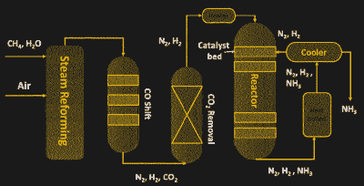
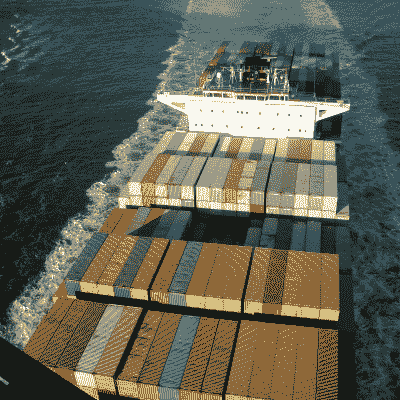
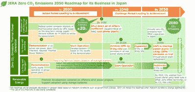

# 日本希望在氨的帮助下脱碳

> 原文：<https://hackaday.com/2022/09/27/japan-wants-to-decarbonize-with-the-help-of-ammonia/>

随着气候变化问题成为人们关注的焦点，世界迫切希望尽快实现碳排放为零。虽然直接电气化在普通客车上越来越受欢迎，但对于像飞机或洲际航运这样的能源密集型应用来说还不实用。因此，人们一直在寻找传统化石燃料的更清洁的替代品。

氢是最常被引用的，因为它燃烧起来非常干净。它唯一的主要燃烧产物是水，尽管它与空气一起燃烧时会产生一些氮氧化物。然而，由于运输、储存和生产方面的问题，氢还没有大规模普及。

然而，在一种普通化学物质氨的帮助下，这一切都将改变。氨现在作为一种替代解决方案开始崭露头角。它经常被认为是一种以替代化学形式储存和运输氢的潜在方式，因为它的分子式由一个氮原子和三个氢原子组成。然而，最近，氨被认为是一种独立的燃料。

让我们来看看这种普通的清洁产品如何成为新能源革命的一部分。

## 干净的烧伤

像氢气一样，氨也是易燃的。它也不含碳，所以燃烧时不会产生二氧化碳。它的能量含量要高得多，几乎是氢的两倍，但只有柴油的三分之一。它也比氢气更容易储存；与必须储存在-253°C 的液态氢相比，它在-33°C 时是液态的。此外，氨不存在与氢相同的储存问题，氢可以通过几乎任何材料的微小间隙渗出，在此过程中往往会损坏它们。

Schematic of the Haber-Bosch process. The steam reforming stage is where the major carbon emissions come from. Source: by [Palma *et al*](https://www.researchgate.net/publication/343655790_A_Review_about_the_Recent_Advances_in_Selected_NonThermal_Plasma_Assisted_Solid-Gas_Phase_Chemical_Processes), CC-BY

人们关心的是如何清洁地获得这种燃料。目前，氨是用哈伯-博世工艺制造的，这种工艺将氢和氮结合起来制造氨。化石燃料通常被用作氢的来源。在一个叫做蒸汽重整的过程中，天然气中的甲烷被转化为氢气，但是这个过程伴随着大量的二氧化碳排放。事实上，氨生产目前约占全球碳排放的 1%。

绿色氨是解决方案，而氢气是以更清洁的方式提供的。这通常涉及到使用氢，氢是由风能或太阳能等可再生能源分解水产生的。这使得生产氨时排放的二氧化碳少得多，否则会破坏其作为更清洁燃料的潜力。

## 用于运输

航运业占全球二氧化碳排放量的 2.5%。长期以来，人们一直在努力减少运输过程中的碳排放，氨可能是这场斗争中的最新工具。

“[Container Ship](https://www.flickr.com/photos/21442511@N08/2875308472)” by Daniel Ramirez

不幸的是，氨独特的燃烧特性意味着它不能替代现有的船用燃料。这些燃料通常包括用于运行大型低速往复式发动机的柴油和重燃料油，尽管液化天然气作为一种稍微环保的替代品正变得越来越受欢迎。

因此，人们正在努力开发能够使用氨作为燃料的船用发动机。人类已经开发出依靠氨运转的二冲程船用发动机，并计划用这种发动机驱动 T2 油轮、T4 散装货船和集装箱船。该公司正致力于一项改造计划，让旧船也能使用氨。

氨在发动机本身之外也带来了一些独特的挑战。由于其比柴油更低的能量密度，传统上使用 1000 米 ³ 燃料箱的船只将需要 2755 米 ³ 来代替使用氨。然而，它仍然击败了氢或电池作为潜在的选择，这将分别需要 4117 米 ³ 和 14000 米 ³ 来储存相同的能量。

和大多数新燃料一样，还有基础设施的问题。目前很少有港口提供散装氨作为燃料，让你的船友去当地超市买几千瓶清洁产品来运转引擎也不太现实。然而，如果氨发动机在实践中工作良好，它很有可能会流行起来，并为航运业开始推动更清洁燃料的主流使用。

## 对于发电厂

Japan has a sophisticated road map for adopting ammonia as a fuel. Credit: [Ammoniaenergy.org](https://www.ammoniaenergy.org/articles/japans-road-map-for-fuel-ammonia/)

日本正在探索使用氨作为燃煤发电厂的混合燃料。目的是在这些工厂的燃料中添加 20%热值的氨，以减少碳排放。与许多其他的[清洁燃料项目](https://hackaday.com/2021/12/23/how-to-get-into-cars-e85-fuel/)一样，从混合燃料开始不那么具有技术挑战性，也减轻了供应链的压力。这项技术将于 2023 年进入测试，预计 20%的混合燃料将于 2025 年投入实际使用。从长远来看，人们希望 100%的氨燃烧可以用于发电，但这一目标是在 2040 年或更久以后。

一种用于发电的零碳燃料将是一种有用的工具，可以支持那些无法全天候使用的可再生能源。然而，氨燃烧仍然会产生氮氧化物，因此它不像太阳能和风能那样清洁。

用氨发电将会大大增加日本对这种化学物质的需求。日本仅 2019 年就使用了 110 万吨氨。为了实现 21 世纪 30 年代中期 20%与氨共燃的目标，日本每年需要 2000 万吨氨。这大约是目前全球市场上交易的氨的总量，所以简单地购买更多不是一个选择。

到 2030 年，计划在国内供应链中扩大到 300 万吨。计划到 2050 年将这一数字进一步提高到 3000 万吨。随着工业探索建造新的码头来运输每年几十万吨的货物，大部分很可能从海外进口。

## 展望未来

如果氨作为一种更清洁的燃料在未来流行起来，一些多米诺骨牌肯定会倒向它。必须推广大规模生产设施，以清洁的方式从可再生能源中生产氨。存储和运输基础设施必须跟上，燃料的性能必须在现实世界中得到证实。它还需要在成本上与太阳能和风能直接发电等可再生能源竞争，这在电网领域是一个困难的选择。

然而，当谈到燃烧燃料作为能源时，人类感到熟悉和安全，而且液体燃料有很大的实用性，替代解决方案仍有待匹配。因此，氨可能成为人类迈向更清洁能源未来的一颗明星。

横幅照片:佩德罗·策克利拍摄的《日本大阪》