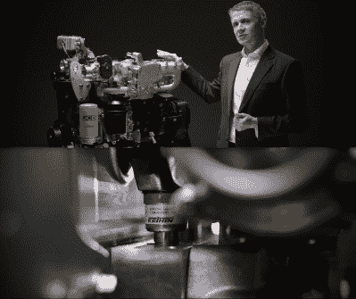
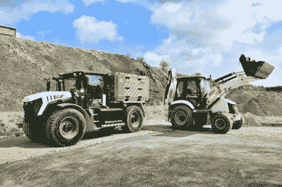

# JCB 正在开发用于工程机械的氢燃烧发动机

> 原文：<https://hackaday.com/2022/11/30/jcb-is-exploring-hydrogen-combustion-engines-for-construction-machinery/>

当我们想到绿化地球时，太阳能电池板和电动汽车往往是我们脑海中的第一印象。然而，还有一大堆其他的东西在排放二氧化碳，也需要清理。这包括吹叶机、割草机，当然还有用于建筑和农业工作的大型设备！

JCB 为大型机器制造柴油发动机，但现在正寻求改变现状，创造更清洁的未来。为此，该公司正在为其大型机器研发氢燃料发动机。

## 燃烧最轻的气体

 [https://www.youtube.com/embed/3fWmQgXcdqA?version=3&rel=1&showsearch=0&showinfo=1&iv_load_policy=1&fs=1&hl=en-US&autohide=2&wmode=transparent](https://www.youtube.com/embed/3fWmQgXcdqA?version=3&rel=1&showsearch=0&showinfo=1&iv_load_policy=1&fs=1&hl=en-US&autohide=2&wmode=transparent)

氢可以通过燃料电池发电，然后用来驱动马达。公司已经探索以这种方式使用氢来驱动汽车和卡车。 JCB 最初也着眼于氢燃料电池，但发现它们并不擅长提供工程机械所需的瞬时高功率。取而代之的是，该公司开始探索在其他相当传统的内燃机中使用氢气燃烧。这是一个其他公司也在探索的概念，丰田甚至通过一个赛车项目来研究这项技术[。](https://hackaday.com/2021/05/13/toyotas-hydrogen-burning-racecar-soon-to-hit-the-track/)

氢作为燃料是有用的，因为它的燃烧非常干净。就氢和氧之间化学反应的直接产物而言，唯一的副产品是水。当然，当氢气在空气中高温燃烧时，反应确实会导致一些氮氧化物的产生。不过总的来说，氢燃烧的排放物比燃烧化石燃料要清洁得多。这都是因为没有碳，这意味着反应产生的二氧化碳为零。

JCB engineered an engine to run on hydrogen. Notably, shots from the video show the engine using components designed for injecting compressed natural gas. Credit: [JCB, YouTube](https://www.youtube.com/watch?v=3fWmQgXcdqA)

出于这个原因，JCB 一直追求氢燃烧发动机作为一种清洁动力的机器。该公司开发了一款 4.8 升四缸氢动力发动机。它能够输出与该公司同样大小的 Dieselmax 448 发动机相同的功率和扭矩，预计着陆成本也相同。此外，甚至有可能将燃烧更清洁的发动机改装到旧机器上。

为了制造氢发动机，JCB 从现有 Dieselmax 模型的下半部分开始。油底壳和气缸体与柴油动力车型相同，冷却系统也是如此。氢发动机也仍然使用常规的可变几何涡轮增压。然而，在顶部，引擎是完全不同的。有一个新的气缸盖和喷射系统，设计用于喷射氢气而不是柴油。发动机不得不修改为火花点火，而不是压缩点火，因为氢是最适合前者。柴油燃料箱也同样不见了，取而代之的是五个由铝和碳纤维制成的 1 公斤重的氢气储存容器。。

值得注意的是，燃氢内燃机的工作方式与火花点火式汽油发动机大致相同。就像天然气发动机可以转换为使用液化石油气一样，只要改变喷射器，就可以将它们转换为使用氢气，尽管由于感应效率低下，功率较低。设计一个专门用于氢燃烧的直喷发动机可以解决这个问题，理论上可以生产出比类似大小的汽油发动机功率多 20%的发动机。其他适合氢动力的改进，如硬化阀门和特殊火花塞，有助于延长寿命和提高燃烧质量。至于柴油发动机，它们不容易转换成氢动力，因为气体燃料不适合压缩点火。然而，正如 JCB 所展示的，如果建造得当，类似大小的氢发动机可以与柴油发动机的功率和扭矩相媲美，甚至可以共用基本部件。

JCB 的引擎仍处于测试阶段。它的目标是在 2023 年底前开始发动机的预生产，应用于其建筑和农业车辆。与此同时，尽管氢气燃烧起来比化石燃料更清洁，但这项技术在更广泛的采用上仍面临一些障碍。

## 挑战

JCB has built a mobile hydrogen refuelling truck to deliver fuel to vehicles in much the same way as diesel tankers already do on job sites around the world. Credit: JCB

氢气还没有一个可行的分销网络，无论是在长距离管道方面还是在消费者的加油站方面。为此，JCB 开发了自己的移动加油车。对于农业和建筑运营商来说，这符合要求，因为燃料经常被带到机器上，而不是相反。与为公路行驶的车辆提供动力相比，这远不是一个问题，车主希望无论他们在哪里，都能够开到加油站。

生产氢气也是一个问题。它可以清洁地生产，使用可再生电力将水分解成氢气，产生所谓的“绿色氢气”然而，目前市场上的许多氢气是从天然气中化学生产的，释放出有害的碳排放物，并产生所谓的“灰色氢气”。一些生产商将两者分开，储存碳排放来制造所谓的“蓝色氢”不过，从根本上来说，还没有一种主要的可再生资源“绿色氢”可以为氢动力汽车提供动力。因此，氢燃料汽车目前只是将排放转移到灰色氢工厂。

JCB’s early experiments with hydrogen fuel cells pushed the company to look to hydrogen combustion engines as an alternative solution. Credit: [JCB, YouTube](https://www.youtube.com/watch?v=q1-__SYskjc)

氢燃烧发动机的另一个主要问题是效率。氢引擎汽车的油井到车轮的效率只有 20-25%左右，与氢燃料电池汽车的 25-30%相比，这一数字要低得多。这在很大程度上是因为与燃料电池相比，内燃机的损耗更大。然而，与电池汽车相比，由于提炼和运输氢燃料过程中损失的所有能量，损失甚至更大。相比之下，类似的电动汽车的效率可高达 80-85%。最终，氢燃料汽车与柴油燃料汽车的效率大致相当，尽管好处是排放更清洁。

## 展望未来

总的来说，如果世界要达到净零碳排放，几乎每一台燃烧化石燃料的机器都需要转换成更清洁的操作方式。JCB 过去几年的研究正是在追求这一目标，应该受到称赞。

与此同时，很明显，在建筑和农业机械可以说是完全清洁和绿色的世界之前，还有更多障碍需要清除。对于长时间从事繁重工作的机器，电力驱动可能还不是一种选择。在这种情况下，氢燃烧可能是一种可行的技术来同时清理它们。然而，清洁来源的氢的生产和分配必须是值得追求的。JCB 正在履行协议，氢气的供应必须跟上以完成这个难题。