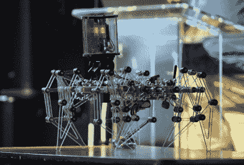
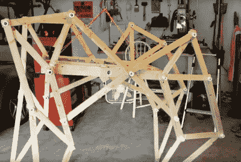
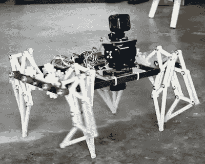

# 杰里米·库克正在实现他的 Strandbeest 梦想

> 原文：<https://hackaday.com/2019/12/30/jeremy-cook-is-living-his-strandbeest-dream/>

当杰里米·库克(Jeremy Cook)看到西奥·詹森(Theo Jansen)的 Strandbeest 走过海滩的视频时，他首先想到的是这台机器看起来有多不可思议。他的第二个想法是，他不可能自己造出那样的东西。这是一种我们大多数人都曾有过的感觉，尤其是当我们开始走一条我们从未走过的路时。

但这些疑虑并没有阻止他研究 Strandbeest 是如何工作的，也没有阻止他朝着构建自己的版本迈出试探性的第一步。这肯定不是一夜之间发生的。这也不是发生在一个月甚至一年之后。

ClearCrawler at the 2019 Hackaday Superconference

对于那些记分的人来说，他在 2019 年 Hackaday 超级大会上的演讲[“strand beets:从不可能的建造到主宰我的车库”](https://www.youtube.com/watch?v=4KUQ1tePHs8)是六年多实验和迭代的高潮。

他的第一个版本几乎不能移动，即使移动了，也不会持续太久。但是，他在洛杉矶音乐学院拥挤的观众面前现场演示的最新版本，以一种几乎超凡脱俗的流畅在舞台上小跑。说他擅长制造这些机器是一种轻描淡写的说法。

杰里米的演讲主要集中在他的 Strandbeest 创作上，但这也是一个人如何通过渐进的改进逐渐从灵感走向精通的迷人视角。他本可以在第一次、第二次、甚至第三次失败后停下来。但相反，他坚持认为自己是某个领域的专家，而他曾经认为这个领域是他力所不及的。

## 学习爬行

有一个众所周知的中国谚语，粗略翻译，国家“千里之行始于足下。”这是任何时候你接受挑战时都要记住的事情，但对于任何想要建造 Strandbeest 的人来说尤其如此。杰里米认为建造多足步行机器人的一个足够合理的方法不是试图一次解决整个机器，而是首先[建造一条腿，并理解它如何操作](https://hackaday.com/2013/06/13/building-a-strandbeest/)。

One of the early wooden designs.

有了一条腿，下一步当然是建造更多的腿。当他组装好四个时，是时候设计一个底座来安装它们了，然后给它装上电动马达让它动起来。

不幸的是，这第一只 Strandbeest，由木头制成，大约有一辆高尔夫球车那么大，从来没有工作得很好。杰里米把它的失败归因于他最终将学会解决的许多问题，例如连杆机构的不精确、过度的摩擦和尺寸过小的马达。作为步行者，第一次建造可能失败了，但它是一次奇妙的学习经历。

对于第二次 Strandbeest 杰里米切换到削减部分中密度纤维板，但装置仍然太重。这个版本比第一个版本更不成功，很快就分崩离析了。在这一点上似乎很清楚，前进的道路是将设计缩小到更易于管理的规模。

## 下一代

一旦他把学步车的设计缩小到桌面尺寸，杰里米真的开始看到一些进展。仍然需要几次迭代才能得到可以四处移动而不会卡住或嘎嘎作响的东西，但随着零件可以在 CNC 路由器上精确切割，并添加了新的齿轮传动系统，这些较小的 Strandbeests 真正开始变得活跃起来。

Smaller, gear-driven, walkers proved successful

他们不仅表现得更好，而且最终切换到透明丙烯酸给了他们一个非常独特的外观。大约在这个时候，Jeremy 也开始添加一些拟人化的功能，如装有摄像头的铰接“头部”或 LED“眼睛”。这些特征不仅赋予了他的机器人表情的能力，也标志着他的作品与西奥·詹森的作品之间的明显区别，[随着时间的推移，西奥·詹森的设计越来越大，越来越奇怪。](https://hackaday.com/2018/08/16/theo-jansen-invents-a-faster-simpler-wind-powered-strandbeest/)

这些丙烯酸树脂 Strandbeests 中最新和最棒的是 ClearCrawler，它考虑了杰里米多年来学到的所有经验教训。这款步行器由 Arduino Nano 驱动，可通过使用 nRF24L01 模块的定制手持遥控器进行控制，易于扩展，为进一步的研究和探索提供了一个出色的平台。

## 保持谦逊

尽管杰里米的 Strandbeests 已经取得了长足的进步，但他仍然对西奥·詹森多年前推出的原始风力助行器感到敬畏。如果有什么不同的话，他说他现在比第一次看到这些作品时更加尊重它们。在不知道它是如何工作的情况下看着它，你当然会印象深刻。但是一旦你理解了其中的机制，以及建造和操作这些作品有多困难，你就会意识到这确实是一个巨大的成就。

这也许是看完杰里米的演讲后真正要学到的一课:总是有更多的东西要学习和留下深刻印象。即使你已经在一个特定的项目上工作了多年，现在你正在一个硬件黑客会议上做关于它的演讲，如果你发现自己仍然不时地挠头，不要感到惊讶。与其灰心丧气，不如把这次经历作为继续前进和学习更多东西的灵感。

 [https://www.youtube.com/embed/4KUQ1tePHs8?version=3&rel=1&showsearch=0&showinfo=1&iv_load_policy=1&fs=1&hl=en-US&autohide=2&wmode=transparent](https://www.youtube.com/embed/4KUQ1tePHs8?version=3&rel=1&showsearch=0&showinfo=1&iv_load_policy=1&fs=1&hl=en-US&autohide=2&wmode=transparent)

