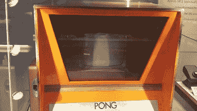

# 杰里·劳森和仙童频道 F；视频游戏卡带之父

> 原文：<https://hackaday.com/2020/07/14/jerry-lawson-and-the-fairchild-channel-f-father-of-the-video-game-cartridge/>

视频游戏控制台现在是一个家庭娱乐中心，通过互联网连接吸引各种形式的娱乐，但可能对大多数读者来说，它最初是作为一个连接到电视的离线设备来体验的，新的游戏软件必须以盒式磁带或光盘的形式购买。回顾游戏的历史可以一直追溯到 20 世纪 70 年代，但是哪家制造商拥有第一台游戏可以从主机上单独购买的机器呢？答案并不是你首先想到的，它背后的故事也不包含你今天所熟悉的名字。

Fairchild Channel F 从未能在美国年轻人的心中击败其竞争对手雅达利 2600，因此它的创始人杰里·劳森并不是一个与雅达利的诺兰·布什内尔或苹果的两个史蒂夫相提并论的知名人物，但如果没有这款现已被遗忘的游戏机，游戏的历史将会有很大不同。

## 启动它的投币项目

The primordial Pong machine. Frmorrison / [CC BY-SA 4.0](https://commons.wikimedia.org/wiki/File:Pong_prototype.jpg)

Jerry Lawson 是一名来自纽约的工程师，在国防电子行业的多家公司工作过之后，于 1970 年来到飞兆半导体公司。作为他们客户参与工作的一部分，他通过使用一辆 RV(是的，一辆野营车)改造成飞兆产品的演示实验室，彻底改变了与客户的接触点，从而在公司获得了卓越的成就。他很幸运地在正确的时间出现在正确的地方，成为著名的家酿计算机俱乐部的成员，这个俱乐部是后来微型计算机行业的摇篮，这使他像 20 世纪 70 年代初一样，处于游戏行业人脉网络的中心。

虽然他的雇主并不参与游戏，但杰里在这个领域的起步是作为一个副业。当他的朋友艾伦·奥尔康在安迪·卡普的酒馆安装第一台 *Pong* 机器时，它遭受了客户干扰其硬币机制以获得免费游戏分数的痛苦，所以杰里制作了一个他自己的游戏柜，名为*拆除德比*，它有一个更强大的系统。这导致飞兆半导体国际公司给他提供了一个机会，开始他们新的视频游戏部门，通往 F 频道的道路就此奠定。

## 第一次，可移动软件

第一个家庭视频控制台是一个单一功能的设备，要么提供一个单一的游戏，如 *Pong* ，要么通过电路提供一组不同的游戏。正如 Al Williams 在[他关于 1972 年 Magnavox Oddyssey](https://hackaday.com/2017/09/14/retrotectacular-a-video-game-odyssey/) 的文章中所写的，那个控制台有点像游戏盒，但它没有包含软件，而是重新连接了机器的配置。劳森的创新是将游戏软件整合到游戏盒中，甚至将 RAM 等额外功能整合到游戏盒中，从而允许编写几乎无限多种游戏。凭借这一点，他创造了游戏机游戏的整个商业模式，并为电脑游戏开发和出版业播下了种子。

The Fairchild Channel F console. Evan-Amos ([CC BY-SA 3.0](https://commons.wikimedia.org/wiki/File:Fairchild-Channel-F.jpg))

F 频道于 1976 年 11 月推出，比雅达利的 VCS 游戏机早了近一年。它的飞兆 F8 微处理器、低分辨率彩色图形和 2K RAM 被它的竞争对手远远超过，尽管它的操纵杆远超对手，而且它缺乏雅达利更大的软件目录，尽管它进行了硬件改造，但它在 20 世纪 80 年代稳步失利。令人惊讶的是，它一直生产到 1983 年，到那时，与 8 位微型计算机相比，它一定显得落伍了。

1980 年，劳森离开飞兆创立了 Videosoft，一家生产雅达利软件的公司，这家芯片制造商没有发布任何游戏机的后续产品。离开 Videosoft 后，他成为了一名咨询工程师，远离了聚光灯。由于患有糖尿病，杰里健康状况不佳，于 2011 年 4 月去世。

在计算机历史的编年史中，有许多名字是脱口而出的。像乔布斯和沃兹尼亚克、布什内尔、达布尼、辛克莱、宫本或迈纳这样的人。我们还应该把杰里·劳森(Jerry Lawson)加入到这个名单中，因为他利用 PCB edge 连接器以低廉的价格制造一台游戏机并销售多种游戏的愿景，为未来几十年设定了标准。