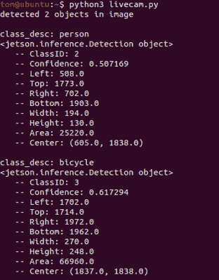

# Jetson 模拟器给学生上了一堂免费的人工智能课

> 原文：<https://hackaday.com/2020/10/26/jetson-emulator-gives-students-a-free-ai-lesson/>

通过 Jetson Nano，NVIDIA 在将 GPU 加速的机器学习带给大众方面做了出色的工作。以低于二手显卡的价格，你可以得到一台现成的、能够处理任何人工智能代码的交钥匙 Linux 计算机。但是，如果您试图为 30 名学生建立一个实验室，即使相对便宜的开发板的成本也会增加。

Spoiler: These things don’t exist.

这就是为什么[【黄茶】开发了 jetson 模拟器](https://pypi.org/project/jetson-emulator/)。这个 Python 库为 NVIDIA 自己为 Jetson 系列设备设计的“Hello AI World”教程提供了一个类似工作的环境，有一个很大的不同:你不需要实际的硬件。事实上，你有什么样的电脑并不重要；有了这个库，任何可以运行 Python 3.7.9 或更好版本的东西都可以带你浏览 NVIDIA 的入门教程。

那么诀窍是什么呢？好吧，如果你还没有猜到，这一切都是假的。显然它不能*实际上*在没有 GPU 的情况下运行 GPU 加速的代码，所以库[Tea]开发出来的只是简单的假装。它提供虚拟图像，甚至是随机生成的物体被分配到的“实时”摄像机画面。

最初的 NVIDIA 函数已经被重写，以处理这些提要，所以当你对其中一个调用类似`net.Classify(img)`的东西时，你会得到一个关于检测到什么人造物体的报告。输出看起来就像你在真实的 Jetson 上运行一样，为边界框提供虚拟的尺寸和位置。

如果你是一名黑客，想要深入研究机器学习和计算机视觉，你最好买一台 59 美元的 Jetson Nano 和一个网络摄像头。但是，如果你正在组织一个研讨会，向十几个人展示英伟达人工智能工作流程的基础，jetson-emulator 将允许所有与会者运行代码并获得结果，不管他们在引擎盖下有什么。