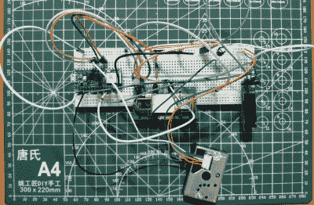

# 胖丁传感器呼吸二氧化碳，所以你不必

> 原文：<https://hackaday.com/2021/11/16/jigglypuff-sensor-breathes-co2-so-you-dont-have-to/>

我们在 Hackaday 看到了很多环境监测项目。说真的，*很多*。它们通常采用微控制器、几个传感器的形式，可能还有一个 3D 打印的外壳来保护它们。它们在功能上也非常相似，唯一的不同通常来自于用来传递它们收集的数据的协议。

但是，即使与之前如此广泛的工作相比，[这个由【Kutluhan Aktar】创建的胖丁物联网环境监控器也是非常不寻常的](https://hackaday.io/project/182586-jigglypuff-iot-carbon-dioxide-and-dust-monitor)。当然，亮点是熟悉的。它的 MH-Z14A NDIR 二氧化碳传感器和 GP2Y1010AU0F 光学灰尘探测器由支持 WiFi 的微控制器读取，这次是 Arduino Nano RP2040 Connect，最终通过 Telegram bot 向用户报告其发现。该单元上甚至有一个通用的 SSD1306 有机发光二极管显示器来显示本地数据。我们过去以某种形式看到的所有事物。

Testing the electronics on a bread board.

那么有什么不同呢？显然，这一切都被安装在一个巨大的神奇宝贝印刷电路板上。即使你不是口袋妖怪的粉丝，你也不得不欣赏那个亮粉色的阻焊膜。老实说，整个演示是 PCB 艺术作品的一个很好的例子[我们很少在 BadgeLife 场景之外看到](https://hackaday.com/2018/08/20/badgelife-the-hardware-demoscene/)。

不可否认，有很多更简单的方法可以让你得到关于你家室内空气质量的通知。我们也不是说，从可靠性的角度来看，随意地将你的电子设备安装到一个设计成看起来像一个近 20 多年前的 Game Boy 游戏中的角色的 PCB 上一定是一个好主意。但是，如果你*要做这样的事情，那么这个项目肯定是一个要击败的。*