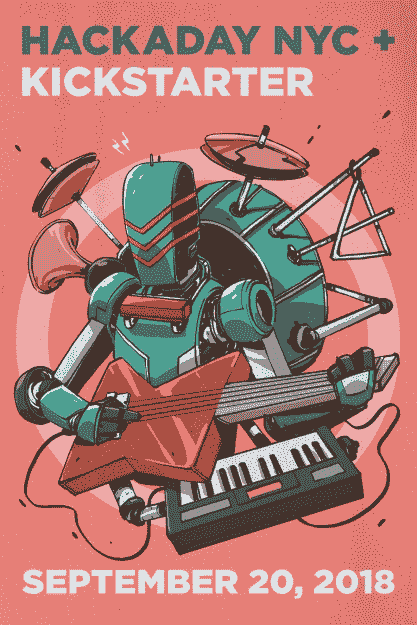

# 加入 Hackaday，享受一个创客大会前的黑客之夜

> 原文：<https://hackaday.com/2018/09/19/join-hackaday-for-a-night-of-pre-maker-faire-hacks/>

本周末是在纽约举行的世界创客大会，Hackaday 将会在那里看到来自全球创客的最新和最棒的项目。我们还会花五美元买几瓶水，但那完全是另一回事了。

 一如既往，今年的世界创客大会(World Maker Faire)将在精彩的纽约科学馆举行，阵容壮观。会有角色扮演，亚当·沙维奇会带着半打初级流言终结者到场。会有一个 26 英尺高的液压手从燃烧人那里运来。你现在看到的是自去年五月湾区创客节以来 STEAM 教育领域最大的事件。

Hackaday 有一个很棒的纽约社区，我们将在本周四举行一次聚会，与 Maker Faire 同步。你猜怎么着？你被邀请了！

我们将与 Kickstarter 上的朋友合作，为您带来一个硬件构建、音乐技巧、小吃等精彩的夜晚。虽然这是一个非正式的活动，但我们确实有一些人会带来他们最新的黑客技术来炫耀。Nick Chelyapov 是一名设计师出身的 gear head，他设计了一款基于 Arduino 的合成器和鼓机。这不是玩具，但也不是一堆复杂的跳线和 eurorack 模块。这个小东西是一个真正的工具，任何人都可以很容易地拿起它并发出哔哔声。

确定参加这次聚会的还有尼克·尤尔曼(Nick Yulman)，他是一位艺术家，在各种背景下从事声音和互动媒体的工作。他正准备在布鲁克林绿点的阿雷特画廊安装他的机器人乐器。但本周他将向我们展示音乐机器人是如何帮助他不再担心并爱上数字音乐的。

这是一个不容错过的事件。你可以在 Eventbrite 上回复这个活动，一定要带上你正在做的任何项目。这将是一整晚的喝酒和黑客活动，这是创客大会真正开始之前的事情。一旦周末来临，在集会上找到我们；我们 Hackaday 团队中的几个人将四处寻找令人敬畏的硬件项目。[斯蒂芬·特拉诺维奇甚至将在周日 11 点发表关于黑客日奖的演讲。集市上见！](https://makerfaire.com/maker/entry/65131/)