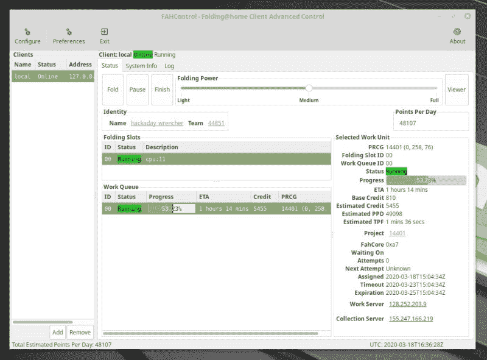
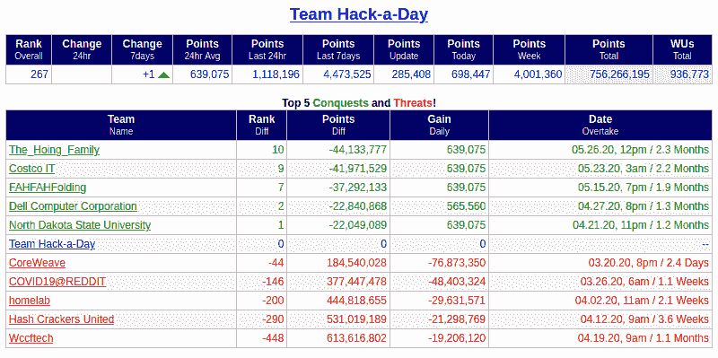

# 加入 Hackaday 团队，通过折叠@Home 来压缩新冠肺炎

> 原文：<https://hackaday.com/2020/03/18/join-team-hackaday-to-crunch-covid-19-through-foldinghome/>

捐出你多余的电脑来对抗新冠肺炎。[Folding @ Home 项目](https://foldingathome.org/)使用通过互联网连接的世界各地的计算机来模拟蛋白质折叠。关键是要生成必要的数据，以发现能够对这种病毒如何影响人类产生影响的治疗方法。该软件模拟蛋白质折叠，以寻找能够削弱病毒攻击人类免疫系统能力的药物治疗方法。把这想象成挖掘比特币，但是[我们是在挖掘治疗冠状病毒](https://foldingathome.org/2020/02/27/foldinghome-takes-up-the-fight-against-covid-19-2019-ncov/)的方法。

最初由斯坦福大学开发并于 2000 年发布，这并不是 Hackaday 第一次倡导 Folding@Home。“Team Hackaday”折叠组是由读者们在 2005 年[发起的](https://hackaday.com/2005/09/04/hackaday-links-25/),该团队编号仍然有效，所以让我们继续努力提高排名。在撰写本文时，我们在世界上排名第 267 位，我们能像 2008 年那样回到第 30 位吗？再一次用比特币做比较，这就像一个矿池，只不过我们最终得到的是善意的展示，我认为我们现在都可以利用这一点。

## 将电脑设置为折叠@Home

你可以在五分钟内准备好。软件包只有几兆字节，配置也很少:

*   [下载并运行 Linux、Mac 或 Windows 的安装程序](https://foldingathome.org/support/faq/installation-guides/)(**更新:** [备用下载链接](https://foldingathome.org/alternative-downloads/))
*   选择任何一个名字来表明你在公共排名系统上的努力
*   使用团队 Hackaday 团队编号来增加我们的集体排名: **44851**
*   这是可选的，但我建议您获得自己的密钥——它是唯一标识您的努力的散列值，您可以在 FAH 密钥页面上通过电子邮件获得一个

就是这样，只要打开 FAHControl，软件就会连接到家庭服务器上的折叠，并请求一个工作单元(WU)——这是目前正在解决的蛋白质折叠数学难题的一部分。一旦它有一个吴软件将解决该单位，并上传结果。冲洗并重复，你就是分布在世界各地的超级计算机中的工蜂。

F@H 项目见证了网络上新计算机的激增。因此，您可能会遇到没有新的 Wu 被下载的情况。我在周三早上经历了这种情况，我认为这只是因为工作的缓冲时间用完了，需要补充。好的一面是您不需要做任何事情，所以只要让您的实例运行，当更多实例可用时，它就会开始工作。

该软件确实允许您使用 GPU 进行更高效的计算，但是设置可能并不简单，超出了本文的范围。我建议您启动并运行客户端，然后在下一步配置 GPU。

## 关注排行榜

你有所作为吗？是啊！但是当然[指标告诉这个消息最好的](https://folding.extremeoverclocking.com/team_summary.php?s=&t=44851)。可以看上面的团队总结。这个统计页面包括一个用户摘要，显示了目前 21 个活动用户，包括我在撰写本文时添加的“hackaday _ wrencher”实例，该实例刚刚开始获得分数。

这个团体现在有 1600 多名成员，但大多数都不活跃。我们能重新激活吗？我们能把这个数字翻倍吗？抓住那些游戏装备，让电子流。Folding@Home 在过去的二十年里对研究产生了巨大的影响，现在我们比以往任何时候都更能在这个基础上加入到对抗全球疫情的行列中来。