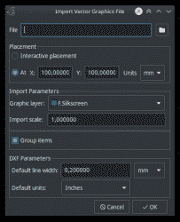
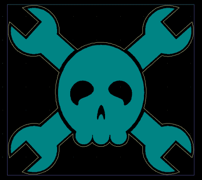
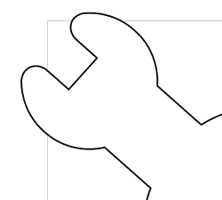
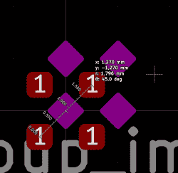
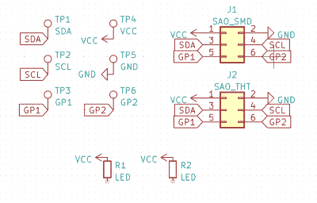

# Jolly Wrencher SAO，以及 KiCad 6 如何让它变得简单

> 原文：<https://hackaday.com/2022/10/11/jolly-wrencher-sao-and-how-kicad-6-made-it-easy/>

如果你计划参加 Supercon 或其他黑客会议，要知道你会得到一个带有 SAO(简单附加)连接器的徽章，这是一个 4 针或 6 针连接器，你可以将附加板插入其上。有无数的 SAO 可供选择，如果你曾经觉得你的选择不够强烈，现在你可以选择得到一个快乐的扳手 SAO 板！

该板为您提供了一个 SMD 原型制作空间，具有 1.27 毫米(0.05 英寸间距)焊盘，适用于许多无源元件、IC，甚至是 ESP32 WROOM 等模块。这些焊盘与接地连接的焊盘呈对角散布——如果你想在现场连接某些东西，你不需要拉单独的 GND 线。鉴于 Supercon 徽章的特性，SAO 标准 SDA 和 SCL 引脚也有 RX 和 TX 标签。加分的是，眼睛是透明的，后面有 LED 脚印——这是我第一次设计 LED 通过 FR4 发光的 PCB，我希望这种美学行得通！

这个设计是开放的，有 [gerber 文件可供下载](https://github.com/CRImier/jolly_wrencher_sao/releases/tag/v2)，所以如果你想快速订购 PCB，我再给你一个。要添加到其中的 zip 文件。否则，你可能会在 Supercon 发现一块扳手板！现在，我想告诉你 KiCad 6 如何使设计这种 PCB 变得超级简单——毕竟，SAO 永远不够，很可能你也想设计自己的特殊 SAO。

## 意外惊喜

我从网上找到的一个快乐扳手的 SVG 开始。我第一次将轮廓导入 KiCad 的经历，[回到 KiCad 4 天，](https://hackaday.io/project/7431-the-kicad-central/log/50436-importing-board-outlines-tips-and-tricks)需要修改 DXF 的导入格式——甚至需要通过 LibreCAD 才能顺利导入。虽然我期待一些改进，但我已经做好了粗糙边缘出现的准备。

然而，当我打开 PCB 编辑器时，我没有看到我上次使用的“导入= > DXF 文件”条目。相反，我注意到它已经被改为“进口= >图形”。当我打开它时，迎接我的是一个标题为“导入矢量图形文件”的简单菜单，这不是 DXF 特有的选项，这是一个令人放心的视图。是否有可能在本地导入 SVG 文件？我点击了“选择文件”按钮。

开心果扳手的 SVG 文件在文件选择器列表中可见，在右下角，“SVG”和“DXF”都出现在支持的文件类型下拉列表中。我选择它出现在前面的丝印层，当我点击确定，乔利扳手多边形刚刚出现在 PCB 浏览器的丝印。显然，今年刚刚发布的 KiCad 6 版本中增加了这一选项，我很兴奋这对我们的电路板设计意味着什么。

首先，SVG 的这种直接导入使得导入徽标、艺术和其他图形更加容易。不用再走 bitmap2component 路线，或者用 SVG2Shenzhen。虽然这两个都是强大的工具，但内置的 SVG 导入工具可以将您的徽标放在您选择的任何图层上，这有更多的潜力，纯粹是因为它使用起来简单快捷。这个导入选项可以让您直接从我们最喜欢的图像编辑器将各种艺术作品放到您的板上，而不必添加足迹库或处理其他类型的限制。

此外，如果您想将作品的轮廓导出为纸板轮廓，它也使机械设计变得更容易。为了创建 SAO 的轮廓，我在 Inkscape 中选择了扳手 SVG 元素，然后按几次 Path = > outstart，使扳手的每个单独元素变大。然后，我选择 Path=>Union，将所有元素连接成一个可用的轮廓。眼睛和鼻子仍在轮廓内，但一条路径= >分开单击(Ctrl+Shift+K)使它们成为单独的路径，并被迅速移除。

我将生成的轮廓保存为一个单独的文件，然后将其导入到 Edge 中。剪切层。就这样，扳手骚做好了。在 KiCad 6 中，从 SVG 制作自己的徽章或 SAO 非常简单，并且只需要您可能已经安装的工具。

## 如果这么简单，我就把它变复杂

当然，在最初的兴奋之后，我提出了额外的要求，据称是为了让这个 SAO 更好，但也是因为我想玩一下导入过程。使用默认的 1.0000 导入比例，徽章大小约为 8 厘米 x 8 厘米，对于普通的 SAO 来说太大了，与 Supercon 徽章相比肯定太大了。最后，我选定了 0，6000，这使得 X 和 Y 尺寸都不到 5 厘米——对于 SAO 来说这是一个舒适的尺寸。如果电路板不适合 5 厘米 x 5 厘米的正方形，一些 PCB 工厂会有价格折扣，所以我希望这能在订购时帮助你。在 KiCad 中没有找到“测量 PCB 边界框”的设置，但是测量工具(Ctrl+Shift+M)有帮助。这很容易。

如果你设计一个可以戴在身上的 PCB，去除尖角是很重要的——尖角会挂在衣服和其他东西上，可能会伤害佩戴者。对于 Jolly Wrencher 来说，这意味着扳手角必须是圆形的，除非我想让 PCB 兼作武器——这不在我的愿望清单上。圆角是一种可以接受的美学妥协，无论如何，你都不会用这块板拧下任何螺母——除非我在尺寸方面运气不错！

这意味着我需要一种在 Inkscape 中圆角的方法。快速搜索显示，Inkscape 有一个内置的过滤器，但前提是你的 Inkscape 安装足够新。在我的 Ubuntu 20.04 LTS 上，情况并非如此，我决定改用 Snap 提供的版本——因为 Snap 声称的目的之一是向我们的桌面提供新软件。我的抓拍经历并不是一帆风顺的，但我在很多地方都从中受益。然而，Inkscape [的打包版本似乎无法打开。svg 文件](https://askubuntu.com/questions/1426931/22-04-svg-open-with-another-application-not-working-with-inkscape/1426937#1426937)–我打开了文件拾取器，但没有看到任何 SVG 文件出现，“打开方式”也不起作用。

这是一个沙盒 bug，当然，从 2018 年开始以各种形式[涌现。Snap 开发者指责 Inkscape 开发者没有在他们的 Snap 清单文件中使用正确的声明。从我的经验来看，如果你正在开发一个沙盒解决方案，它将被数以千计的桌面应用程序使用，每个应用程序都有一个庞大的用户群支持，你有责任让沙盒参数清晰明了，并且不可能以如此大的方式搞砸——否则就不会有结果。也就是说，我急切地等待着 Linux 桌面上的 Snap 年——也许，下一个十年的某个时候。与此同时，](https://forum.snapcraft.io/t/inkscape-does-not-open-files-on-different-partition/7592/2)[号的 PPAs](https://inkscape.org/release/inkscape-1.2.1/gnulinux/ubuntu/ppa/dl/) 号 Inkscape 顺利运行。

路径效果菜单中的“拐角(圆角/倒角)”选项终于可用了。我可以将四个扳手的每一个都完全倒圆角，但是我特别想保留所有的尖角，除了突出的两个。事实证明，我的做法很复杂，花了一两个小时才弄明白，因为我希望所有八个角都有一个完美的圆角，最终将每个扳手端分成不同的路径，圆角，然后重新连接。在角工具中有一个“只改变选中的节点”的设置，但是[不清楚如何使它工作，](https://inkscape.org/forums/beyond/bspline-path-effect-only-selected-nodes/#c41791)因此进行了分割。如果你不介意快速和肮脏的圆角，[请遵循本教程。](https://www.educba.com/inkscape-rounded-rectangle/)

在对扳手进行圆角处理后，我再次使用 Outset 和 Union 工具重新生成轮廓，这样轮廓圆角半径将与丝印圆角整齐地同心。将用于丝网印刷的部分和用于轮廓的部分保存为单独的 SVG，我将它们导入到各自的层中，在亚毫米网格上移动它们，直到它们在视觉上匹配，徽章的美学部分就准备好了。

## 一个实验性的原型空间

我是 deadbug 原型制作的忠实粉丝——如果由我来决定，每一个烙铁都会和一卷 0.1 毫米的漆包线一起出售。我也不想在这个徽章上添加特定用途的组件——理想情况下，你实际上只需要 4 针插头，因为这些很容易从任何地方获得。我决定在电路板背面填充 SMD 原型垫，让人们添加自己的元件——毕竟，最有趣的元件往往是 SMD。这个想法是，应该可以在现场制作 Supercon SAO 附加物和工具的原型——灵感来自【摩根】的[2018 super co ESP32 附加物](https://hackaday.io/project/161906-attention-supercon-addon)和[born hack 2021 徽章。](https://hackaday.com/2021/08/31/reporting-from-bornhack-2021-hacker-camps-making-it-through-the-pandemic/)

如果你喜欢一些 THT，你可以修改 PCB 文件，制作一个 THT 原型扳手端，并订购以这种方式修改的电路板，但我决定默认情况下让徽章的正面尽可能干净。这种原型空间具有 1.27 毫米(0.05 英寸)的网格，应该与 SO/SOIC IC 和 ESP32 等城堡式模块兼容。我希望这些焊盘实际上足够大，能够可靠地焊接在一起——在我自己的 PCB 到货之前，我无法完全证实这一点。如果原空间的球场对你自己的技能来说过于激烈，我提前道歉，我希望 Supercon 的设备可以弥补这一点！

我最初想在 Jolly Wrencher 的扳手头上安装公制网格，但后来决定不这么做。谢天谢地，似乎没有多少器件的引脚使用公制网格。我必须使焊盘足够大，看起来可以使用，但又足够小，以便地面填充物能够进入焊盘之间，同时我在足迹中添加了掩膜开口。一旦地面填充成功，我将它复制粘贴到整个板上，网格设置为 0.025”，这样我就可以快速正确地对齐焊盘。在放置足迹时将网格设置为一定的大小有助于快速实现这些想法！

我还没有找到更好的方法在 KiCad 中建立灵活的 protospace 足迹，但我洗耳恭听！一般来说，似乎有两种方法可以在 KiCad 中制作原型空间——要么将整个空间创建为一个单独的足迹并将其放在您的板上，要么将其拆分为可与网格对齐的更小的原型空间块，然后堆叠在一起；后一种选择对于像这样的任意形状的电路板更方便。

## 组件和禁止区

All the components that it made sense to keep in the schematic

当然，我必须添加像 6 针接头和测试点这样的组件。你必须决定徽章的哪些部分要保留在示意图中。我的观察是，承载特定信号的东西，如连接器和测试点，最好通过通常的“符号= >足迹”路线来完成，而像原型空间和艺术品这样的东西最好作为独立的足迹来完成，甚至只是导入的图形。如果您不想在原理图同步时丢失您的作品，请记住确保“从原理图更新 PCB”对话框中的“删除没有符号的封装外形”选项未被选中——谢天谢地，这似乎是默认设置。

我们的编辑建议我在眼睛后面添加 LED，我决定走“SMD LED 通过 FR4 发光”的路线，以避免通孔。虽然 THT 发光二极管有其魅力和好处，我想象他们会看起来有点关闭，和 SMD 发光二极管无处不在。两个 0805 封装完成了这项工作，使用“手握”变体应该可以让您轻松使用 0603。我没有增加电阻，相反，我调整了 led 的位置，以便增加一个电阻将它们的阴极跨接到周围众多接地焊盘之一，这是微不足道的。

使眼睛部分透明意味着我必须移除底层的地面填充，特别是眼睛所在的地方——在 KiCad 中，这是一个禁止多边形。我最初害怕这条路线，因为我认为我需要手动跟踪两个眼睛形状——结果，你可以将眼睛形状导入到 KiCad 中的任何层，右键单击它们，并使用右键菜单中的“从选区创建区域”。就这样，很快，我添加了眼睛形状的地面填充禁止区，然后将相同的眼睛形状 SVG 导入到两个蒙版层，板的眼睛区域变成了透明的——反正就像裸露的 FR4 一样透明。

这种能力很奇妙，对很多事情都有帮助；在某种程度上，这意味着您可以从 SVG 轮廓添加填充区域——当您想要将铜的最终形状连接到电路板上的某个网络时，简单地将矢量导入到. Cu 层可能不是最佳选择。例如，如果你想制作一个定制的电容式触摸滑块，你可以在 Inkscape 中设计它，将 SVG 导入到你的板上，然后将焊盘变成铜区。

## 随机相遇

将这些板提交给 JLCPCB 后，我收到了他们的评审发来的邮件。她的电子邮件中写道:“根据公司流程，覆盖着许多衬垫的木板应该用 ENIG 制成”。我对从 HASL 到 ENIG 的相关价格上涨不感兴趣，并决定询问具体问题是什么。她回答说，考虑到焊盘的数量，短路可能会出现——考虑到 HASL 的工作方式，这是有道理的。我觉得这暗示了他们不想花额外的精力去清理这些东西——这听起来很公平。我要求他们与 HASL 一起生产电路板，并且我不会对短路提出投诉——令人惊讶的是，[他们同意了。](https://github.com/CRImier/jolly_wrencher_sao/blob/master/JLCPCB_SPEECH_CHECK.md)我会看看我的主板到达后是什么样子——这将是一次有趣的测试！

从 JLCPCB 订购这些电路板半天后， [the Hackaday Discord](https://discord.com/invite/NkbHrAW7NG) 上的一个朋友指出，在任何一方，丝网印刷的订单号都无处可去——这是 JLCPCB 的要求，除非你支付少量额外费用来放弃它。JLCPCB 允许您在对 PCB 文件进行生产更改后下载并检查它们，这是我立即求助的一个选项。在那里，我发现他们把订单号放在通孔 SAO 连接器轮廓后面他们能找到的微小空间里——这是一个惊喜。我建议您为“移除订单编号”选项支付一点费用，尽管如此，这是一个很小的价格，并保证您的徽章不会以 Y23-84112 出现在丝网印刷的正面和中心。

我对“^__^”表情有一种亲近感，所以我决定制作丝印补丁 SVG，将徽章的眼睛变成两个^形状。这样，我就可以把它们放到原来的丝网版上，重新生成 gerbers。不知何故，这变得出乎意料的困难——在我画完之后，形状不会作为填充的多边形导入，而是作为两个轮廓导入。最终成功的诀窍是使用 Inkscape 中的“描边和填充”工具包，将外部形状填充为黑色，内部形状填充为白色。我不知道为什么会有帮助，但我希望它也能帮助你，如果你曾经遇到过这个问题，^补丁文件在回购中为你修补的目的。

## 制作一个漂亮的 PCB 要简单得多

你可以用这种方式设计出艺术复杂度相当高的 Sao 和 artsy PCBs 或者，简单地把你的标志/艺术品/整个原理图放在丝网印刷上。你把你的 PCB 做得越艺术化，我就越怀疑像 [SVG2Shenzhen](https://github.com/badgeek/svg2shenzhen) 这样的工具会让你变得更容易。我从未经历过 SVG2Shenzhen 流程，但我怀疑像[mch 2022 badge](https://hackaday.com/2022/05/04/the-mch2022-badge-has-landed/)这样的项目会受益于相关的自动化。也就是说，令人高兴的是，我们所有的简单 PCB 现在都有了一条简单高效的路线。

您不必执行我描述的这些步骤中的大部分！使 Jolly Wrencher PCB 变酷的 80%已经在本文的 9 个段落中完成了——本文的剩余部分将向您展示如何进一步润色。我们当中任何一个设计过足够多 PCB 的人都知道，你可以花费过多的时间来制作一个更加完美的 PCB。当我一次又一次地对需求进行分层时，我当然也分享了我的乐趣，我希望我已经向您展示了在 KiCad 6 中获得乐趣是多么容易。