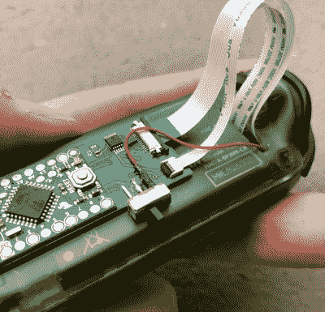

# Joy-Con Mod 让任天堂 Switch 可以控制触摸板

> 原文：<https://hackaday.com/2020/05/22/joy-con-mod-gives-nintendo-switch-touchpad-control/>

虽然 Valve 的蒸汽控制器最终以商业失败告终，但大多数用户都同意，它使用触摸感应垫代替传统的模拟操纵杆或数字方向按钮至少是一个值得探索的概念。这些触摸板爱好者可能会对[Matteo Pisani]的这一修改非常感兴趣，它用电容触摸传感器取代了任天堂 Switch Joy-Con 上的模拟操纵杆。

正如[Matteo]在他的详细报道中解释的那样，这个项目的最初灵感是为操纵杆疲劳和漂移问题创造一个永久的解决方案。他推断，如果他完全移除物理操纵杆，它在未来就不会出现故障。我们不确定有多少人会把这个概念发展到这一步，但是你不能否认这个逻辑。

 最初的操纵杆是一个相当简单的设备，由两个模拟电位计和一个数字按钮组成。它通过 0.5 毫米间距的柔性电缆连接到 Joy-Con 的主 PCB，因此[Matteo]的第一步是在 KiCad 中为电缆设计一个分线点，以使开发过程更容易一些。

电路板设计最终演变为支持 Arduino Pro Mini、数字电位计和圆形触摸板的连接器。Arduino 通过 I2C 与这两款设备进行通信，并将触摸控制器的高分辨率数字输出转换为原始操纵杆预期范围内的模拟信号。[Matteo]说他仍然必须实现操纵杆的数字按钮，但由于 pad 上令人印象深刻的 63 级压力灵敏度，这应该不是问题。

既然他知道这个概念可行，那么[Matteo]的下一步就是稍微清理一下。他已经在做一个更小的 PCB，应该可以放在 Joy-Con 里面，我们非常有兴趣看到最终的产品。

[自从 Switch 上市以来，我们已经看到了几个有趣的 Joy-Con 黑客](https://hackaday.com/2017/11/06/reverse-engineering-the-nintendo-switch-joy-cons/),[包括一个不太激烈的操纵杆交换](https://hackaday.com/2018/08/11/get-nostalgic-with-these-gamecube-themed-joy-cons/)。在 Joy-Con 和传说中的 Wii 遥控器之间，任天堂显然有创造[输入设备的诀窍，这些设备抓住了游戏玩家和修补匠的想象力](https://hackaday.com/2018/01/20/nintendo-switch-gets-making-with-labo/)。

 [https://www.youtube.com/embed/alDVeICKqrM?version=3&rel=1&showsearch=0&showinfo=1&iv_load_policy=1&fs=1&hl=en-US&autohide=2&wmode=transparent](https://www.youtube.com/embed/alDVeICKqrM?version=3&rel=1&showsearch=0&showinfo=1&iv_load_policy=1&fs=1&hl=en-US&autohide=2&wmode=transparent)

