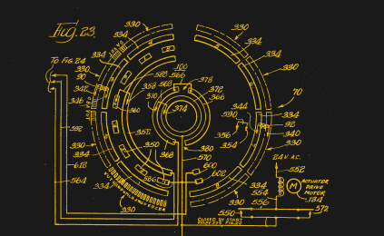
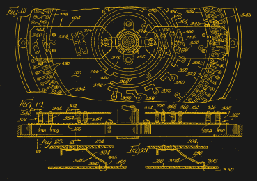

# 自动点唱机机电自动化解释

> 原文：<https://hackaday.com/2022/01/27/jukebox-electromechanical-automation-explained/>

如果你曾经好奇过老式点唱机是如何工作的，那就是全是机电式的，没有电脑。在两个视频中，[Technology Connections]带我们[深入了解他在中学时用自己的零花钱买的 1970 年款 Wurlitzer Statesman 3400](https://www.youtube.com/watch?v=NmGaXEmfTIo)的操作。这个盒子可以以 33-1/3 或 45 转/分的速度播放由 100 张唱片组成的圆盘传送带上的唱片，因此有 200 首歌曲可供选择。这将是后来的模式之一，因为 Wurlitzer 的点唱机业务正在下降，他们在 1973 年出售业务。

> 这可能是有史以来最丑的点唱机了。
> 
> 实际上是这个点唱机让我变成了今天这个怪人。

除了外观，这个机械奇迹的内部才是最引人注目的。这种机制被称为*，由弗兰克 B. 伦尼和罗纳德 P. 埃伯哈特于 1967 年发明。查看专利 [US3690680A](https://patents.google.com/patent/US3690680A) 文件，获得一些精彩的图表和示意图，它们本身就是艺术品。*

 *   

[技术连接]解释整个事情是如何工作的，当他完成时，你的大脑将会旋转。令人惊讶的是，一切都是如此精确地编排，更令人惊讶的是，人们能够维护和排除这些装置的故障。他说可能会有第三部，敬请期待。如果你喜欢这些东西，看看我们在 2018 年做的关于一个餐桌桌面 Seeburg 点唱机的[修复的报道。你做过这些机电序列器吗？如果有，请在下面的评论中告诉我们。](https://hackaday.com/2018/03/30/this-is-how-the-fonz-would-play-mp3s/)

 [https://www.youtube.com/embed/NmGaXEmfTIo?version=3&rel=1&showsearch=0&showinfo=1&iv_load_policy=1&fs=1&hl=en-US&autohide=2&wmode=transparent](https://www.youtube.com/embed/NmGaXEmfTIo?version=3&rel=1&showsearch=0&showinfo=1&iv_load_policy=1&fs=1&hl=en-US&autohide=2&wmode=transparent)

 [https://www.youtube.com/embed/o1qRzKuskK0?version=3&rel=1&showsearch=0&showinfo=1&iv_load_policy=1&fs=1&hl=en-US&autohide=2&start=1044&wmode=transparent](https://www.youtube.com/embed/o1qRzKuskK0?version=3&rel=1&showsearch=0&showinfo=1&iv_load_policy=1&fs=1&hl=en-US&autohide=2&start=1044&wmode=transparent)

*