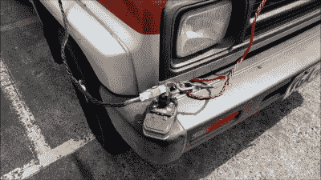
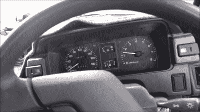

# 用电钻电池启动你的汽车

> 原文：<https://hackaday.com/2018/08/16/jump-start-your-car-with-a-drill-battery/>

有时候，你搬到一个新的城市，事情并没有按照你的方式发展。你没有现金，没有能量，由于你自己的愚蠢，你的汽车电池没电了。你需要启动汽车，但你感觉非常不合群，而且你不知道镇上还有谁可以打电话。你是做什么的？

这不是问题，因为你是黑客，你的车后座上有一个无绳电钻。今天的普通钻机往往依靠一个漂亮的 18 伏锂电池组运行。这些包能够提供大量的电流，可以采取很多滥用。这就是它们派上用场的地方。

典型地，当跨接起动一辆汽车时，另一辆工作的汽车被拉到合适的位置，并且电池与不能行驶的汽车的没电的电池并联连接。理想情况下，工作车辆随后启动，使其交流发电机为整个系统充电，以避免耗尽其自身的电池。此时，不能行驶的车辆可以启动，并且其交流发电机可以开始为其自身的电池充电。断开所有连接后，你就可以走了。

The drill battery, delicately resting on the front bumper, with jumper leads precariously attached. The risk of a short-circuit is readily apparent here.

被困在(相对)陌生的土地上，不想和任何人说话，我决定用另一辆车的电池代替我的 RYOBI ONE+ drill 电池。然而，这也带来了一些挑战和风险。最基本的问题是建立联系。大多数电钻电池都有一个非常独特的模制连接器，用于将电池机械固定在电钻上，并进行电接触。试图将一对相当大的汽车跳线连接到面积不到一平方厘米的端子是很困难的。

A voltmeter makes the job easier. With the drill battery in parallel with the car battery, we see the system hit around 12 volts.

更糟糕的是，将跳线连接到如此微小的端子上，往往会使正极和负极跳线有相互短路的风险，这可能会产生火花或导致电池起火或爆炸。进行连接时要非常小心，尤其是如果你在火灾危险区域。我很幸运有一个真正娇小的线索集，这是接近完美的任务。如果你的跳线太大，你可能会有一些运气，如果你能找到一些金属物体或电线碎片塞进端子，使各种适配器。看看你能想出什么，但要小心行事。

另一个主要问题是电压。汽车电气系统额定工作电压为 12 伏；实际上，由于负载和交流发电机输出的变化，该系统在任何地方都能看到 10-15 伏的电压。如果你的汽车仪表板上安装了电压表，这是很容易看到的。更高的电压会损坏汽车电气系统中的部件，特别是在较新的汽车和电子燃油喷射的汽车中。那么我们如何逃脱呢？从某个方面来说，纯粹是运气不好。我很清楚我的电池已经没电了——汽车电池的电压表读数不到 10V。这低于电池开始发生硫酸盐化的点，硫酸盐化会导致永久性损坏。了解这一点后，我确信我的相对较小的钻孔电池(容量仅为 2.4Ah)在连接到由几乎完全耗尽的铅酸汽车电池组成的负载时，电压可能会显著下降。这比你故意做一些愚蠢的事情更不容易造成损害，比如将一个 18V 的钻孔电池直接连接到 ECU 等精密部件上。如果你今天过得很好，在短期内，你可能会很好。也就是说，*自担风险，*记住，有些车根本不喜欢被启动。

最后一个问题是容量问题。如果你有一个大而坚固的钻头电池，和一辆小型汽车，你很可能会成功。我有一个中等大小的钻头电池，2.4 Ah，一个 1.6 升的四缸发动机来翻转。你不太可能成功地翻转一辆 6.9 升的卡明斯，它带有一个半充电的 1.2 Ah 电钻电池。不过，你可以试一试。

Revs equals success!

充分意识到风险，我决定无论如何都要坚持下去，并将电钻电池连接到汽车电池上，地对地，正极对正极。然后就像转动钥匙一样简单，随着一声得意的叫声——我的引擎启动了！成功！然后，我肯定会立即断开钻机电池，以免交流发电机反向充电，造成损害。

总的来说，我非常高兴，及时赶回家吃晚饭。更重要的是，我后来把电钻电池重新充电，它似乎没有受到任何不良影响！希望有一天这能让你摆脱困境——这是你工具箱里的一个有用的窍门！

 [https://www.youtube.com/embed/2LQIjkTcv_w?version=3&rel=1&showsearch=0&showinfo=1&iv_load_policy=1&fs=1&hl=en-US&autohide=2&wmode=transparent](https://www.youtube.com/embed/2LQIjkTcv_w?version=3&rel=1&showsearch=0&showinfo=1&iv_load_policy=1&fs=1&hl=en-US&autohide=2&wmode=transparent)

