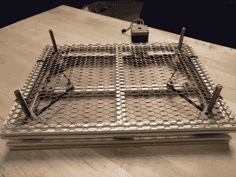

# K40 在开源 Z Table 上占了上风

> 原文：<https://hackaday.com/2019/01/31/k40-gets-a-leg-up-with-open-source-z-table/>

如果你对购买激光切割机做过最粗略的研究，你肯定听说过 K40。K40 通常在网上售价约为 400 美元，与其说它是一台单机，不如说它是一类来自中国不同制造商的非常相似的 40 瓦二氧化碳激光器。正如你所料，要把成本降低到如此之低需要相当大的成本削减，但 K40 仍然可以说是让一台“真正的”激光切割机进入你的商店的最具成本效益的方式。如果你愿意做一些修改，那就更好了。

K40 的缺点之一是缺少 Z 轴，对于需要在越来越深的深度进行多次切割的厚材料，这可能是一个麻烦。[【Aaron Peterson】决定在他当地的 makers space(River City Labs)为 K40](https://gitlab.com/armoredblood/lazr_bed) 设计并建造一个可调节的 Z 形工作台，作为一个了不起的人，他已经在开源许可下提供了这个工作台，这样拥有 K40 的世界就可以从他的工作中受益。

[Aaron]开始设计时设定了许多目标，这些目标确实有助于将该项目从一次性的黑客项目提升为可持续的社区项目。首先，他只想使用容易获得的商用硬件来降低成本。最复杂的组件都应该是 3D 打印的，这样设计就很容易被其他人复制，最后，他希望用户能够在所有维度上进行缩放。最终结果是一个电子控制的升降平台，任何人都可以为任何激光切割机建造。它甚至不必局限于激光切割机；如果你需要精确地升高或降低某物，这种设计可能正是你正在寻找的。

该桌子主要由 15×15 的铝挤压件构成，并使用标准五金店扩展金属丝网作为顶面。通过使用 GT2 皮带和滑轮旋转四个 95 毫米 T8 丝杠来调整高度，这可以防止任何角落与其他角落不同步。连接到一个标准的 NEMA 17 步进电机，这种安排应该很容易能够达到亚毫米精度。看起来似乎[Aaron]已经将控制步进电机作为读者的一项练习，但带有 CNC 屏蔽的 Arduino 可能是最简单的途径。

在过去的几年里，我们已经看到了很多围绕 K40 、[的黑客攻击，从弹簧床垫](https://hackaday.com/2018/12/02/spring-loaded-bed-for-k40-laser-acts-as-an-auto-focus/)到[几乎认不出来的完全重建](https://hackaday.com/2018/07/19/expanding-the-k40-laser-cutter-with-aluminum-extrusion/)。如果你正在寻找一个便宜的激光器，有大量可能的破解和修改，[你可能会比从这个便宜的中国机器](https://hackaday.com/2018/09/27/laser-noob-getting-started-with-the-k40-laser/)开始糟糕得多。