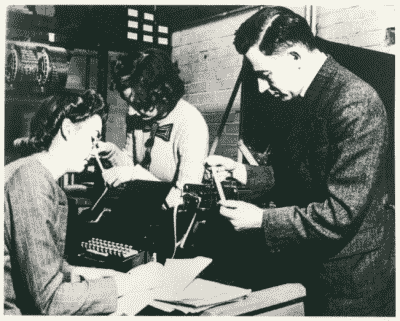
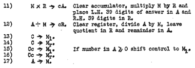
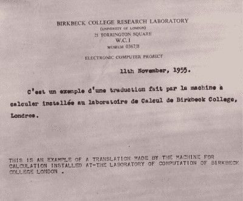

# 凯瑟琳·布斯:在发明组装的同时组装早期的计算机

> 原文：<https://hackaday.com/2018/08/21/kathleen-booth-assembling-early-computers-while-inventing-assembly/>

想象一下，你必须通过重新布线来给你的电脑编程。在 20 世纪 40 年代中期的一段短暂时间里，第一台通用电子计算机就是这样工作的。像 ENIAC 这样的计算机最初没有代码的内部存储。编程需要操作数千个开关和电缆。这些开关和电缆的位置就是程序。

凯瑟琳·布斯开始从事计算机工作时，内部存储程序的想法正开始渗透到建造计算机的一小群人中。因此，她是第一批从事软件工作的程序员之一，并被认为发明了汇编语言。但是她也参与了硬件的工作，她设计了大部分的计算机。她还在自然语言处理和神经网络方面做了一些早期工作。这一切都发生在 1962 年之前，这让她成为了真正的先锋。这就是她的故事。

## 早年

凯瑟琳·布思 1922 年出生于英国伍斯特郡的斯托布里奇，原名凯瑟琳·布里顿。她在伦敦大学获得数学学士学位，并于 1950 年获得应用数学博士学位。到目前为止还没有任何计算机学位。从 1944 年到 1946 年，她是皇家飞机研究所的初级科学官员，然后从 1946 年到 1952 年，她是英国橡胶生产商研究协会(BRPRA)的研究科学家。也是在 1946 年，她开始在伦敦大学伯克贝克学院担任研究助理，后来成为研究员和讲师。

## 在伯克贝克学院建造计算机

Kathleen, Xenia Sweeting and Andrew working on the ARC in 1946, Source: [Birkbeck](http://www.dcs.bbk.ac.uk/site/assets/files/1029/50yearsofcomputing.pdf)

在伯克贝克，计算机研究是由安德鲁·布斯完成的，凯瑟琳最终会和他结婚。安德鲁之前在伯明翰大学做过 X 射线晶体学研究，其中包括大量的计算。这使他走上了制造计算机以使工作更容易的道路。接下来，他在 BRPRA 做了一段时间的研究物理学家，开始研究 ARC，即自动继电器计算机(有时也称为自动继电器计算器)。它使用纸带作为输入，实际上是一台用作傅立叶合成器的专用计算机。

1946 年，他在伯克贝克担任纳菲尔德研究员。他继续在 ARC 上工作，但由于学院没有空间，而且因为 BRPRA 提供资金，工作在他们的设施上完成。就在那时，他遇到了凯瑟琳。凯瑟琳和另一名研究助理西尼亚·斯威廷帮助安德鲁继续建造 ARC，事实上完成了大部分的建造工作。

## 在普林斯顿待了 6 个月

1945 年，约翰·冯·诺依曼写了一份名为 [*的文件，这是一份关于*](https://fa82ee93-a-62cb3a1a-s-sites.googlegroups.com/site/michaeldgodfrey/vonneumann/vnedvac.pdf?attachauth=ANoY7cqS3xeSf8HJhohgh1_veQp08BEyZ0CCmOo6_8tmtTWRAXLeIqbrZB3tSIDiwzZ4RT4BYR4uCpc_rknA-Q3eblu6zFtXjp2H3ThcqXfjT5YXeHK9hCYg7H7yw5zuTvxbpZDpR4GPlwK9WDxNJA6g5LWdXewv9Q9rAwzMa4KvMyE_yqYP6kJwdr6rBfmSE-j2K8k_X5mdVd-D_QADagNGd3S5CBb7zlVgZOw9G_9j-rxl6AHpeBA%3D&attredirects=0)EDVAC 的报告初稿，其中他描述了计算机的冯·诺依曼架构。在书中，他定义了计算机的组成部分，特别是存储在计算机内存中的程序。因此，它有时也被称为存储程序计算机。

1947 年，通过洛克菲勒基金会和 BRPRA 的资助，安德鲁和凯瑟琳与冯·诺依曼一起进行了为期 6 个月的美国之旅，安德鲁在上次访问中见过他。这次旅行是在新泽西州普林斯顿的高级研究所进行的。

这次参观也是布思第一次听说冯·诺依曼建筑。这让安德鲁重新设计了 ARC，仅用了两个月就设计出了机器的继电器部分，推出了有时被称为 ARC2 的产品。还是在 1947 年，凯思琳和他还写了两份关于此事的报告，分别是通用电子数字计算机设计的一般考虑和计算机代码的 T2。第一份报告广为流传，甚至还出了第二版。在书中，他们详细说明了冯·诺依曼架构的机器需要什么，概述了内存的许多不同选项。

## 发明早期汇编语言

 我唯一能找到的*编码 A.R.C.* 的地方是研究所书架上的硬拷贝，这很不幸，因为它通常是 Kathleen 第一次概述她的 ARC2 汇编语言或 autocode 的地方。她还为它编写了汇编程序。

另一份[报告](http://mt-archive.info/Booth-1947.pdf)大约在同一时间发布，虽然它给出了 ARC2 机器语言的缩写符号，但我怀疑这不是汇编语言。在那份报告中，她首先解释了我们现在称之为指令的指令是如何用载入某种存储器的 0 和 1 来表示的。对于 ARC2，`10011`是清除算术寄存器并将值从存储器传输到寄存器的命令。今天，我们称之为机器语言。在简写符号中，她给出了与`M -> cR`相同的顺序。

## 电子计算机

安德鲁·布斯的下一台计算机是完全电子化的，被称为 SEC(简单电子计算机)。其后是 APE(*)C(通用电子计算机)，其中*将由代表发起人的字母代替。

凯瑟琳也为这两台电脑编写软件，但与 ARC 和 ARC2 不同，她不做任何构建工作。

## 自然语言处理

1947 年，为了获得洛克菲勒的资助，布斯将自然语言处理工作添加到他们的项目列表中。目标是实现准确的技术翻译，而不是文学质量。在他们的书《自动数字计算器 中，他们概述了他们和同事们直到 1965 年一直在研究的一些算法，从单词替换和词干词尾处理开始。虽然他们在伯克贝克学院和他们的学生一起做了很多关于 NLP 的工作，但也有记录显示他们在 1965 年至 1972 年间为加拿大国家研究委员会做英法翻译。

French-English translation, Source: [Birkbeck](http://www.dcs.bbk.ac.uk/site/assets/files/1029/50yearsofcomputing.pdf)

## 20 世纪 50 年代的神经网络

作为她开创性工作的另一个例子，伯克贝克学院 1958/59 年度报告说，凯瑟琳编写了一个程序来模拟神经网络，研究动物识别模式的方式，次年的报告提到了她在字符识别神经网络方面的工作。这距离神经网络首次在计算机上运行仅四年时间。

## 去加拿大

布斯于 1962 年离开伯克贝克学院，两人都去了加拿大，先后在萨斯喀彻温大学和 1972 年的莱克海德大学工作。她于 1978 年从莱克海德退休，但一篇文章搜索显示，她和她的儿子伊恩·j·m·布斯博士在 1993 年发表了一篇题为*使用神经网络识别海洋哺乳动物*的论文，当时她已经 71 岁了，仍然很健康。