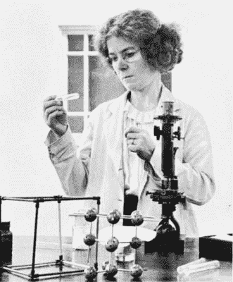
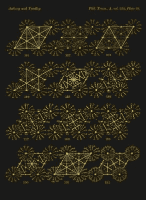
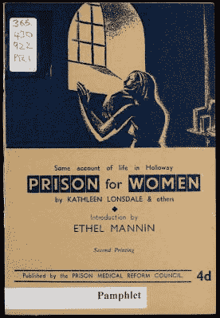

# 凯瑟琳·朗斯代尔看穿了苯的结构

> 原文：<https://hackaday.com/2021/06/29/kathleen-lonsdale-saw-through-the-structure-of-benzene/>

新技术的不言而喻的承诺是，它们将推进和增强我们对世界的认识——对于那些专门设计来让我们比以往任何时候都能够更近距离地观察物理世界的技术来说，这一点更加明显。其中一项进步是 X 射线结晶学的发明，它让科学家们能够窥视分子内原子的空间排列。凯瑟琳·朗斯代尔(Kathleen Lonsdale)在 X 射线晶体学于 20 世纪初被发现后不久就进入了它的底层，并利用它决定性地证明了苯分子是由六个碳原子组成的扁平六边形，一劳永逸地结束了长达几十年的科学争论。

苯是一种无色易燃液体形式的有机化合物。它有许多用途，如作为汽油的添加剂，也用于制造塑料和合成橡胶。它也是一种很好的溶剂。尽管苯的分子式早已为人所知，但它的尺寸和原子结构在六十多年里仍然是个谜。

Kathleen Lonsdale 是结晶学的先驱，他开发了几种利用 X 射线研究晶体结构的技术。她才华横溢，但她也谦逊、勤奋、适应性强，尤其是在她管理三个年幼的孩子和一个崭露头角的化学职业生涯时。第二次世界大战爆发时，她因坚定的和平主义在监狱呆了一个月，后来致力于监狱改革，习惯性地参观女子监狱。

战后，凯瑟琳周游世界，支持促进和平的运动，并经常被邀请就科学、宗教和妇女在科学中的作用发表演讲。她一生获得了许多荣誉，并于 1956 年成为大英帝国女爵士。在此之前，她以自己的贡献为有机化学增光添彩。

## 从数学到物理到化学

Kathleen in the lab. Image via [Britannica](https://www.britannica.com/biography/Kathleen-Lonsdale)

凯瑟琳·亚德利于 1903 年 1 月 28 日出生在爱尔兰。她是哈利和杰西·亚德里的第十个也是最后一个孩子。她的父亲哈里是镇上的邮政局长，他把大部分空闲时间都花在了阅读上。凯瑟琳说她对事实的热情来自于她的父亲。

不幸的是，她父母的婚姻结束了，杰西把孩子搬到了英国。杰西是一个严格的浸信会教徒，凯瑟琳说她最早的记忆是去教堂和在学校用黄色小球学习数数。

凯瑟琳获得了一所女子高中的奖学金，后来进入一所男子高中学习数学和科学课程，而女子学校并不提供这些课程。她的哥哥姐姐被迫辍学，以便他们可以找到工作，帮助支持家庭。她的一个兄弟弗雷德是无线电操作员，接收泰坦尼克号发出的最后信号。

十六岁时，凯思琳赢得了县奖学金，进入伦敦大学的贝德福德女子学院。她开始走上数学道路，但很快转向物理，1922 年，19 岁的她以学校十年来的最高分获得了理学学士学位。她担心找不到工作，当 X 射线衍射的先驱、1915 年诺贝尔物理学奖获得者威廉·亨利·布拉格爵士邀请她留下来，在她攻读硕士学位期间，带薪加入他在大学的结晶学研究团队时，她感到惊讶和荣幸。1929 年，凯瑟琳被皇家学会法拉第实验室授予科学博士学位。

布拉格爵士被证明是一位相当鼓舞人心的导师和监督者，凯瑟琳这样评价他:

> 他用自己对纯科学的热爱和热情的探索精神激励了我，同时让我完全自由地从事自己的研究。

A plate from the Astbury-Yardley Tables. Image via [Data is Nature](https://www.dataisnature.com/?p=2154)

## 解码苯环

1923 年，W.H .布拉格去了伦敦的皇家学院，凯瑟琳和他一起去了。大约就在这个时候，X 射线晶体学开始被用于观察有机分子内部——附着有其他元素原子的碳原子。这个过程涉及大量的计算，凯萨琳发现需要结晶学查找表来大大加快速度。他们和她的实验室伙伴一起创建了阿斯特伯里-亚德利表，这为后来的国际 X 射线晶体学表奠定了基础。

在皇家学院时，凯思琳遇到了托马斯·朗斯代尔，一名工程系学生，后来成为她的丈夫。他们于 1927 年结婚，然后搬到利兹以适应他的新工作。与此同时，凯瑟琳加入了利兹大学物理系，从事 X 射线衍射的研究。

凯瑟琳是在利兹大学成名的。几十年来，化学家们一直在争论苯的原子结构。1865 年，化学家奥古斯特·库克勒做了一个梦，梦里看到了苯的结构。他看到原子四处飞舞，变成了大毒蛇——一条吞下自己尾巴的蛇。凯瑟琳被给予六甲基苯晶体进行研究，并且在 1929 年她能够决定性地证明苯分子实际上是一个平环。这是一个了不起的成就，尤其是考虑到所有的计算都必须手工完成。似乎这还不够，Kathleen 还是第一个将傅立叶方法应用于 X 射线图案分析的人，她解决了另一种苯——六氯苯的结构。

Benzene structures throughout history. From left to right: Claus (1867), Dewar (1867), Ladenburg (1869), Armstrong (1887), Thiele (1899), and Kekulé (1865). The two on the right are used today, since Kathleen Lonsdale proved its cyclical structure in 1929\. Image via [Wikipedia](https://en.wikipedia.org/wiki/Benzene#/media/File:Historic_Benzene_Formulae_V.3.svg)

同年晚些时候，凯瑟琳的第一个孩子简出生了。这个家庭很快搬回伦敦，并在 1931 年和 1934 年又有了两个孩子——南希和斯蒂芬。尽管搬家和抚养孩子极大地扰乱了凯瑟琳的工作，但她仍全神贯注于结晶学游戏，一有时间就手工计算结构因子。很快，布拉格爵士分享了一个好消息:他得到了一笔津贴，这样凯瑟琳就可以雇一个保姆，然后回到皇家学院工作。

当凯萨琳回来时，她没有 x 光仪器可用。相反，她找到了一个大电磁铁，于是她开始追求另一个兴趣——确定被称为芳烃的类苯化合物的磁性。通过这样做，她能够建立分子轨道的证据，但是另一个化学家莱纳斯·鲍林在她之前发表了论文。

## 因为她的信仰而入狱

Kathleen’s account of her time in Holloway Prison. Image via [Wikipedia](https://commons.wikimedia.org/wiki/File:Prison_for_Women_by_Kathleen_Lonsdale._1943._(22149638693).jpg)

成年后，凯萨琳拒绝接受浸礼会的教育。她和托马斯加入了主要是和平主义者的贵格会。凯瑟琳拒绝在二战中报名参军，尽管这是每个人都期望的。她被罚款 2 英镑，但她拒绝了，这使她在霍洛韦监狱呆了一个月。

凯萨琳不得不在那里擦地板和做其他工作，但这些杂务并没有太多限制——她在大多数日子里都设法参与几个小时的科学工作。她在霍洛韦的时光深深触动了她，她后来为监狱改革而斗争，并成为女子监狱的志愿者访问者。

在皇家研究所的最后一段时间，她检查了人造和天然的肾结石和钻石，研究了固态反应，并开发了发散光束 X 射线摄影技术。

凯瑟琳也加入了争取世界和平的斗争，并获得了许多荣誉和奖励，包括 1956 年获得女爵士称号和皇家学会会员资格。

感谢 skookum 提示，[AvE]！