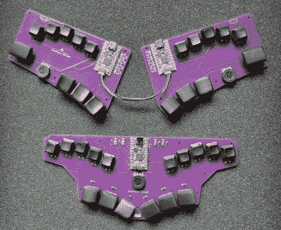
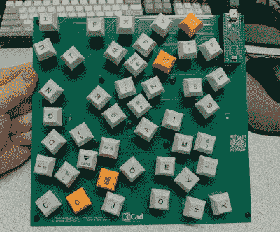
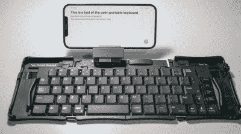

# 和克里斯蒂娜一起跳舞:用圆珠笔打字机的那个

> 原文：<https://hackaday.com/2022/02/10/keebin-with-kristina-the-one-with-the-ballpoint-typewriters/>

所以你想在打字的时候尽量减少手指的移动，但是没有 3000 美元买一个旧的 DataHand，或者没有足够的时间来制作开源的 lalboard？[看看这两个来自【south paw engineer】](https://www.reddit.com/r/ErgoMechKeyboards/comments/si320r/two_board_concepts_that_minimize_finger_movement/)的概念 keebs，它们看起来只是和弦板。

home 行上的每一个键都是一个五向开关——就像一个直接向下输入的 D-pad。[SouthPawEngineer]将它们设置为每个覆盖一个 QWERTY 列。所以像，对于左小手指开关，上是 Q，右是 A，下是 Z，左是 1。从技术上讲，分裂有 58 个键，而统一有 56 个键。

这两个 keebs 都使用 KB2040 板，这是 Adafruit 对这些咆哮的 2020 年代键盘制造热潮的回应。这些小电路板当然很容易用 CircuitPython 编程，circuit python 支持流行的 QMK 的分支 KMK。感谢提示，[foamyguy]！

## 新款 Keebs:glove 80 是一款适合所有人的款式

尽管我很喜欢我的 Kinesis 优势，但它是家庭使用的理想键盘，不一定适合其他地方。除非我想让我的重复性压力损伤重新出现，否则我不可能回到长方形，所以我需要一个符合人体工程学的户外分体。几乎任何分裂都比身势术更容易移植，但并不是所有分裂都是一样的。到目前为止，我发现 ErgoDox 对我的手来说太大了，我还没有让我的手指一直工作，所以没有数据。因此，我对 Glove80 更感兴趣，这是一款低调的拆分产品，可以通过[资金充足但仍然活跃的 Kickstarter](https://www.kickstarter.com/projects/moergo/glove80-the-incredibly-comfortable-ergonomic-keyboard) 获得。它有 Kailh Chocs，POM 键帽，使用一对 nRF52840s。

Glove80 背后的设计者是狂热的爱好者——一位企业家和工程师，他们用手指触摸了 18 年的 ergo 键盘。他们做了 500 多项人体工程学实验，并建造了[看起来非常酷的模块化测试设备](https://www.linkedin.com/pulse/repetitive-strain-injury-rsi-how-ultimate-ergonomic-keyboard-created-/?msgControlName=reply_to_sender&msgConversationId=2-ODQ5ZjFjMWEtZmZkZi01Y2QyLWEzMTAtM2IxZDk4YzJhMTA2XzAwMA%3D%3D&msgOverlay=true&trackingId=QybtDH0zwx0IuopBXgwhow%3D%3D)，以便建造一个据称适合所有手尺寸的键盘。他们原本不打算将这种键盘商业化，但幸运的是，有人说服他们应该与世界共享。

这种蓝牙分体式有 80 个低调的按键(因此得名)，所有按键的大小都一样——1u。这使得你可以随心所欲地交换布局和键帽。这款键盘最吸引人的地方是选择:目前，你可以选择红色、棕色或白色开关，并且有一个针对第四种开关类型的延伸目标，将进行投票。

## 物理学设计的 Keeb

 正如【Foone】在推特上指出的([ThreadReader 版)](https://threadreaderapp.com/thread/1482114631913115650.html)前几天，我们所知道的键盘布局已经从打字机及其操作限制中传承下来。但是我们可以把这些都扔出窗外，因为我们现在有了数字键盘。

为此，[Foone]让物理学来设计这种布局(如果你可以这样称呼它的话)，本质上是把所有的键放在一个虚拟的罐子里，罐子里有一些间隔球，摇动罐子，让字母、符号和修饰语落在它们可能落的地方。

如果你认为在这上面打字会是一场噩梦，考虑一下布线。[Foone]用的是 Teensy++ 2.0，有 45 个 GPIO 管脚，所以不需要矩阵或者二极管。这本质上是一个昂贵的笑话，但也有一定的道理。如果没有别的，就让这个有趣的练习作为一个灵感吧——它允许你把人体工程学放在第一位，或者当涉及到键盘设计时给你松饼涂黄油的任何东西。感谢提示，[J. Peterson]！

## 历史的噼啪声:圆珠笔打字机会吸引你

 串行键盘设计师【deʃhipu】向我透露了[这个来自【保罗·里卡德】(](https://twitter.com/paulrickards/status/1482114631913115650) [ThreadReader 版本](https://threadreaderapp.com/thread/1482114631913115650.html))的关于圆珠笔打字机的旧 Twitter 帖子，有点像文字处理器和笔式绘图仪之间的私生子。在正常情况下，用户在键盘上打字，字符每次出现在一个小屏幕上大约 20 个，这给了它在将单词发送到打印头之前纠正错误的机会。

当通过 RS-232 串行端口连接到计算机时，这些机器可以使用 Alps 绘图仪机制和红色、蓝色、绿色和黑色的微型圆珠笔绘制从图形到图形艺术的各种东西。帖子里有很多漂亮的图片，展示了这些年来不同的品牌和型号，所以去看看吧。

## ICMYI:掌上便携式键盘无线化

 好吧，你可能再也没有掌上设备了，但你几乎肯定会随身携带一部智能手机。如果你能使用 Palm 革命性的(当时的)折叠键盘，它能整齐地折叠成口袋大小，那不是很酷吗？是的，会的。

现在你可以了，多亏了[陈新明]和[他们整洁的小蓝牙适配器](https://hackaday.com/2022/02/08/palm-portable-keyboard-goes-wireless/)。它本质上是一个 Adafruit Feather nRF52840 和一个电压电平反相器，可以将键盘的 RS-232 转换为蓝牙主机的 TTL，所有这些都在一个整洁的 3D 打印封装中，可以滑动到键盘的连接器上，并通过一个微小的隐藏开关通电。不喜欢什么？你不会相信 kee-bay 上这些折纸材料有多便宜和丰富。我拿了我的，给你们留了很多。

* * *

有关于键盘的热门提示吗？通过发送一两个链接来帮助我。不想让所有的黑客抄写员看到它？欢迎[直接给我发邮件](mailto:kristinapanos@hackaday.com?Subject=[Keebin' Fodder])。