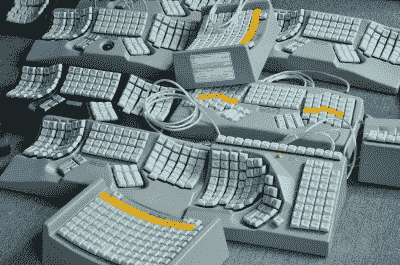
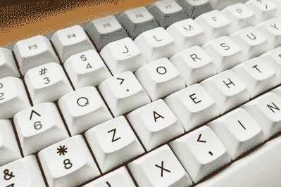
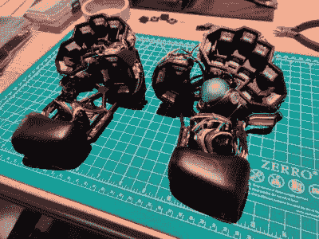
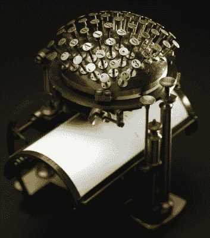
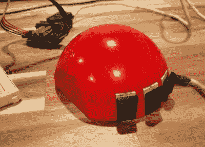

# 和克里斯蒂娜一起跳舞:戴着手套的那个

> 原文：<https://hackaday.com/2021/09/21/keebin-with-kristina-the-one-with-the-grabbity-gloves/>

我一直说我需要远离拍卖网站，但那样我就不会有那么多黑客日的素材了，不是吗？当我写这篇文章时，我正在等待一台戴尔 at 101 w T1，这将是我第一台带有 Alps 开关的 keeb。嗯，希望它有阿尔卑斯山 SKCM 鲑鱼或黑色开关——根据 Deskthority，它可能有橡胶圆顶。如果它没有键盘，我可能会抢救开关，并建立更符合人体工程学的东西。无论如何，我认为我们需要一个关于 Alps 交换机的帖子，因为有些人认为他们甚至比 Cherry MX 交换机更好。

## 给我做麦芽酒

说到忠实的 Cherry MX 爱好者，Maltrons 可以说是人体工程学键盘的老爷爷，生产它们的英国公司自 20 世纪 70 年代就已经存在了。他们不仅是第一个使用凹键井的人，Maltron 也采用了他们的设计，制造了一些第一只手和嘴驱动的键盘。他们甚至有内置轨迹球的键盘。

A small fortune in keyboards. Image via [Maltron](https://www.maltron.com/)

双手弯曲的马尔特龙绝对在我的圣杯竞争者的短名单上。这些键盘中的每一个都是手工精心布线的，所以它们相当昂贵——即使是那些已经在美国本土的键盘。对于一个键盘来说，700 美元是很难接受的，我可能不喜欢它，因为它激发了 [Kinesis Advantage](https://hackaday.com/2020/03/03/inputs-of-interest-my-first-aggressively-ergonomic-keyboard/) 。

但好消息是 [Maltron 提供了一个可定制的 DIY 工具包！](https://www.maltron.com/bespokecustom-keyboards.html)他们按菜单出售所有产品，从注塑外壳到 Teensy 2.0 再到键帽，这些产品要么带有激光标识，要么根本没有标识。我们没有看到任何关于操作手册的东西，所以你只能靠自己来安装。

如果我想要的只是外壳和轨迹球，那只要 120 英镑加上运费和增值税。但是，除非我能在美国找到一个配件经销商，否则光是这两个配件的运费就可能会让我自己建造一个配件的吸引力大打折扣。我必须仔细考虑一下，并得到一个运输报价。

## 单手键盘也可以 DIY

Beautifully clean DSA ‘caps. Image via [New York Times](https://www.nytimes.com/wirecutter/blog/search-for-the-perfect-mechanical-keyboard/)

我们不确定独臂作家[Britt H. Young]是否尝试过 Maltron，但无论如何，她对完美机械键盘的追求都是一个很好的选择。

[Britt]首先回顾了联邦安全橙色键盘皮肤和单手 Dvorak 布局，这在小学打字课上引起了如此多的负面关注，所以单手 Maltron 可能是一个过于临床的解决方案。在弯曲的键井和直排式布局之间，需要适应很多东西。除了不好的回忆，[Britt]一直喜欢响亮的键盘，渴望像过去一样噼啪作响。

幸运的是，现在是 2021 年，有很多选择可以让你打造自己的键盘。有些键帽配置文件不适合[Britt]要求的密钥交换，但 DSA 可以。正是因为这个原因，[Britt]选择了 Tofu65 板和 Kailh whites 以及这里显示的这些漂亮的 DSA 键帽。快乐噼啪声，[布里特]！

## 动手黑客:贪婪的手套

Image via [r/ErgoMechKeyboards](https://www.reddit.com/r/ErgoMechKeyboards/comments/oywuqd/introducing_the_grabbity_gloves/)

信不信由你，这是[loopsbellart]的第一个版本，他们已经在玩假设游戏了。如果每个键都在主行，或者至少尽可能靠近主行，会怎么样？这是 Grabbity 手套背后的理念。

这种赛博朋克的美让我们想起了[拉板](https://hackaday.com/2021/04/02/adjustable-low-impact-keeb-is-about-as-comfortable-as-it-gets/)，启发它的[数据手键盘](https://hackaday.com/2020/04/20/inputs-of-interest-the-differently-dexterous-datahand-directionalizes-digits/)，以及同样简约的 [Squeezebox](https://hackaday.com/2021/04/26/where-were-going-we-dont-need-keycaps/) 。但是在这种情况下，手指只是推拉，而不是向下压。我们不确定，但那可能会更好。我们将不得不自己制造一个并找出答案，以[loopsbellart]为榜样，至少在向前驱动的开关中放置更轻的弹簧。

由于一对 nRF52840s，Grabbity 手套是完全无线的。他们的主大脑是一个运行 BlueMicro 固件的 BlueMacro840，但如果你想运行 QMK，840 与 Arduino Pro Micro 引脚兼容。虽然[loopsbellart]不打算出售这些，但他们愿意发布 STL 文件。[这是 Grabbity 手套的 gif 图](https://imgur.com/a/51v44T5)。

## 历史克拉克斯:马林-汉森写作舞会

Image via [r/SpecializedTools](https://www.reddit.com/r/specializedtools/comments/eqjeen/the_hansen_writing_ball_the_first_commercially/)

早在凹键排列的想法出现之前，就有了这种凸型打字机，看起来像一个针垫或一只迟钝的豪猪。打字条(如果你可以这样称呼它们的话)与键盘的方向成直角。没错，它是横着打字的，[早期的机型挡住了用户对结果的查看](https://www.thevintagenews.com/2016/06/22/hansen-writing-ball-invented-1865-worlds-first-commercially-produced-typewriter/)。当你写满一页纸时，纸会通过电磁铁以柔和的弧线前进。后来的版本使用机械擒纵机构。

Malling-Hansen 书写球是第一款商业化销售的打字机，比 Scholes & Glidden 的 Remington I(QWERTY 布局)早几年上市。这种球是由拉斯姆斯·汉斯·马林·约翰·汉森牧师发明的，他是哥本哈根一所聋哑学校的教师兼主任。

汉森希望他的学生能够用手指说话，从而创造出易于快速使用的球。还制作了其他一些模型，包括电报模型、密码模型和盲人模型。这种车只生产了 200 辆左右，目前仍有 40 辆左右。

### 尼采很在行

> “写字球就像我一样:由铁制成，但在旅途中很容易扭曲。
> 
> 耐心和机智是非常必要的，使用我们也需要灵巧的手指。"
> 
> 弗里德里希·尼采

当弗里德里希·尼采的视力开始衰退时，正常的书写方式会让他头痛欲裂。根据写给他姐姐的信，尼采与拉斯姆斯·汉森有直接联系，并在 1882 年将最新和最伟大的书写球版本寄给了他。

不幸的是，[消息来源表明他无法使用它，因为它在运输过程中被损坏了](http://www.malling-hansen.org/friedrich-nietzsche-and-his-typewriter-a-malling-hansen-writing-ball.html)，而他带去的修理工只是进一步损坏了它。他一定在某个时候修理或更换了它，因为他对它着迷到写了一首关于它的诗。

如果你想看这种噼啪声，你很幸运。一个人(Felix Herbst)制作了一个书写球的模型，并制作了一个动画来展示它的动作，你可以在下面看到。【Felix】还做了[一个交互版](http://felixherbst.de/?p=nietzsches_schreibkugel)，可以让你用原来的字体打字母，发送或者打印，但是好像坏了。

[https://player.vimeo.com/video/43124993](https://player.vimeo.com/video/43124993)

## 这只老老鼠

 是的，我知道——这是 Keebin，而不是 Mousin，但自从上一次以来，与输入相关的黑客攻击一直是鼠标密集型的。此外，[这款老式 Depraz 鼠标上的按钮看起来又响又诱人，有点像凯尔·乔克斯](https://hackaday.com/2021/08/09/this-old-mouse-building-a-usb-adapter-for-a-vintage-depraz-mouse/)。

现在[John Floren]已经使用 Arduino Pro Micro 为这个可爱的鼠标建立了 USB 适配器，他报告说手感很好，按钮的点击感也令人满意。你可以在简短演示视频的结尾听到它们。

* * *

有关于键盘的热门提示吗？通过发送一两个链接来帮助我。不想让所有的黑客抄写员看到它？欢迎[直接给我发邮件](mailto:kristinapanos@hackaday.com?Subject=[Keebin' Fodder])。