# 克里斯蒂娜的“Keebin ”:六边形键盘的那个

> 原文：<https://hackaday.com/2022/09/15/keebin-with-kristina-the-one-with-the-lego-keyboard/>

嗯，我不是说整个夏天都不去基宾，只是事情就这样发生了。你可能会认为是第 13 版把我绊倒了，但我们还没到那一步——这只是第 12 版。我一直在想我应该写一个，但它并没有发生，直到我从[s.ol bekic]那里得到了一个关于他们的[令人惊叹的六边形键帽](https://s-ol.nu/hex-caps)和将[制作成具有相同](https://s-ol.nu/0xC.pad)的开源 12 键宏 pad 的旅程的提示。

但是让我们倒回去一点。最初，[s.ol]从零开始设计了一个完全病态的混合 MIDI-and-typing 键盘，这个[你可以在这个短视频](https://www.youtube.com/watch?v=GDOJF7oPh4s)中看到。它会发光，分裂成两半，然后又令人满意地重新合在一起。你可能注意到了六边形的键帽，它们看起来像是被印刷或研磨过的，或者甚至是被印刷然后研磨过的。

实际上，【s . ol】[在这个键帽项目](https://fabacademy.org/2020/labs/opendot/students/sol-bekic/log/15/)上抛下了所有的工序——铣削、成型铸造、3D 打印。它们都不够好，无法通过原型阶段，但最终，[s.ol]与 fkcaps.com 联手，创造并提供了一个注射成型的版本，我真的真的很想摇摇我的指尖。还好我能买到便宜的。

[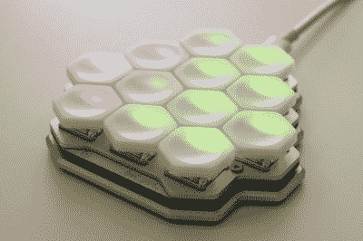](https://hackaday.com/wp-content/uploads/2022/09/OxC_macropad.jpg) 当然，[真正的过程是【s.ol】一路走来](https://kbd.news/HEX-keycaps-1526.html)所做的所有学习——无论是在制作混合键盘的早期，还是在与 fkcaps 合作将键帽和附带的 macropad 制作成真正的产品之后。这是在所有的设计工作之后，才得到这个新奇的蜂巢结构。

如果你想知道的话，这些只适用于 Kailh chocs，但不管是哪种开关，间距都非常重要，因为设计中可能会引入摩擦点。请务必查看[键帽文档页面](https://hw.s-ol.nu/HEX-keycaps/)、[宏键盘文档页面](https://hw.s-ol.nu/0xC.pad/)和[键帽和宏键盘图库](https://drive.google.com/drive/folders/1ddoZGplpFRmC8NY9qAE5N-BPgVxHqLr3?usp=sharing)。

## 看看这个:计划一个“T”我的网络甲板三

[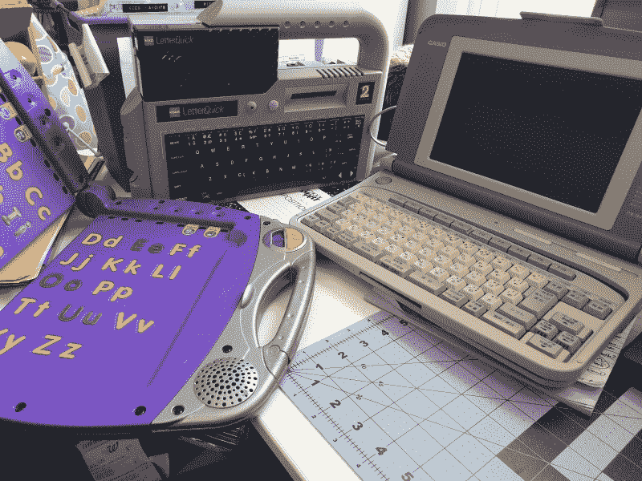](https://hackaday.com/wp-content/uploads/2022/09/cyberdecks_three.jpg)

在 [Hackaday Podcast #184](https://hackaday.com/2022/09/09/hackaday-podcast-184-what-is-art-bulk-tape-eraser-go-brr-and-the-death-of-email/) 上，我稍微梳理了一下我的 cyberdeck 计划，并提供了我的三个主题的这张图片——一个带有内置打印机的卡西欧文字处理器、一个奇怪的旧标签制作系统，以及一个为儿童设计的折叠式电子书，它给你贴在里面的一套特殊的枯树书增加了一层伴随噪音。

我拥有全日本的卡西欧 PX-9V 文字处理器大概有一两年了。当我拿到它的时候，我真的很兴奋，最终我把它大部分拆开了，但后来我真的不知道从那里去哪里。我怀疑我是否能重复使用屏幕，但这很好——问题是我不知道如何去做。我也想重新使用键盘，因为它是如此该死的赛博朋克看起来这个美国人。只有在我的梦想中，我才能保留打印功能。所以我退后，把它放下。

 [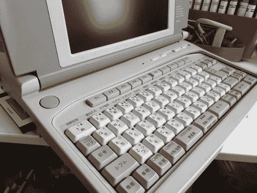](https://hackaday.com/2022/09/15/keebin-with-kristina-the-one-with-the-lego-keyboard/binary-comment-62/) Just look at all those thumb keys! And the floppy drive. . . [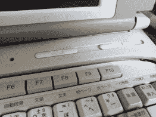](https://hackaday.com/2022/09/15/keebin-with-kristina-the-one-with-the-lego-keyboard/binary-comment-64/) Mmm, sliders. [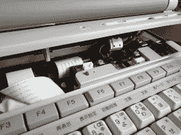](https://hackaday.com/2022/09/15/keebin-with-kristina-the-one-with-the-lego-keyboard/binary-comment-61/) Ugh, you can’t see much. [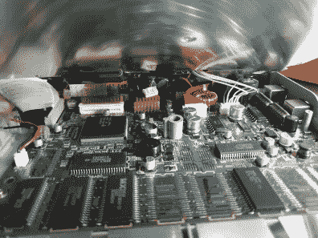](https://hackaday.com/2022/09/15/keebin-with-kristina-the-one-with-the-lego-keyboard/binary-comment-65/) Until you lift up the keyboard! [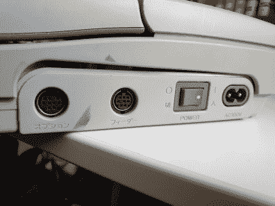](https://hackaday.com/2022/09/15/keebin-with-kristina-the-one-with-the-lego-keyboard/binary-comment-63/) Woo, mystery ports!

### 处理事情

[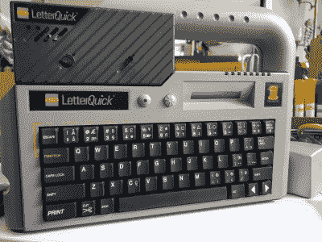](https://hackaday.com/wp-content/uploads/2022/09/k-sun.jpg)

I love that it has two little round feet for standing upright.

但是几个月前，[汤姆·纳尔迪]给我指了一个标签制造商，它有一个非常厚的把手。在威胁要把他自己的加入我们的 Cyberdeck 竞赛和竞赛本身之间，火花这次以更高的温度被重新点燃。

K-Sun LetterQuick 真的感觉像是一个发现，因为尽管我在互联网上找不到真正提到它的地方，但这个特别的东西通过原始的盒子和手册等方式找到了我。

我只是喜欢这个东西的外观，键盘也不太糟糕，尽管听起来比摸起来更好。我知道这只是一个花哨的标签制造商，但如果你想要一个全键盘，全尺寸的按键，为什么不使用好的开关呢？

无论如何，我想我会在墨盒现在所在的左上角放一个屏幕，也许我可以打印一个边框，并为它建立一个上翻/下翻铰链，这样它就可以折叠起来。希望我可以在某些事情上重复使用 LCD，尽管它是放置一些滑稽的大按钮的好地方。

### 确切地说，是费雪牌电脑

[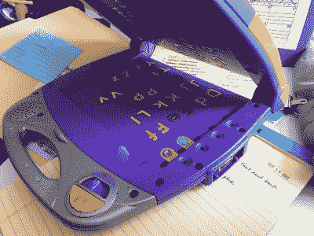](https://hackaday.com/wp-content/uploads/2022/09/purple_power_touch.jpg)

C is for Cyberdeck.

在我等待 K-Sun 到来的时候，我在旧货店找到了这台紫色的故事书笔记本电脑。这个东西——一个 Fisher-Price PowerTouch 学习系统——正在乞求成为 cyberdeck 的素材，介于坚固的塑料，显示区域现存的凹陷，以及右侧运行的一排 led 之间，我肯定会重新利用它来随机闪烁什么的。

半月形的开/关开关看起来有点粘，但无论如何它不是一个电源按钮的好地方，所以我们看看会发生什么。它上面的紫色部分是一个带有制动器的音量滑块，我不知道现在该怎么做。

我最担心的是两部分之间的电线，因为它有很大的间隙。我希望铰链的一部分是空心的，我可以把电线穿过去。最有趣的一点是侧面奇怪的专有墨盒端口——如果我不能在里面安装一个像样的键盘，我可能会像任天堂 DS 一样让它双屏，并使用墨盒端口插入 Kinesis。

## 插页:[杰罗普兰]在仙境中的实践

[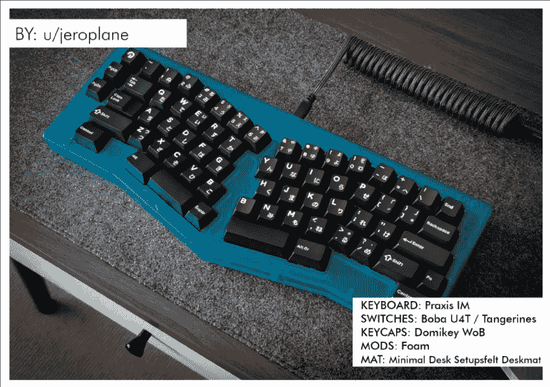](https://hackaday.com/wp-content/uploads/2022/09/centerfold.png) 爱丽丝构型有一些东西引起了我的兴趣，这个爱丽丝式的数字也不例外。通常情况下，桌垫/桌子/地板的调色板会让我厌烦，但是天哪，那个键盘真的把所有东西都融合在一起了。我很喜欢这个东西的外壳——它让我想起了 Tron 和那些彩色的 iMacs。

虽然颜色有点暗，但我敢打赌桌垫摸起来感觉非常好，看起来像是把键盘牢牢固定住了。感谢[该死的精致键盘](https://www.nerdbude.com/dfk/issues/ISSUE_03.pdf) (PDF)的【Philipp】为细节添加了桌垫，感谢【jeroplane】为我提供了一个新的桌面壁纸来进行旋转。

## ICYMI:网络甲板竞赛和宝宝的第一次聚会

[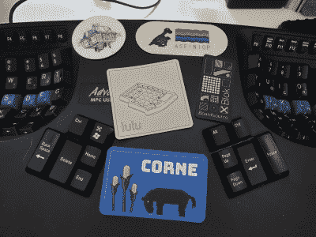](https://hackaday.com/wp-content/uploads/2022/09/kinesis_with_stickers.jpg) 除非你一直生活在没有无线网络的岩石下，否则你可能知道[我们正在举办一场网络竞赛](https://hackaday.io/contest/186672-2022-cyberdeck-contest)。虽然我没有资格赢得任何奖项，但我可能会及时启动费雪牌，尽管我怀疑它能否在 9 月 30 日截止日期前完成。

下面是我已经做过的事情——去参加我的第一次键盘聚会！(他们通常离我住的地方有数百英里/公里远。)我以为我带了很多键盘，但实际上，我应该带更多的。太棒了，有很多照片可以看，我等不及下一张了！如果你在中西部，但离堪萨斯城比芝加哥近，[来看看 MKKC Discord](https://discord.gg/Q77bshMQDe) ，成为我们中的一员！

* * *

有关于键盘的热门提示吗？通过发送一两个链接来帮助我。不想让所有的黑客抄写员看到它？欢迎[直接给我发邮件](mailto:kristinapanos@hackaday.com?Subject=[Keebin' Fodder])。