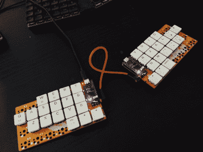
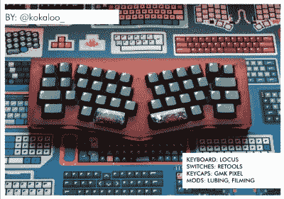
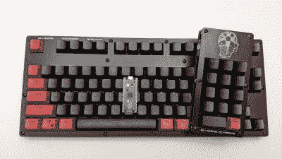
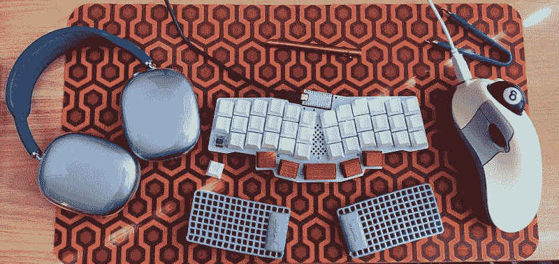
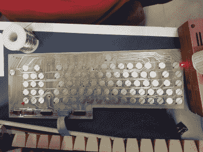
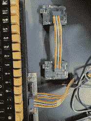
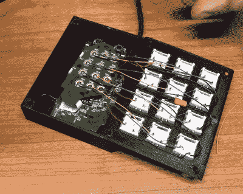

# 和克里斯蒂娜一起跳舞:戴着高高的键帽的那个

> 原文：<https://hackaday.com/2022/03/14/keebin-with-kristina-the-one-with-the-really-tall-keycaps/>

 大约一个月前，[意想不到的制造者]完成了他们的 TinyS3，一个 ESP32-S3 开发板。由于该芯片支持真正的 USB 和蓝牙，所以[ deʃhipu 想知道它在键盘上的表现如何。

就这样，[vegemite 三明治](https://hackaday.io/project/184163-vegemite-sandwich-keyboard)诞生了，也许是在[ deʃhipu 梦想着乘坐油炸 Kombi 旅行的时候。但实际上，它之所以如此命名是因为[意外的制造者]来自澳大利亚。

这是[ deʃhipu]'s 第一次使用开关插座，这也是(据我们所知)说到可热插拔的 Kailh chocs 的唯一选择。我们会用饥渴的眼神看着这一个。

## 逐渐进入替代布局

谈到[]，他在 [the Hackaday Discord](https://discord.gg/DWeM2dD3UH) 中说，前几天他正在尝试[尼克·格拉夫加德]的 [qwerty-flip](https://nickgravgaard.com/qwerty-flip/) ，这是一种经常出现的交替布局，只需在顶行和底行之间交换七个键，其他一切都植根于你肌肉记忆的 Qwertyville hills。对于[deʃhipu]来说，关键是尽量减少手指的移动，而不一定是为了提高速度。

qwerty-flip 背后的想法是将最常见的英文字母 ETAOINSRHL 放在主行上。我就不跟你说 gif 相关的眼疲劳了:只有 N 和 L 不见了，但是如果你想更接近 ETAOINSRHL，[Nick]还创建了 Spin 和 Twist 变体，它们各自向 home 行添加 N 或 L，但不能两者都添加。

最终，在使用 qwerty-flip 几天并变得相对舒适后，[ deʃhipu 决定这种布局不适合他。首先，和大多数非 Qwerty 布局一样，它打乱了 WASD。实际上，与标准稍有不同是不值得的。

## 该死的精致键盘索引

 【塔玛斯·多文伊】的一贯优秀的[键盘建造者文摘](https://kbd.news/)引导我来到[该死的精致键盘](https://www.nerdbude.com/dfk/dfk_index.html)，这是一本在【菲利普】的 [Click Click Hack 播客](https://www.nerdbude.com/podcast/index.html)一周年之际推出的 PDF 杂志(德语)。到目前为止，它主要以好看的矩形为特色，但也有一些分裂。欢迎向杂志投稿。

作为一个旁注，我认为人们应该申报他们的桌垫的名称和来源，这样我们平民就有希望有一天在 r/mechmarket 上找到一个。同样的道理也适用于你的键盘美照中的小盆栽仙人掌。(我们还在那样做吗？)

## 新 Keebs: Pico87 支持 FR4

是的，[Bolt Industries pico 87](https://www.kickstarter.com/projects/1639195067/the-bolt-industries-pico-87-mechanical-keyboard)是另一个 Kickstarter keeb，但是创始人【伊恩·邓恩】在活动开始的那天发布了[项目文件](https://github.com/mountainmannm/Bolt-Industries)。正如你可能已经猜到的，这个婴儿是基于树莓皮微微。这个 87 键的数字完全由 FR4 板螺栓连接而成——一个用于底座，一个用于电子设备，另一个用于美观。

 其中一个认捐层用于具有自己的 Pico 的匹配 num pad。键盘和数字键盘都可以作为套件提供，或者完全内置。为了增加固件字母汤，Pico87 运行 BMK，这是博尔特工业公司用 C++编写的定制固件，但它也兼容 KMK，一种主流的基于 CircuitPython 的固件。

对我来说，FR4 的结构很有趣。它肯定会收集很多猫毛，但用压缩机吹出来会轻而易举。我认为包含一个数字小键盘是很棒的，尽管我不理解为什么要把人们期望在数字小键盘上看到的最右边的一列键排除在外。各有所好。

这个活动最好的部分可能是各种各样的开关选择。有七种类型的 Gaterons 可供选择——蓝色、绿色和棕色用于触觉 clackers，黑色、黄色、红色和白色用于 team linear。如果你想要蓝色和绿色的修饰，额外的开关将作为附件提供。

## 插页:[semperfacisimus]“甜蜜的设置

 没错，这是一个新章节。我在 [r/ErgoMechKeyboards](https://www.reddit.com/r/ErgoMechKeyboards/comments/t00a0c/sharing_with_my_favorite_subreddit/) 上看到了这个设置，并不得不把它传递下去。[semperfacisimus]正在摇动一个可爱的开源鼠标[plopy mouse](https://hackaday.com/2019/11/01/ploopy-open-source-trackball-keeps-rolling-along/),它传递了鞍式牛津的永恒外观，同时用那个杀手台球轨迹球展示了一点态度。如果那个桌垫看起来很眼熟，你一定是《闪光的 T7》(1980)的粉丝。

这些护腕是微型紫色床垫，可以在他们的实体店免费买到，或者在他们的网站上以合理的价格买到。我最近自己也买了两包，虽然它们对于 Kinesis 优势和我的短粗手指来说有点高，但当我把它投入使用时，我肯定会用它们搭配 dactyl。要是我能在 z 方向上减半就好了。对此有什么想法吗？

## 历史克拉克斯:北极星优势恢复

Look at the height of those friggin’ keycaps!

[SaratogaJerry]提醒我 [[Evan]爱心修复一对北极星优势电脑](https://abzman2k.wordpress.com/2022/02/20/northstar-advantage-keyboard-tester-and-simulator/)。这些一体式设备有[电容式的 Keytronic 泡沫箔键盘](https://deskthority.net/wiki/Key_Tronic_foam_and_foil)，并且使用几乎不含铟的芯片。但请继续关注。

随着时间的推移，键盘内部的泡沫盘已经变成了灰尘。幸运的是，这种相同风格的 keeb 用于最初的康柏便携式电脑和苹果丽莎，所以复制垫在那里。

 到目前为止，【埃文】已经完全拆卸并清理了两个键盘的价值碎片。使用第三个工作的北极星，[埃文]和[弗兰克]能够测试两个刚洗过的键盘。他们使用这些棒极了的 DIP-to-DIP 带状电缆来连接他们设计的基于 Arduino 的键盘测试器。

控制器通过电容感测哪个键被按下，但它也使用两个芯片来扫描矩阵。其中一个键盘有一个坏的控制器芯片，[埃文]可以更换。[Evan]和[Frank]还编写了模拟键盘的代码，因此人们有可能为 Northstar Advantage 制作自己的键盘，并绕过整个泡沫塑料盘问题。请务必查看图库中的所有优秀图片[！](https://photos.google.com/share/AF1QipOGX6X149mCEabMKB_Duyk1k410DdKPvtBCx3Jb_tfHsHaA8dvm_MpxGWuZZZXiXw?key=RTRLbUNRMk1oaUJDOVd1SGZzcXZHMlI2TFlkaElB)

## ICYMI:鼠标垫

 从零到宏有很多种方法，这种方法需要一点巧妙的重用。

[泰勒]想加入键盘制作游戏，但坚持走非传统路线，用废弃的技术制造东西。幸运的是，[Taylor]发现了一个用过的有点破损的游戏鼠标，旁边有一组令人印象深刻的 12 个拇指驱动的宏按钮。

解放 PCB 后，主要是印刷一个合适的外壳，将按键开关连接到鼠标按钮垫上。[Taylor]简单地使用原来的控制器板和软件对他们新的 12 按钮 macropad 进行编程，他骑着它走向永恒的蒸汽波日落。

* * *

有关于键盘的热门提示吗？通过发送一两个链接来帮助我。不想让所有的黑客抄写员看到它？欢迎[直接给我发邮件](mailto:kristinapanos@hackaday.com?Subject=[Keebin' Fodder])。