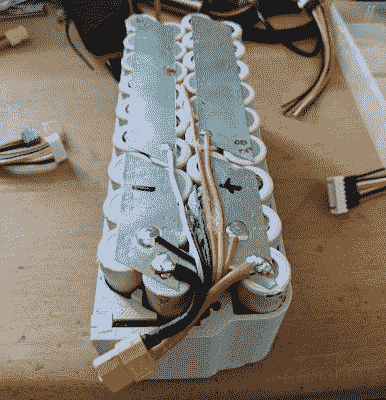

# 用这款巨型 DIY 电池让它们飞起来

> 原文：<https://hackaday.com/2018/10/03/keep-em-flying-with-this-monster-diy-battery/>

如果你花了一个下午的时间在遥控飞机上，你可能很清楚这种利用的最大限制:电池寿命。在大多数遥控飞机都是气体驱动的日子里，很容易携带一些额外的燃料来保持美好时光，但现在除了大比例模型之外的所有东西都使用电动马达，遥控飞机飞行员正在寻找更好的方法在实地给他们的电池充电。

 尽管这看起来有些违背直觉，但【亚当·皮什尼】认为[让他的四轴飞行器电池充满电的最好方法就是简单地使用另一个更大的电池](https://www.thingiverse.com/thing:3036082)。他不用摆弄逆变器或发电机，只需使用 DC 到 DC 的电池充电器和他定制的巨大电池组就可以继续飞行。

该包包含 36 个三星 INR18650-35E 3500mAh 电池，总容量为 454 瓦时。1965 克(4.3 磅)的包装并不完全是轻量级的，但它比携带小型发电机甚至铅酸电池到野外要轻得多。

[Adam]在 FreeCAD 中设计了一个光滑的外壳，并在 Minadax ASA-X filament 中打印，这是专门为户外使用而设计的。一个特别好的细节是，平衡连接器(用于为电池充电)干净地集成到电池组的侧面，而不是在微风中四处飘动；这似乎是商业生产的电池的标准，令人恼火。

该项目的下一个有趣的步骤是[增加太阳能电池板和充电控制器](https://hackaday.com/2018/07/31/high-efficiency-open-sourced-mppt-solar-charger/)来帮助恢复充电。除了一个为你更换电池的[自动化平台](https://hackaday.com/2018/04/10/recharging-drones-on-the-go-with-a-supercharger/)，像这样的 DIY 包可能是最简单的方法来最大限度地延长你的遥控飞机在空中的时间。