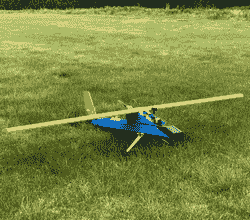
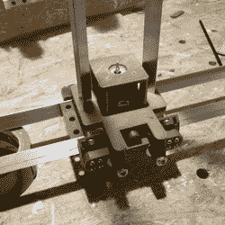

# 保持简单，巧妙

> 原文：<https://hackaday.com/2020/09/05/keep-it-simple-smartly/>

“保持简单”听起来是个好建议，但是“它”到底是什么？你应该尽量简化项目的哪些部分？你不能总是把一切都简单化，对吧？所有类型的“简单”都同样有价值吗，或者在设计的某些方面，简单对项目的其他部分有乘数效应吗？

在过去的几周里，我遇到了两个看似不同，但惊人地相似的设计问题，我意识到专注于保持项目的一个方面简单会对其他方面产生乘数效应——简化问题的正确部分会使一切都变得非常简单。

EA [Axon](https://www.rcgroups.com/forums/showthread.php?2934127-Experimental-Airlines-Axon-FPV) Great plane, but heavy!

第一个例子是白手起家的飞机设计。整个夏天，我制作了几架飞机，专注于强调实际构建简单性的互联网计划。因此，飞机有点重，可能不完全符合空气动力学，可能动力不足。这是因为你花在制造飞机上的努力根本与飞行无关。保持简单的结构不一定能得到一架好飞机。

另一方面，体重是最重要的。翅膀产生升力，不管是以克还是盎司来衡量，任何更重的东西都飞不起来。但是减肥有事半功倍的效果。更轻的重量意味着更小更轻的马达和电池。如果结构不承受更大的弯曲力，就不需要那么硬。而且，对 noob 飞行员来说重要的是，单位机翼面积重量较轻的飞机飞得较慢，当有东西侧向移动时，给了我(咳咳，noob 飞行员)更多的反应时间。试图通过减轻重量来简化设计会产生连锁反应。

我最新的全 DIY 设计摒弃了任何带来重量的东西，包括一些我认为对刚度或抗撞性来说必不可少的部件。但是随着重量的显著降低，这些问题不需要我来解决就烟消云散了——在某种程度上，设计的复杂性正在创造设计的复杂性应该解决的问题。抛弃它意味着我有了一架速度慢的飞机，有易于制造的机翼，能够携带一架轻型 FPV 相机。完成了完成了。很简单。

Nope. Too complex.

与此同时，我正在建立一个四轴数控泡沫切割机。我已经建造了许多 3D 打印机，并与其他人的 DIY 数控机器一起玩，所以我的脑海中开始有一些设计想法。我的第一个机器 XY 轴迭代运行在金属角钢上，每个轴有八个巨大的滑板轴承。它坚固而僵硬，笨拙而过分，对这台机器来说是一种不好的方式。

3D 打印机希望在小体积内移动相对较轻的工具头，但速度相对较快。数控铣床需要非常刚性，并承担沉重的侧负荷，受到一些速度的限制。泡沫切割机没有这些需求。热线通过辐射熔化泡沫，因此机器上没有负载，因为它甚至不接触工件。因为它通过熔化来切割，所以它*有*来减速。这些都是设计中简化会结出最大果实的地方。

我写这篇文章是回顾过去，或者至少是从第二个原型的角度。我想第一个设计保持切割丝拉紧，因此刚性框架。但是，通过使用轻质的外部蝴蝶结来保持细丝紧密，将张力从运动中分离出来，这意味着机器可以非常简单。我可以用更小的塑料滑块代替复杂的轴承，用细杆代替笨重的轨道。意识到这一点后的一天内，我就完成了之前一周内机器设计的两倍，而且它在地下室占用的空间也少了很多。

所以让你的吻更上一层楼。头脑风暴一下你的设计的约束条件，以及放松它们能做什么。是否有任何特定的简化可以进一步简化？这些是你想要开始的。保持简单，巧妙。而且因为发现这些乘数效应并不总是那么容易，所以告诉你的朋友吧！

This article is part of the Hackaday.com newsletter, delivered every seven days for each of the last 200+ weeks. It also includes our favorite articles from the last seven days that you can see on [the web version of the newsletter](https://mailchi.mp/hackaday.com/hackaday-newsletter-649368). Want this type of article to hit your inbox every Friday morning? [You should sign up](http://eepurl.com/gTMxQf)!