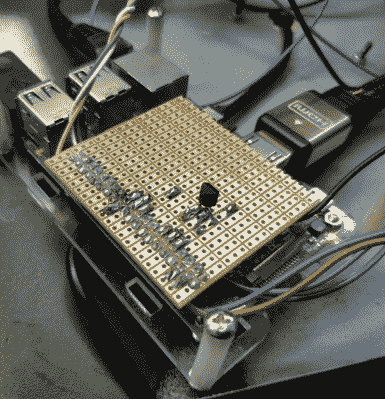

# 用时间机器让孩子们开心

> 原文：<https://hackaday.com/2019/05/28/keep-the-kids-entertained-with-a-time-machine/>

我们经常听到人们说，现在的孩子不像过去那样经常出去玩了，但老实说，很难真正责怪他们。你看过他们现在的一些比赛吗？当他们有了 4K 和虚拟现实游戏系统可以玩的时候，将会有比棍子球游戏更令人兴奋的事情让他们离开沙发。

Circuit to control ATX PSU

这就是为什么[博贝克]要给他的孩子建造一台时间机器。当然不是字面上的意思。所需的通量电容器技术尚未掌握。但它确实允许玩家通过视频进行时间旅行，播放视频时输入特定的代码，他们必须通过解决现实世界中的谜题来解锁。话又说回来，在一些人看来，让孩子们保持活跃和积极的心态就像是“回到过去”。

从表面上看，[博贝克]在这个项目上还有一点工作要做，但已经足够了，我们可以有一个想法。在重型塑料盒的底部，他安装了 ATX 电源和树莓 Pi 3，在顶部，有一个金属板，上面有电源按钮，RGB 背光键盘和真空荧光显示器。

打开系统电源后，孩子们在键盘上输入他们获得的代码。如果被接受，它会启动相应的演示，播放他们解锁的那个时间段的画面和声音。在休息后的视频中，你可以看到[博贝克]用挂在 HDMI 电缆末端的小显示器测试设备，但据推测，该系统最终将获得集成显示器。孩子们也可以把它插在电视上，但那样的话，你可能会绕了一大圈。

我们已经看到了几个黑客创造他们自己的电子产品来娱乐他们的孩子的例子。这条线可能有点模糊，但我们宁愿看到孩子们[在他们的卧室里发挥他们的想象力“驾驶”宇宙飞船](https://hackaday.com/2018/01/08/mom-ill-be-in-my-attic-spaceship/)，而不是在他们的手机上玩 *Roblox* 。

 [https://www.youtube.com/embed/R8P0Sa0llYg?version=3&rel=1&showsearch=0&showinfo=1&iv_load_policy=1&fs=1&hl=en-US&autohide=2&wmode=transparent](https://www.youtube.com/embed/R8P0Sa0llYg?version=3&rel=1&showsearch=0&showinfo=1&iv_load_policy=1&fs=1&hl=en-US&autohide=2&wmode=transparent)

