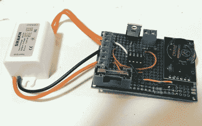

# 用自动旋转的猫头鹰驱赶鸟类

> 原文：<https://hackaday.com/2019/05/30/keeping-birds-at-bay-with-an-automated-spinning-owl/>

仅仅为了制造而制造东西并没有错，但是能够用自己设计和制造的一件装备解决现实世界的问题却是一件特别令人满意的事情。当所有阻止鸟儿在他母亲的地产上栖息的传统方法都失败后，【MNMakerMan】决定想出一个更有说服力的选择:[一个太阳能旋转猫头鹰，配有可扩展的警棍](https://www.instructables.com/id/Raft-Bird-Repeller/)。

 我们认为当你开始用金属棒打鸟时，猫头鹰并不是绝对必要的，但它确实增加了一种美感。也许它甚至可以在一些不太冒险的鸟进入攻击距离之前起到威慑作用，这可能对它们最有利。[MNMakerMan]说，铁条的旋转速度似乎足够低，他认为这不会对鸟类造成任何身体伤害，但仍然会相当不舒服。

乍一看，你可能会认为这个装置只是在它旁边的 10 瓦小光伏板捕捉到阳光时旋转，但实际上不止如此。当然，他可能*可以*只要太阳升起就让它不停地旋转，但相反【MNMakerMan】使用 ATtiny85 来控制带 IRF540 MOSFET 的 11 RPM 齿轮 DC 电机。通过在组合中添加 DS3231 RTC 模块，他不仅能够精确控制旋转器开始和结束捕鸟班次的时间，还能实现定时模式，而不是一直运行它。当然，所有这些都可以通过调整几个变量和刷新芯片来微调。

我们已经看到[许多自动系统让猫远离](https://hackaday.com/2016/07/08/neural-network-targets-cats-with-a-sprinkler-system/)，当然[松鼠也是这种建筑的常见目标，](https://hackaday.com/2018/04/30/training-the-squirrel-terminator/)但是阻止鸟类的装置在这些页面中相当不常见。所以看起来，至少现在，[MNMakerMan]垄断了太阳能鸟粉碎设备的市场。我们确信妈妈非常自豪。

 [https://www.youtube.com/embed/Z9JdDufT_Ss?version=3&rel=1&showsearch=0&showinfo=1&iv_load_policy=1&fs=1&hl=en-US&autohide=2&wmode=transparent](https://www.youtube.com/embed/Z9JdDufT_Ss?version=3&rel=1&showsearch=0&showinfo=1&iv_load_policy=1&fs=1&hl=en-US&autohide=2&wmode=transparent)

