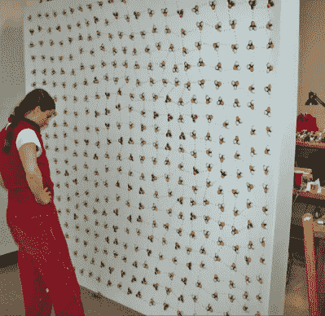

# 凯利·希顿的作品模糊了传统和电子之间的界限

> 原文：<https://hackaday.com/2019/12/16/kelly-heatons-artwork-blurs-the-line-between-traditional-and-electronic/>

数字电子固然很好，但我们很难忽视模拟领域的有机、生动的品质。凯莉·希顿花时间研究这些电路，构建艺术创作，将美术与经典模拟硬件相融合，讲述电子与自然之间的关系。在 2019 年 Hackaday Superconference 的演讲中，Kelly 分享了她的旅程故事，她称之为电子自然主义，以及未来可能会带来什么。

The [Pool of Reflection Loop](https://www.kellyheatonstudio.com/reflection-loop-1) was one of Kelly’s early electronic installation pieces.

像许多创客一样，凯利也是从这里起步的。她的旅程是从拆开东西开始的，最初的 Furby 是一个特别的灵感。在了解了这个装置的构成后，她开始进行实验，并在史蒂文·格雷的工程协助下，于 2001 年创作出了反射回路雕塑。这个装置有 400 个重新编程的 Furbys，这只是 Kelly 艺术实验的开始。出于对模拟生命的电子产品的兴趣，凯利接着转向了“胳肢我”Elmo。Live Pelt(2003 年)将 64 个晃动的布偶放入一件可穿的外套中，毫无疑问，长时间穿着会令人不安。

> 模拟电子类似于活的有机体，而可编程逻辑只是模拟生命。
> 
> ——福里斯特·米姆斯

想要创作与有机过程有密切关系的艺术，Kelly 专注于研究分立元件和模拟电路。非稳态多谐振荡器等基本构件成为关键工具，以不同的组合来产生预期的效果。通过将几个振荡器和模拟序列发生器连接在一起，可以创造出模仿后院蟋蟀的声音或卡罗莱纳州鹪鹩在树上唱歌的电路。

 [https://www.youtube.com/embed/stIh4WLNnc8?version=3&rel=1&showsearch=0&showinfo=1&iv_load_policy=1&fs=1&hl=en-US&autohide=2&wmode=transparent](https://www.youtube.com/embed/stIh4WLNnc8?version=3&rel=1&showsearch=0&showinfo=1&iv_load_policy=1&fs=1&hl=en-US&autohide=2&wmode=transparent)

然而，这项工作并没有因为一些音效而停止。这些电路被编织到绘画中，单个组件在作品本身中扮演着功能性和视觉性的角色。接下来是一系列的绘画作品，描绘了创造动物声音的电路。其他项目更具雕塑感，比如我的喂食器上的 *[鸟的透明聚酯薄膜结构](https://www.kellyheatonstudio.com/blog/tag/birds+at+my+feeder) (2019)* ，或者 *[授粉的发出噪音的工蜂](https://www.kellyheatonstudio.com/pollination-images) (2015)。从振荡器到驱动它们的模拟序列器，电子设备本身成为艺术品的一部分。Kelly 认为硬件很漂亮，这种感觉得到了许多人的认可，他们还记得自己第一次窥视拆卸下来的收音机或电视机的神秘内部时的情景。*

Kelly’s various works employ a variety of analog circuits to create noises reminiscent of real-life organisms.

来自美术背景，而不是电子背景，一路上有很多东西要学。Kelly 在麻省理工学院媒体实验室呆了很长时间，像你在世界顶级黑客大学之一所期望的那样，以很快的速度学习东西。在平行系列 (2012) 的 *[的制作过程中，凯莉意识到她很难记录她的实验是如何进行的，于是在一个作品的一角潦草地写了一张纸条:“为了我自己的理智，我需要记录这些回路”。任何离开几个星期后回到试验板上的一堆乱七八糟的电线的制造者都会有这样的经历。凯利的过程也发展了多年，变得更具分析性。对各种生物的声音进行了音高、音色和节奏分析，以帮助指导在模拟硬件中重现它们的工作。](https://www.kellyheatonstudio.com/the-parallel-series-2004-2012-1)*

凯利的工作超越了简单的模拟振荡器。通过多年的修补，她学到了许多技巧和窍门来创造一个令人愉快和发人深省的艺术品。重复的声音可能会令人讨厌，即使它们是大自然母亲创造的一个像样的复制品。为了缓和这一点，并加入一点现实主义，随机性被引入触发电路，使它们听起来更自然。通常通过一些简单的东西来实现，如晶体管的基极不连接，当过滤时，这可以作为一种很好的方式来有机地再现夜晚蟋蟀相互鸣叫的声音。

大部分工作都是在试验板上完成的，这使得实验变得很容易。由于所用的组件便宜且容易获得，因此几乎没有什么危害，最严重的错误最多造成几美元的损失。在这部作品中，各种模拟振荡器的堆叠和重新配置类似于模块化合成器的世界，我们相信 Kelly 也会喜欢探索这个世界。

总的来说，这是一个伟大的演讲，涵盖了创造融合传统和电子的艺术作品的旅程。凯利的艺术已经在很多地方得到了庆祝和展示，看看创作背后的过程是很鼓舞人心的。