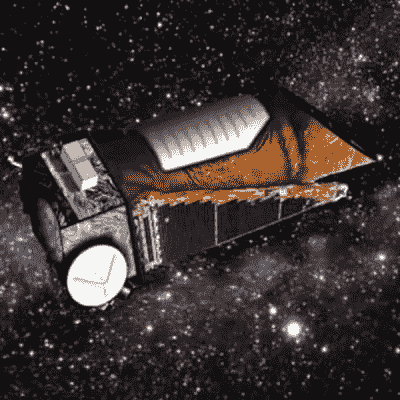

# 开普勒在十年的发现后闭上了眼睛

> 原文：<https://hackaday.com/2018/10/30/kepler-closes-eyes-after-a-decade-of-discovery/>

自 2009 年 3 月发射以来，开普勒太空望远镜为我们提供了大量关于我们银河系内系外行星的数据，证明这些世界比我们想象的更加多样和数量更多。在它发射之前，我们根本不知道像我们这样的行星有多常见，但今天我们知道银河系包含数十亿颗这样的行星。这些星球中的一些太热了，以至于有熔融岩石的海洋，另一些在围绕一对恒星运行时一天经历两次日落。也许最重要的是，开普勒发现的数千颗行星与我们的地球非常相似:正如我们所知，它们可能是生命的宿主。

 开普勒的一生无论用什么标准来衡量都是硕果累累的，但这并不容易。由于进入深空太远，我们无法像对哈勃那样修复它，天文台上的硬件故障几乎使该计划在 2013 年停止。当美国国家航空航天局宣布飞船没有修复的希望时，大多数人认为任务将会结束。即使到了那个时候，开普勒还是取得了绝对的成功，为我们提供了足够多的数据，让天文学家忙碌了好几年。但是一个巧妙的解决方案被设计出来，允许它在容量减少的情况下继续收集数据。

依靠太阳风，开普勒能够利用阳光照射太阳能电池板的压力来稳定自身。开普勒的“视力”在反应轮故障后再也不一样了，它消耗了比最初打算更多的推进剂来维持这种小心的平衡行为，但科学继续发展。这个已经回答了我们许多关于我们在银河系中位置的问题的任务将会继续进行，尽管失败会使它在太空中死去。

随着开普勒迅速耗尽其推进剂，很明显这项任务的时间不多了。这是不可避免的，因为另一种选择是让飞船在太空中翻滚，但任务规划者明白，他们实施的修复已经给开普勒设定了一个到期日。修正后的计算可以提供一个关于飞行器何时会耗尽油箱并失去姿态控制的估计，但不是一个确定的日期。

在过去的几个月里，美国国家航空航天局已经知道这一天即将到来，但他们决定继续收集数据，直到飞行器的推进器溅射失败。所以今天宣布开普勒[最终失去了自我定位的能力并不令人惊讶。开普勒已经观察到了它最后一次外星日落，但是在银河系我们这个角落寻找行星，甚至生命的工作今天还没有结束。](https://www.nasa.gov/press-release/nasa-retires-kepler-space-telescope-passes-planet-hunting-torch)

## 开普勒打电话回家

在过去的几个月里，美国宇航局一直特别小心地定期下载从航天器上收集的数据；知道每次下载都可能是他们的最后一次。当推进剂耗尽时，开普勒不再能够将其自身朝向目标，它也不再能够可靠地将其高增益天线指向地球。当方向正确时，开普勒能够以大约 4.3 Mbps 的速度将数据传输回地球(对于深空飞行器来说，这是不寻常的高带宽)，但在低端数据速率可能会下降到每秒一个字节。将开普勒留在太空中，将宝贵的数据锁在船上的存储库中，将是这项任务的一个特别不光彩的结局，所以美国宇航局确保没有数据被留下。

直到最后一次观测会议(称为活动 19)收集的数据将让科学家们忙碌数年。美国宇航局预计，迄今为止他们从开普勒获得的数据量[将在未来几年产生至少 1000 篇科学论文](https://keplerscience.arc.nasa.gov/kepler-fuel-status-update-faq.html)，并估计至少还需要十年才能分析完所有数据。他们指出，就在今年夏天，一篇论文发表了，该论文使用 2016 年 Campaign 10 观测数据来[识别另外 44 颗行星](https://arxiv.org/abs/1806.11504)。

## 光明的未来

不仅有 10 年的开普勒数据需要整理，而且美国宇航局的下一代行星搜索望远镜[凌日系外行星调查卫星(TESS)](https://tess.gsfc.nasa.gov/) 已经在太空中。TESS 于 2018 年 4 月 18 日在 SpaceX Falcon 9 上发射，几个月后开始了它的主要科学任务，并已经开始识别候选系外行星。利用与开普勒相同的凌日观测方法，仔细监测来自目标恒星的光，以检测行星遮蔽它时的警告性变暗，TESS 将能够监测比其前身大大约 400 倍的天空区域。

可以理解，期望非常高。鉴于开普勒在观察其相对较小的银河系切片时收集了大量数据，天空实际上是 TESS 的极限。它也不会单独工作，当它上线时，TESS 发现的行星将被视为詹姆斯·韦伯太空望远镜的主要目标。这两个互补的航天器的发现和分析相结合，有望提高我们直接对系外行星成像的能力，迄今为止这种能力非常有限。

在它一生中直接收集的数据和利用开普勒开创的技术的后续任务之间，我们正在寻找 20 到 30 年的发现。因此，开普勒任务的结束不是一个时代的结束，而是一个新时代的开始；它有望重新定义我们对银河系的认识以及我们在其中的位置。