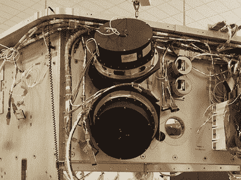
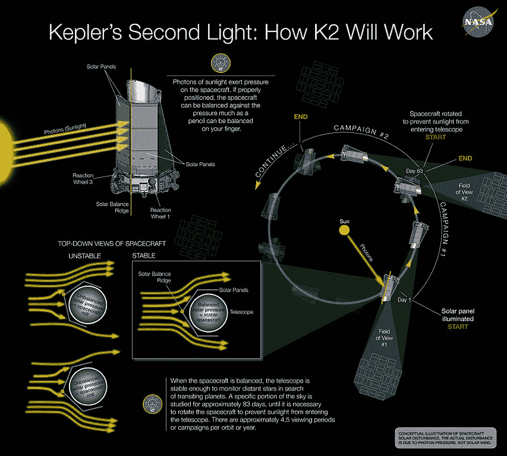

# 开普勒行星猎人接近史诗旅程的终点

> 原文：<https://hackaday.com/2018/07/31/kepler-nears-end-of-epic-journey/>

开普勒飞船正处于它生命的最后时刻。美国宇航局不太确定他们什么时候会和太空望远镜说再见，自 2009 年发射以来，太空望远镜已经证实了数千个系外行星的存在，但大多数估计最多给它几个月的时间。诊断结果很简单:她没油了。推进器没有推进剂，开普勒就不能自我定位，这意味着它不能将天线指向地球进行通信。

现在，就航天器故障而言，推进剂耗尽并非完全出乎意料。毕竟，它不能开到最近的加油站给油箱加满油。开普勒最终将不得不因为这样一个平凡的原因停止运行，这一事实的有趣之处在于，这台价值约 6 亿美元的太空望远镜此前已经“死亡”过一次。早在 2013 年，美国宇航局宣布开普勒在一系列关键系统故障后受到了不可修复的损坏。

但多亏了自他们将阿波罗 13 号的机组人员安全带回家以来，美国国家航空航天局所做的可能是最好的最后努力，一种让飞船回到控制之下的新方法得以实现。虽然它从来没有完全相同，但开普勒能够继续修改任务参数，迄今为止已经提供了如此多的原始数据，科学家们将在未来几年对其进行分析。对一只死鸟来说还不错。

在开普勒永远陷入黑暗之前，让我们看看美国宇航局是如何设法复活这台行星搜索太空望远镜并大大扩展我们对银河系中行星的知识的。

## 坚定的凝视

为了理解开普勒遇到的问题，理解开普勒如何寻找行星是很重要的。望远镜观察天空的一部分，并仔细记录下个别恒星的变暗和闪烁。虽然在地球上，当光线穿过我们的大气层时，由于折射，星星似乎在闪烁，但在深空中，来自星星的光应该是恒定的，除非它被某些东西阻挡。根据这一原理，开普勒寻找来自恒星的光线中断，这可能表明有一颗行星在它周围的轨道上。通过仔细观察，有可能确定每颗恒星周围行星的大小和数量；让我们能够虚拟地描绘遥远的太阳系。

正如你所料，要实现这一点，开普勒必须能够非常小心地控制它在空间中的方向。从望远镜的角度来看，恒星需要保持相对静止，以尽量减少假阳性。任何在地球上从事天体摄影的人都会告诉你，[有很多方法可以补偿漂移和噪声，从而获得更清晰的天空图像](http://hackaday.com/2018/06/06/stars-looking-a-bit-dim-throw-some-math-at-them/)。但是为了获得最好的效果，相机确实需要尽可能靠近恒星。

Photo credit: Ball Aerospace via SpaceNews

为了保持它的方向，开普勒配备了推进器和四个反作用轮:飞轮用于存储角动量并在航天器上施加扭矩。当需要对航天器的方向进行大的改变时，推进器是理想的，反作用轮用于小而精确的调整。不幸的是，2012 年开普勒的一个反应轮开始出现问题。剩下三个，足够继续任务，但是 2013 年另一个轮子关闭了。由于只有两个起作用的反作用轮，航天器无法在观测期间精确地调整自己，实际上结束了它最初的任务。

在这一点上，任务已经完成了它的科学目标。即使开普勒再也没有看到其他恒星，这仍然是一个巨大的成功。但是，由于航天器仍然基本上是功能性的，美国宇航局开始寻找一种方法来利用它进行修订的科学任务，该机构称之为 K2。

## 理想均衡

美国宇航局意识到，由于只有一半的反应轮可以工作，开普勒不可能在所有维度上均匀地施加扭矩。试图使用剩下的两个轮子只会导致飞船翻滚。美国宇航局需要的是一种方法来对飞行器施加某种压力，使剩余的反作用轮可以推压。答案来自一个相当令人惊讶的地方:太阳。

NASA 想出的解决办法利用了这样一个事实:光子撞击航天器会产生一个恒定的力，尽管力很小。通过小心操纵开普勒以正确的方向面对太阳，剩下的两个反作用轮可以用来施加与太阳压力相反的扭矩。一旦达到平衡，宇宙飞船就平衡得足够好，可以继续进行观测。

这不是一个完美的解决方案。用这种方法定位开普勒比正常情况下需要消耗更多的推进器推进剂，灵敏度也有相当大的下降，因为这种小心翼翼的平衡行为不像当方向由所有四个反作用轮控制时那样稳定。但即便如此，开普勒 K2 任务在过去四年里还是设法从一艘许多人认为已经报废的飞船上收集了宝贵的科学数据。

## 最后一章

如果所有四个反应轮都可以工作，开普勒可能现在就不会耗尽推进剂。具有讽刺意味的是，保持开普勒相对于太阳风的位置所需的推进剂用量增加，在某种程度上加速了任务的结束。但考虑到另一种选择是在 2013 年开普勒开始在太空中翻滚时关闭它，这是一次极其成功的黑客攻击。

就目前的情况而言，美国宇航局并不能 100%确定开普勒的燃料箱中还有多少推进剂。信不信由你，没有办法用机载传感器来判断。他们可以根据燃料离开地球时燃料箱里有多少燃料以及他们燃烧了多少次来估计，这就告诉他们已经接近终点了。但是，在他们命令推进器点火并且没有任何反应之前，真的没有办法确定燃料箱是否已经干了。因此，美国宇航局正在尽可能地限制推进器的使用。

当推进器开始溅射，美国宇航局知道开普勒处于其生命的最后时刻，他们将命令它将其高增益天线指向地球，并在永远断电前最后一次广播其收集的所有数据。开普勒的轨道足够远，它永远不会返回地球或足够靠近太阳系中的任何其他物体，这不会是一个问题。它很可能会作为人类创造力和我们永不满足的探索需求的深空纪念碑度过余生。