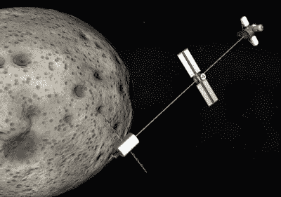

# 克巴尔太空计划去偷渡客电影

> 原文：<https://hackaday.com/2021/04/09/kerbal-space-program-goes-to-the-movies-in-stowaway/>

声音甜美的太空迷(Scott Manley)的粉丝会知道他经常在他的视频中使用 Kerbal Space Program (KSP ),以简单的演示拼凑出令人眼花缭乱的复杂主题，如轨道力学。但是正如他最近的一个视频所揭示的，YouTube 并不是这些天唯一可以找到他的 KSP 工艺的地方。原来他用他的虚拟火箭制造技能帮助网飞的*偷渡者*的创作者开发了一个在火星循环轨道上的载人飞船的现实写照。

火星探测器的概念是由巴兹·奥德林在 1985 年提出的，作为人类在红色星球上建立长期存在的一种方式。简而言之，它描述了一种轨道，这种轨道将允许车辆在地球和火星之间连续行驶，而只需要偶尔燃烧发动机进行航向修正。飞船实际上不能停在任何一颗行星上，但当它近距离通过时，较小的飞船可以与它会合，搭个便车。这个概念可以被认为是一种星际列车:乘客和货物在地球和火星上方的“车站”被搭载和放下。值得注意的是，类似的 cycler 轨道对于地球-金星旅行应该是可能的，[但是没有人真的想去那里](https://hackaday.com/2020/09/21/exploring-the-clouds-of-venus-its-not-fantasy-but-it-will-take-specialized-spacecraft/)。

An early KSP proof of concept for *Stowaway.*

《偷渡者》的编剧希望他们的电影发生在火星探测器上，为了避免产生失重的幻觉，他们希望他们虚构的飞船也有某种人造重力。唯一的问题是，他们不确定那实际上会是什么样子。因此，他们联系了斯科特，斯科特又利用 KSP 大致勾勒出了这样一艘船在现实世界中的运作方式。

正如你在下面的视频中看到的，电影最近发布的预告片中显示的 CGI 航天器最终与其 KSP 原型非常相似。虽然自然使用了一些艺术许可，但[Scott]对他目前所看到的感到兴奋。旋转飞船使用一个废弃的上面级来平衡其乘员舱，并在中心有一个固定的实用节点，看起来确实令人印象深刻；更重要的是，我们知道它是基于合理的原则。

虽然网飞在过去参与了一些令人惊讶的现实科幻小说，但他们也为一些真正值得叹息的作品开了绿灯(如果你还没有看《T2 走开》，不要看)。所以在我们亲眼目睹整件事之前，我们只能希望[斯科特]明智的建议能让*偷渡者号*的机组人员安全飞行。

 [https://www.youtube.com/embed/WCwXJMVVdck?version=3&rel=1&showsearch=0&showinfo=1&iv_load_policy=1&fs=1&hl=en-US&autohide=2&wmode=transparent](https://www.youtube.com/embed/WCwXJMVVdck?version=3&rel=1&showsearch=0&showinfo=1&iv_load_policy=1&fs=1&hl=en-US&autohide=2&wmode=transparent)

