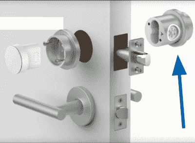
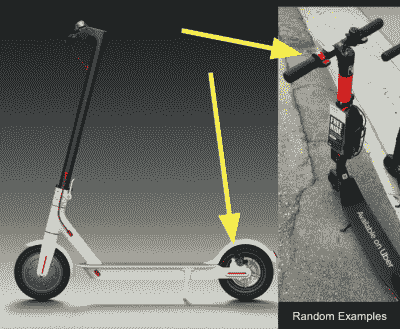

# Kerry Scharfglass 保护您的物联网物品

> 原文：<https://hackaday.com/2019/12/20/kerry-scharfglass-secures-your-iot-things/>

我们都见过物联网设备安全事故:这些设备如此引人注目地失败，以至于评论区充满了“他们甚至考虑过最基本的安全问题吗？”不，他们可能不是。是吗？

Hackaday 贡献者和周围的好人 Kerry Scharfglass 思考基本的安全问题，他的演讲针对设备安全的新手。(嵌在下面。)当然，“安全”不是一个放之四海而皆准的命题；你需要考虑你所担心的威胁，你可以忽略这些威胁，并防范那些重要的威胁。但是如果你从来没有做过这样的练习，你就可以在这里享受一下了。在定义什么是可接受的风险时，你需要像一个创造者一样思考，像一个破坏者一样思考，而且令人惊讶的是，像一个会计师一样思考。

Kerry 通过三种产品工作，一种物联网医疗训练设备，一种智能插销，和一种物联网无码头共享滑板车。虽然你可能认为这种医疗设备需要高安全性，但它实际上是他列表中最简单的。它由医疗专业人员在受控的环境中现场使用，除此之外你别无他法。他们花了一些努力使刷新错误的固件变得困难，包括只通过 USB 刷新，但基本上他们认为最低限度的安全性是可以接受的。

 对比医疗器械与物联网锁。锁是所有关于安全和保护你的房子。更糟糕的是，如果失败了，它会把你锁在门外。威胁面很大。想象一下，使用你门上的锁让人们进入你的 AirBnB 租赁——现在你有了一个陌生人，他可以扩展对设备的物理访问，甚至可以卸下它，而不会看起来太奇怪。

存在隐私问题、拒绝服务攻击以及利用它进入家庭网络的可能性。不用说，这里的固件更新机制要复杂得多，涉及认证*和*加密，Kerry 将在这里介绍整个链条。

 终于，踏板车来了。这个设备本身很酷，可以偷，如果它出了故障，会成为公共安全的隐患，如果你能找到一种远程关闭它们的方法，你知道视频会出现在 YouTube 上。简而言之，这是一个安全噩梦。通过让滑板车技术人员频繁接触这些设备，解决了一半问题。固件只能用电缆在本地刷新。技术人员可以查看 PCBA 是否被添加了任何东西。等等。另一半是通过将一个单独的微控制器专用于油门和刹车来解决的，将最重要的驾驶功能从物联网东西中分离出来。

关于滑板车案例研究最有趣的是公司选择*而不是*来对抗的所有事情。用户傻？没有。盗窃？无论如何，它们的预期寿命只有 6 个月，任何真正想偷它的人都可以在亚马逊上买到售后“大脑”。

还有很多其他威胁，但克里讲话的首要主题是确定哪些风险你可以减轻，哪些不能。把你的努力集中在基本的东西上能让你克服基本的威胁。这将使凯瑞工作过的公司不会在黑客评论区蒙羞。

 [https://www.youtube.com/embed/o30TAezzorA?version=3&rel=1&showsearch=0&showinfo=1&iv_load_policy=1&fs=1&hl=en-US&autohide=2&start=50&wmode=transparent](https://www.youtube.com/embed/o30TAezzorA?version=3&rel=1&showsearch=0&showinfo=1&iv_load_policy=1&fs=1&hl=en-US&autohide=2&start=50&wmode=transparent)

