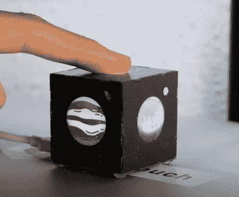

# 触摸行星立方体时的键盘快捷键

> 原文：<https://hackaday.com/2022/09/19/keyboard-shortcuts-at-the-touch-of-a-planetary-cube/>

[Noteolvides]创造了 [CubeTouch](https://cubetouch.noteolvid.es/) ，这是一个由六块印刷电路板焊接在一起的立方体，通过其内嵌的 led 和电容触摸传感器创造了一个功能性和互动性的艺术品。

设备本身通过 USB-C 连接器连接，该连接器为设备供电，并允许设备根据触摸的面发送自定义键盘快捷键。

CubeTouch 的内部由六个 WS2812 LEDs 照明，这些 led 利用底层 FR4 材料的扩散特性来透过 PCB 发光。中央微处理器是 CH552，支持原生 USB 并兼容 Arduino。五个朝外侧面上的每个“行星”都充当电容式触摸传感器，可以通过编程产生自定义的按键组合。

组装该装置包括在连接表面的每个边缘的两个接头处焊接连接。

我们对从 FR4 构建外壳[并不陌生，对融合](https://hackaday.com/2015/06/03/how-to-build-beautiful-enclosures-from-fr4-aka-pcbs/)[艺术](https://hackaday.com/2017/04/09/the-cubic-cyphercon-badge/)和[功能](https://hackaday.com/2020/08/19/building-the-scoreboard-of-your-imagination/)也不陌生。CubeTouch 在一个甜蜜的包中提供了对这些想法的进一步探索。

CubeTouch 通过了[开源硬件认证](https://certification.oshwa.org/es000028.html)，所有的[文档](https://cubetouch.noteolvid.es/docs/intro/)、[源代码和其他相关的数字产品](https://github.com/Noteolvides/CubeTouch)都可以在 libre/free 许可下获得。

 [https://www.youtube.com/embed/8IG3UgNzkUI?version=3&rel=1&showsearch=0&showinfo=1&iv_load_policy=1&fs=1&hl=en-US&autohide=2&wmode=transparent](https://www.youtube.com/embed/8IG3UgNzkUI?version=3&rel=1&showsearch=0&showinfo=1&iv_load_policy=1&fs=1&hl=en-US&autohide=2&wmode=transparent)

