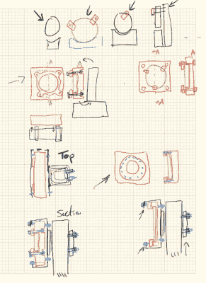
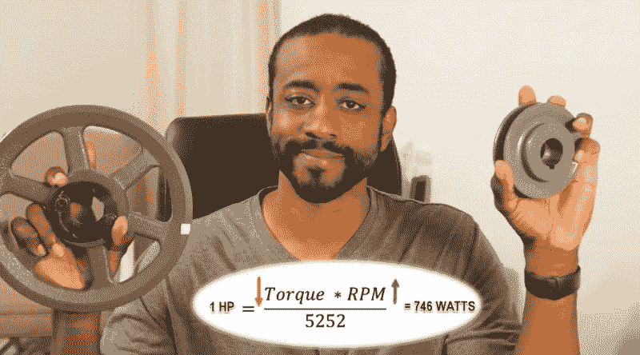

# 主题视频:杰里米·菲尔丁想帮你动起来

> 原文：<https://hackaday.com/2021/12/23/keynote-video-jeremy-fielding-wants-to-help-you-get-moving/>

对于许多 DIY 硬件项目来说，最可能看到的动作是当我们从工作台上拿起组装好的单元，并把它带到它注定要度过其剩余功能寿命的任何地方。从天气传感器到智能镜子，有大量的设备不需要移动一毫米就能工作。但是最终，你可能会遇到一个更有活力的项目。也许你想把你的窗帘机动化，或者全力以赴建造一辆遥控漫游车。随着这些更活跃的设计而来的是一系列你以前可能从未遇到过的新问题。

幸运的是，像杰里米·菲尔丁这样的人愿意分享他们的知识。[在他为 2021 年 Hackaday Remoticon](https://www.youtube.com/watch?v=sXXCsvaF99A) 、*所做的精彩演示中，他带领观众进行了一次旋风式的旅行，展示了他从多年的专业经验中学到的关于设计和制造复杂机器的知识。无论是相对简单的车间铰接工作台，还是巨大的土方机械，或者高灵敏度的机械臂，他参与的每个项目都提出了需要解决的独特挑战。*

Not all of Jeremy’s machines will fit in your average workshop.

Jeremy 参与的许多项目的规模远远超过了普通业余爱好者的想象。当你和你正在工作的机器的照片上有一个箭头指向那个小人时，你知道事情变得严重了。但看过他的 YouTube 视频的人都知道，他有一种真正的诀窍，可以将这些高层次的概念提炼为更容易被家庭游戏玩家消化的东西。

## 熟能生巧

Sketch early concepts out on paper.

如果你从*构建移动*的硬件中只拿走一件事，那就是原型制作是一个跳过的步骤，后果自负。如今，我们拥有令人难以置信的工具，尤其是在 CAD 软件方面，但没有什么能取代在现实世界中把你的设计放在一起，并观察所有移动的部分如何相互作用。

也就是说，原型不需要像最终产品一样坚固或僵硬。杰里米说，在你开始切割或焊接之前，你可以用厚纸板和胶带做大量的基础工作。即使你真的想用稍微耐用一点的东西做原型，比如木头，也不一定要全尺寸的。微缩版的设计可能无法提供与 1:1 比例的设计完全相同的洞察力，但构建微缩版所需的时间和材料可以大大弥补保真度的降低。

杰里米还说，简单地用手勾画出你的设计概念会有很多收获。绘图纸是理想的，因为它会让你建立一个规模，但它不是严格要求。在这一点上，你只是想弄清楚机制的主要形状是什么样子。这种粗略的纸上草图通常可以通过在早期抖落一些低悬的果实来为您节省一些硬件修改。

## 挑选你的力量

当你想出了一个机械设计，并且由于你的原型，你相当肯定它会像你预期的那样工作，下一步就是弄清楚如何给它提供动力。在他的演讲中，Jeremy 花了相当多的时间谈论专业人士和业余爱好者预算中可用的许多不同的电机和致动器。正如我们很幸运能够使用强大的工具一样，我们也可以认为自己在运动方面很幸运:因为今天有一个广阔的世界，可以让你的创作在不破产的情况下运动。

例如，他谈到了低成本无刷 DC 电机的广泛使用，这可以直接归因于遥控四轴飞行器和其他飞机的爆炸式流行。虽然这些电机需要比我们多年来从坏掉的玩具或小玩意中取出的简单永磁电机更复杂的控制电路，但新技术提供的明显和众多好处(更高的功率重量比、更高的能效、更好的速度控制、更低的噪音、更长的寿命等)将值得在许多应用中付出额外的努力。

Figuring out what motor you need is only part of the equation. Literally.

如你所料，凭借他的工业经验，当项目需要时，Jeremy 并不害怕转向交流电机。他带观众看了几种类型的交流电机，甚至在你寻找一种特殊的动力装置时，在你最有可能找到每种类型的地方进行了分解。作为一个多才多艺的零件清道夫，他已经学会在路边的洗衣机或烘干机中使用单相感应电机，而新型跑步机有时会隐藏一个三相单元。

但也许我们在这方面有点超前了。你怎么知道给定的应用需要哪种电机呢？为此，Jeremy 详细介绍了如何确定给定任务的扭矩和速度要求，然后使用这些数据来确定您需要哪种动力系统。注意我们没有说马达。这是因为，在许多情况下，你需要齿轮，滑轮，皮带，或其他一些手段来配合电机的其余部分。这是一些人开始感到不知所措的地方，但通过一些简单的实际例子，Jeremy 表明，弄清楚这一切并不像你可能认为的那样困难。

## 各就各位，预备，跑！

杰里米在 2021 年 Remoticon 上的演示一直持续到将近一个小时，但现在看它，肯定不会有那种感觉。有了这样一个神奇的沟通者，你会在不知不觉中看到一半的视频。事实上，如果你发现自己渴望更多他的特定品牌的技术教育，不要感到惊讶。幸运的是，[他有近十年的视频，你可以查看](https://www.youtube.com/c/JeremyFieldingSr)，其中许多深入挖掘了*构建移动硬件过程中触及的一些主题:每个人都应该知道的基本原理*。

在杰里米的轻松风格和富有感染力的乐观主义之间，你也可能会在结束这次演示后突然有一种冲动，想做一些真正离开工作台四处走动的东西。别担心，这很正常。深呼吸，设计几个联动装置的原型，然后[让我们知道你什么时候让它工作](https://hackaday.com/submit-a-tip/)。

 [https://www.youtube.com/embed/sXXCsvaF99A?version=3&rel=1&showsearch=0&showinfo=1&iv_load_policy=1&fs=1&hl=en-US&autohide=2&wmode=transparent](https://www.youtube.com/embed/sXXCsvaF99A?version=3&rel=1&showsearch=0&showinfo=1&iv_load_policy=1&fs=1&hl=en-US&autohide=2&wmode=transparent)

