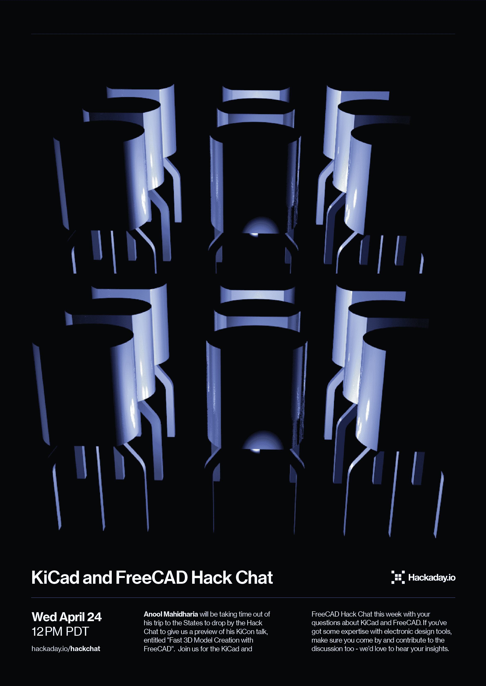

# KiCad 和 FreeCAD 黑客聊天

> 原文：<https://hackaday.com/2019/04/22/kicad-and-freecad-hack-chat/>

加入我们太平洋时间周三中午由 Anool Mahidharia 主持的 [KiCad 和 FreeCAD Hack Chat](https://hackaday.io/event/164063-kicad-and-freecad-hack-chat) ！

[首届 KiCon 大会](https://kicad-kicon.com/)将于本周五在芝加哥开幕，来自世界各地的 KiCad 爱好者齐聚一堂，讨论有关跨平台、开源电子设计自动化平台的任何事情。如你所料， [Hackaday 将出席](https://hackaday.com/2019/04/17/next-week-is-kicon-come-for-the-talks-stay-for-the-parties/)会议，包括一个会后见面会。我们的几位作家也将发表演讲，其中包括[阿诺·马希达里亚](https://hackaday.io/hacker/953-anool-mahidharia)，他将从[美国之行中抽出时间](https://wyolum.com/anools-whirlwind-tour-in-the-summer-of-2019/)拜访 Hack Chat，并预览他的演讲，题为“用 FreeCAD 快速创建 3D 模型”。

请带着您对 KiCad 和 FreeCAD 的疑问，加入我们本周的 KiCad 和 FreeCAD Hack Chat。如果你对电子设计工具有所了解，一定要来参加讨论，我们很想听听你的见解。和往常一样，您可以在 [KiCad 和 FreeCAD Hack Chat](https://hackaday.io/event/164063-kicad-and-freecad-hack-chat) 活动页面上发表评论，将您的问题排队等候，我们会将它们放在 Hack Chat 讨论的列表中。

 我们的黑客聊天是 [Hackaday.io 黑客聊天群发消息](https://hackaday.io/messages/room/2369)中的社区直播活动。本周我们将在太平洋时间 4 月 24 日星期三中午坐下来。如果时区让你心烦意乱，[我们有一个方便的时区转换器](https://www.timeanddate.com/countdown/generic?iso=20190424T12&p0=224&msg=KiCad+and+FreeCAD+Hack+Chat&font=cursive)。

点击右边的那个发言气泡，你会被直接带到 Hackaday.io 上的黑客聊天群，不用等到周三；随时加入，你可以看到社区在谈论什么。

