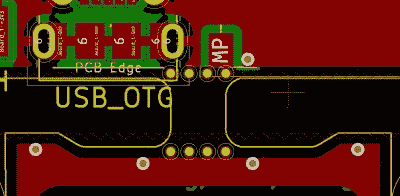

# 轻松实现 KiCad 面板化

> 原文：<https://hackaday.com/2020/04/25/kicad-panelization-made-easy/>

有一个新的基于 Python 的脚本可以从命令行面板化你的 KiCad 电路板。[Jan Mrázek]的项目名为 KiKit，它处理`.kicad_pcb`文件，将它们排列成一个网格，你可以选择 mousebites 或 v-cuts 来在生产后分离电路板。

当使用较小的电路板时，通常的做法是将它们组合成面板。这样做是为了加快 PCB 组装速度，因为多块电路板可以涂上焊膏，通过取放机，然后作为一个单元送入回流焊炉。这通常是手动完成的，但是在许多情况下，这个脚本会在提供您需要的结果的同时节省您的时间。

假设你真的想做一大堆我们几周前看到的 [Xling 开源电子鸡一样的](https://hackaday.com/2020/04/06/put-an-open-source-demon-in-your-pocket/)钥匙链。使用 KiKit，您可以一次组合六块电路板，在生产过程中使用“mousebites”将它们放在一起，但在所有组件焊接完成后，可以轻松地将它们分开:

`/usr/local/bin/kikit panelize grid --space 3 --gridsize 2 3 --tabwidth 3 --tabheight 3 --htabs 2 --vtabs 1 --mousebites 0.5 1 0.25 --radius 1 Xling/hardware/xling.kicad_pcb xling_panel.kicad_pcb`

您可以看到[参数](https://github.com/yaqwsx/KiKit/blob/master/doc/cli.md)让您设置板之间的间距、网格中板的数量、翼片的宽度、翼片的尺寸、板之间翼片的数量，甚至翼片与板相接处的曲线半径。这些[设置来自示例页面](https://github.com/yaqwsx/KiKit/blob/master/doc/examples.md)，展示了许多不同设置选项的结果。

 如果你想试试这个，我们建议直接从仓库安装，因为改进正在进行中，pip3 版本没有例子中显示的所有选项。对我们来说，这和`sudo python3 setup.py install`一样简单，然后用完整路径`/usr/local/bin/kikit`调用脚本。

来自这个委员会的结果既令人印象深刻又令人警醒。你可以看到设计的顶部边缘是凹进去的，但最新版本的 KiKit 仍然能够进行连接。但是，这将如何影响主板设计底部的 USB 连接器，可能是您在订购面板前需要考虑的问题。