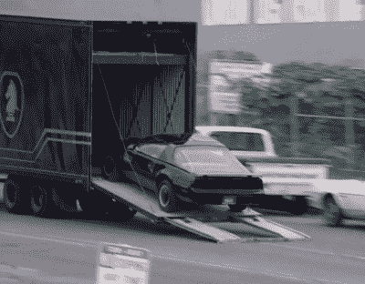
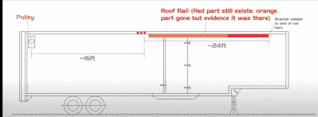

# 霹雳游侠继续前进

> 原文：<https://hackaday.com/2022/08/21/knight-rider-keeps-on-truckin/>

，[AJ]和[Joe]，合在一起的[霹雳游侠历史学家]正在[带回 20 世纪 80 年代最具标志性的车辆之一](https://www.youtube.com/watch?v=YextPz00Hsg)。所有人都记得凯特开车撞上了联邦调查局的卡车。甚至流言终结者也在 2007 年重演了这一特技。[KRH]设法从展览中找到了最初的拖拉机和拖车。他们正在恢复这两个，这一过程的一部分意味着揭露好莱坞黑客用来使汽车驾驶到拖车特技工作。

回到 80 年代，当一部电影或电视节目结束时，这些道具会在其他作品中重新使用、出售或废弃。《霹雳游侠》中使用的 1975 年多尔西预告片最终被卖掉，拆下来，漆成白色。在过去的 30 年里，它一直是一辆赛车拖车。运载汽车和工具，在赛道上充当流动商店。《霹雳游侠》中的大部分定制部分都消失了——但一些提示仍然存在。具体来说，[KRH]正在试图弄清楚免下车门是如何操作的。最初，他们认为是液压油缸系统拉动了电缆。然而，在一个吊顶上，他们发现了一个焊接的硬支架和一条 24 英尺长的铁轨从拖车顶上延伸下来。

他们认为硬支架是用于绞盘的，而铁轨是用作两根绞盘缆绳的缆绳导向装置。门后的一组滑轮将这些电缆引向坡道本身。

当然，这都是猜测——建造时的蓝图早已不在，许多工作人员已经忘记了它是如何建造的。所有[KRH]要做的就是《霹雳游侠》剧集的截图和卡车本身的物证。那么门机制到底是怎么工作的呢？请在评论中告诉我们你的想法。

 [https://www.youtube.com/embed/YextPz00Hsg?version=3&rel=1&showsearch=0&showinfo=1&iv_load_policy=1&fs=1&hl=en-US&autohide=2&wmode=transparent](https://www.youtube.com/embed/YextPz00Hsg?version=3&rel=1&showsearch=0&showinfo=1&iv_load_policy=1&fs=1&hl=en-US&autohide=2&wmode=transparent)

