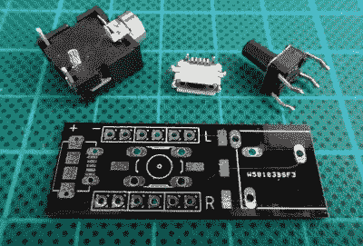

# 山寨 AirPods 并入蓝牙接收器

> 原文：<https://hackaday.com/2018/08/31/knock-off-airpods-merged-into-bluetooth-receiver/>

无论你个人是否喜欢 AirPod 蓝牙耳机的概念都无关紧要，作为一款苹果产品，有一点是肯定的:所有酷孩子都想要它们。这也意味着，对于那些更关注苹果外观而不是价格的人来说，许多海外制造商正在以很低的价格生产 janky 克隆产品。他们好吗？不，当然不是。但这并不意味着你不能和他们一起做一些有趣的事情。

 【伊戈尔·克罗明】拆开了一对假的 AirPods，不出所料，没什么印象。以至于他甚至懒得把东西放回原处。相反，[他把两个劣质的蓝牙音频接收器组合成一个稍差的蓝牙音频接收器](https://www.igorkromin.net/index.php/2018/08/19/hacking-the-hbq-i7-tws-wireless-headphones-to-make-a-stereo-bluetooth-receiver)。这可能不符合时间和/或金钱的“好”使用的经典定义，但至少他从一个注定要成为垃圾的产品中获得了一些娱乐。

正如你可能想象的那样，左右“AirPod”都有自己的电池、蓝牙接收器和扬声器。必须这样，因为他们彼此之间没有物理连接。这也意味着每个接收器只播放一个频道，使他们单独无用。[Igor]意识到的是，他可以将两个音频通道组合成一个普通的立体声 3.5 毫米音频插孔。

同时，他还将每个耳机上的单独按钮连接到 PCB 上的一个中央按钮，这样他就可以在物理上同步它们。尽管如此，[Igor]提到偶尔它们不会同时出现。但是，对于一件价格接近原价二十分之一的东西，你能期待什么呢？

上一次我们看到与苹果 AirPod 相关的黑客攻击，是在[有人把它们扔出窗外](https://hackaday.com/2017/07/30/fishing-for-airpods-with-magnets/)的时候，所以人们可能会认为[大多数黑客更喜欢他们的设备栓在一起](https://hackaday.com/2017/09/07/bringing-back-the-iphone7-headphone-jack/)。