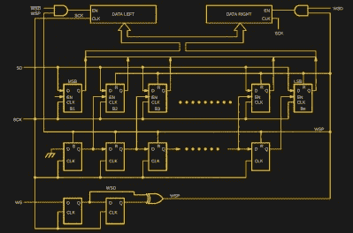
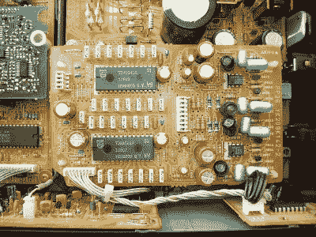

# 了解音频:这完全取决于 DAC

> 原文：<https://hackaday.com/2021/10/20/know-audio-it-all-depends-on-the-dac/>

我们的音频技术之旅一步步将我们从你的耳朵带入典型的家庭高保真系统。我们已经看到了扬声器和放大器，现在是时候看看放大器的供电情况了。

在这里，我们遇到了从耳朵向外的旅程中的第一个数字元件，即数模转换器(DAC)。你会发现这个电路是一个集成电路，它将数字信息转换成放大器所需的模拟电压。

数字音频有许多标准，但在这种情况下，CD 使用的标准是最常见的。CD 以 44.1 kHz 16 位采样音频，也就是说，它们将每个立体声通道的音量表示为 16 位数，每秒 44100 次。有一种称为 i2s 的电气标准用于传输这种数据，它由一条串行数据线、一条时钟线和一条指示当前数据是用于左声道还是右声道的 LRclock 线组成。[我们在 2019 年](https://hackaday.com/2019/04/18/all-you-need-to-know-about-i2s/)详细报道了 i2s，如果你仔细观察几乎任何消费数字音频产品，你都会在某个地方找到它。

## 制作 DAC 很容易。做一个好的 DAC，没那么多。

The Philips i2s to parallel converter.

请记住，i2s 是 20 世纪 70 年代末的一项技术，为其创建 DAC 非常简单。最初的飞利浦规格文档包含一个电路，该电路使用移位寄存器和锁存器来捕获样本，样本可以馈入一个简单的梯形电阻和滤波器来执行转换。这是一种将数字转换为模拟的有效方法，但就像每个音频组件一样，它会带来一定程度的失真。

如果从频域而非时域来观察任何 DAC 的输出，就会发现噪声和它所处理的任何信号的频谱。例如，采样频率会存在，由此产生的大量杂散混频器产物和信号也会存在。在音频 DAC 中，所有这些带外噪声都可能表现为失真。

音频 DAC 设计人员面临的问题是，采样频率相对接近信号频率，因此虽然低通滤波器尽最大努力消除干扰频谱，但这是一项艰巨的任务。作为 2020 年的一个例子，我们看了一下[camp zone 2020 徽章](https://hackaday.com/2020/07/31/campzone-2020-badge-literally-speaks-to-us/)，这是一个使用非常便宜的 DAC 来降低成本的音频游乐场。[深圳泰坦 TM8211 i2s DAC](https://datasheet.lcsc.com/lcsc/1811022110_TM-Shenzhen-Titan-Micro-Elec-TM8211_C92003.pdf) 是一种类似于飞利浦 DAC 电路单芯片实现，虽然它拥有令人印象深刻的低价格，但其输出中的噪声清晰可闻，这种噪声不会出现在更昂贵的芯片上。

## 将问题向上转移以获得更好的声音

The Philips TDA1541 was the archetypal oversampling DAC of the late 1980s and 1990s. Cjp24, [CC BY-SA 3.0](https://commons.wikimedia.org/wiki/File:DAC_Philips_TDA1541A_S1.jpg) .

上世纪 80 年代和 90 年代，DAC 设计人员找到的解决方案是提高带外噪声的频率，以便滤波器更有效地抑制它。如果你还记得多年前 CD 播放器吹嘘的“过采样”、“比特流”或“1 位 DAC”，这些指的是更先进的 DAC 设计的发展，通过各种不同的技术实现带外噪声频率的上移。当时，这是制造商之间激烈的营销战，因为 CD 播放器被视为一种优质设备，三十年后的今天，CD 是必须向从未见过 CD 的孩子解释的东西。

所有这些基本上都是σ-δ型 DAC，它们通过以采样时钟的高倍数产生脉冲链来解决带外噪声上移的问题，其中脉冲数对应于被转换样本的值。通过以更低的分辨率但更快的速度进行采样，相关的带外噪声在频率范围内向上偏移得更高，这使得将其从信号中分离出来的工作变得更加容易。它可以通过一个相当简单的低通滤波器解码成模拟信号。这些是 20 世纪 90 年代 CD 播放器上宣传的“比特流”和“1 位”DAC，曾经是音频技术的前沿，现在已经司空见惯。

## 好的 DAC 无法补偿差的信号源

虽然一个好的 DAC 对音频质量有很大的贡献，但我们假设数字数据来自一个未经压缩的信号源，比如 CD。CD 现在不再是主流，数据更可能来自压缩源，如 MP3 文件或音频流服务。压缩本身就是一个话题，但值得指出的是，数据流上表达的音频质量反映了所用压缩算法的特性，无论 DAC 有多好，也无法弥补其源的质量。

该系列将在下一期回归，届时我们将解决黑胶和磁带发烧友的担忧，他们对信号链中会有 DAC 的假设感到不满。虽然曾经占主导地位的模拟音频格式，如 LP 唱片和盒式磁带，现在可能占据了它们曾经拥有的一小部分市场，但近年来它们的重新发现导致了它们的受欢迎程度略有回升。高端音频系统使用模拟源组件并不罕见，因此非常值得一看。