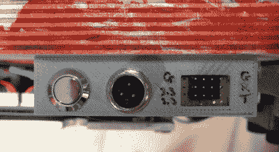
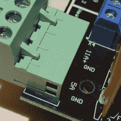

# 给你的衣服贴上标签！

> 原文：<https://hackaday.com/2020/12/19/label-your-shtuff/>

约书亚·瓦斯奎兹几周前写了一篇文章，讲述了他的开源机器如何从将[零件号集成到所有 3D 打印零件](https://hackaday.com/2020/12/02/a-case-for-project-part-numbers/)中获益匪浅。它让人们确切地谈论他们面前的是哪个小部件，以及该小部件的哪个版本。

同时，他提到，在任何有信号或连接器的地方，将标签作为机器的一个集成部分也是一个好主意。这样，你永远不必问自己哪一边是正极，或者这个端口是为多少伏特设计的。这是“头脑中的知识”和“世界上的知识”的区别——如果你必须记住它，你会忘记它，但如果它印在物品上，你只会读它。

我提到这一点是因为上周我被这种现象打了两次，一次是我自己花了一个小时的额外工作打的，另一次是别人打的，释放出神奇的烟雾，让我爬回易贝。

 第一个案例是一个 3D 打印的数据和电源端口，安装在一个改装的悬浮滑板运输车的底部，这是我为去年的混沌通信大会组装的。事实上，我对这个设计非常自豪，直到一年后我想刷新固件。

我知道我已经打破了不只是串行线和电源轨(标签！)还包括 STM32 SWD 编程头和 I2C。我依稀记得有一个助记符，解释了 TX 和 RX 如何与 SCK 和 SDA 相关联，但我无论如何也记不起来了。电线蜿蜒在散热片下，我甚至无法追踪到芯片。“世界上的知识”？我失败了，所以我花了一个小时寻找我的构建笔记。(至少我有*他们*。)

 然后烟从一台 Arduino Mega 冒出来，我当时用它和 RAMPS 1.4 板一起驱动一台热线切割数控机床。我已经用它玩了一个月了，看到它全部启动并运行是令人满意的，直到有些东西闻起来很有趣，并且除了 Mega 之外还拿出了一个壁式电源。

RAMPS 板上的所有器件对 36 V 左右都很好，所以这应该不是问题，电源输入只标有“5 A”和“GND”，所以你会认为它对电压不敏感，18 V 就可以了。当然，当人们吸烟时，你可以在网上阅读悲哀的故事，他们的 Mega boards 有一个电压调节器，只能达到 12 V，出于某种原因，即使它通过 USB 连接到计算机，也是通过 RAMPS board 供电的。老实说，如果电源输入被标为 12 V，我仍然可能冒险用 18 V，但至少我只能怪自己。

零件号是个好主意，我会把它列入我 2021 年的新年决心清单。但是更好的标签，*在有问题的设备*上，用于任何连接，甚至不会等到几个星期直到一月。我现在正在改变。

This article is part of the Hackaday.com newsletter, delivered every seven days for each of the last 200+ weeks. It also includes our favorite articles from the last seven days that you can see on [the web version of the newsletter](https://mailchi.mp/hackaday.com/hackaday-newsletter-649368). Want this type of article to hit your inbox every Friday morning? [You should sign up](http://eepurl.com/gTMxQf)!