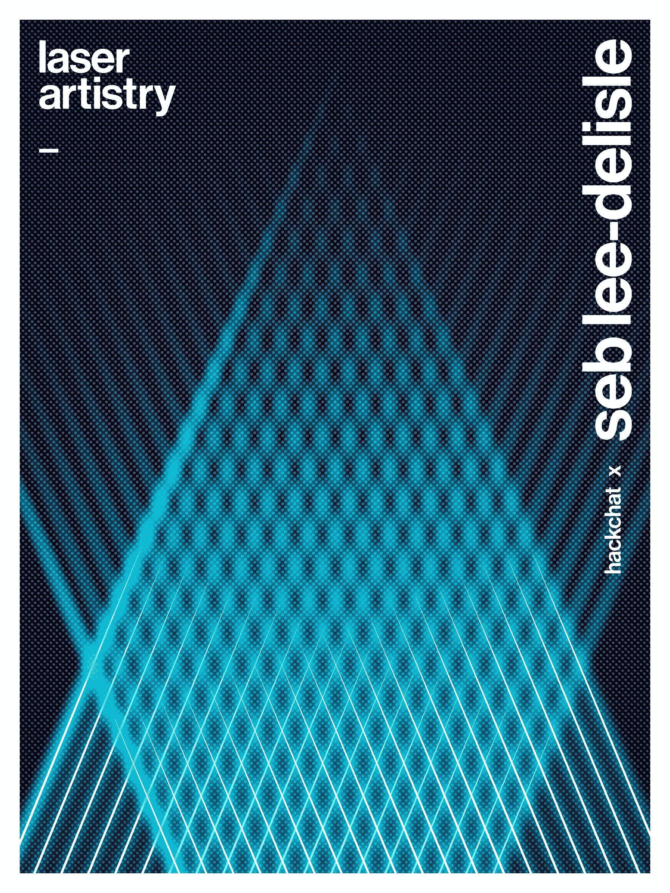

# 激光艺术黑客聊天

> 原文：<https://hackaday.com/2020/03/30/laser-artistry-hack-chat/>

加入我们太平洋时间 4 月 1 日星期三中午[与](https://hackaday.io/event/170294-lasers-hack-chat) [Seb Lee-Delisle](https://hackaday.io/sebleedelisle) 的激光艺术黑客聊天！

第一次看激光灯光秀，很难忘记。从 20 世纪 80 年代开始，在音乐会上看到绿色激光枪在数万名尖叫的粉丝头上划过，描绘出一个动画人物或脉动的几何形状是一种纯粹的魅力，想知道这一切是如何完成的是一半的乐趣。现在我们都知道，这一切都是由镜子完成的，这些镜子很小，并连接到能够进行最剧烈运动的低惯性检流计，但足够精确地将光束准确地定位在需要的位置，以创造出想要的幻觉。它是工程、科学和艺术的综合体。

快进到今天，激光表演技术确实进步了。笨重的激光管已经被固态设备取代，更多的颜色可供选择，电流计的设计也有所改进。激光艺术家的艺术和艺术随着技术的发展而发展，这就是我们的嘉宾 Seb Lee-Delisle 的独到之处。我们以前展示过 Seb 的一些作品，比如[小行星*激光矢量显示器*和](https://hackaday.com/2017/03/08/light-replaces-electrons-for-giant-vector-graphics-asteroids-game/)[巨大的公共激光显示器](https://hackaday.com/2016/05/02/curiously-delightful-things-done-with-lasers-and-projectors/)。现在，他会停下来谈谈艺术和技术如何在他手中结合起来，创造出比各部分之和更伟大的东西。

 我们的黑客聊天是 [Hackaday.io 黑客聊天群发消息](https://hackaday.io/messages/room/2369)中的社区直播活动。本周，我们将于太平洋时间 4 月 1 日星期三中午 12:00 开始讨论。如果时区让你烦恼，我们有[一个方便的时区转换器](https://www.timeanddate.com/countdown/generic?iso=20200401T12&p0=224&msg=Laser+Artistry+Hack+Chat&font=cursive)。

点击右边的那个发言气泡，你会被直接带到 Hackaday.io 上的黑客聊天群，不用等到周三；随时加入，你可以看到社区在谈论什么。

