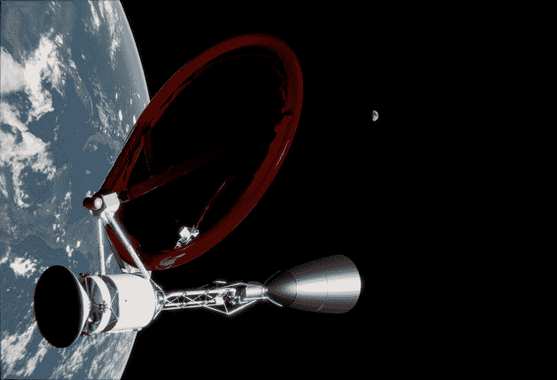
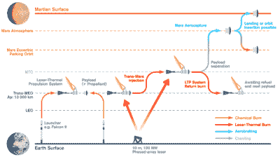

# 激光推进可以满足我们航天器对速度的需求

> 原文：<https://hackaday.com/2022/06/06/laser-propulsion-could-satisfy-our-spacecrafts-need-for-speed/>

宇宙中有许多我们想去的奇妙地方，可能还有更多我们还没见过或听说过的地方。不幸的是…它们都太遥远了。以目前的技术，最好的情况下去火星旅行需要大约六个月，同时，如果你想去半人马座阿尔法星，那就要整整四光年远了！

当要穿越这些遥远的距离时，传统的化学火箭技术根本无法胜任。事实证明，激光可能是缩短太空旅行时间的关键！

## 45 天登上激光火星

激光热推进是一个相对简单的概念，可以让我们的航天器以前所未有的速度在我们的天体附近旅行。从地球上发射的强大激光束瞄准了飞船上的一个大型热交换器，通过这个热交换器泵入推进剂。随着加热的推进剂膨胀，它最终从喷嘴中排出，与传统火箭的方式非常相似。它也类似于核热推进的概念，但它不是使用核反应的热量，而是依靠外部供应的激光能量。

最近的一篇论文表明这种推进系统可以在大约 3000 秒的 T2 比冲下运行。这基本上是衡量发动机每单位质量燃料产生多大推力的指标。在 3000 秒时，激光热推进系统在推力方面的燃料效率可以说至少是航天飞机上的固体火箭助推器(SRB)的 12 倍。

A rendering of a laser thermal propulsion spacecraft. Note the large reflector and rocket nozzle at the rear. Credit: [Duplay, 2022, CC BY 4.0](https://www.researchgate.net/figure/Conceptual-render-of-a-Laser-Thermal-Propulsion-System-carrying-a-1-ton-payload-for-a_fig2_357553420)

这使得激光热推进能够以更少的燃料实现更大的速度变化，从而使太空任务能够将有效载荷送得更远更快。计算表明，按照一个理想化的任务计划，大约 1000 公斤的有效载荷可以在短短 45 天内被送往火星，远远快于典型的化学燃料任务中通常需要 6-7 个月的时间。

A conceptual laser thermal propulsion space mission to Mars. Credit: [Duplay, 2022, CC BY 4.0](https://www.researchgate.net/figure/Concept-of-Operation-diagram-for-a-reusable-Laser-Thermal-Propulsion-System_fig1_357553420)

如你所料，所涉及的技术非常复杂。这项任务将需要一个功率在 100 兆瓦左右的大型激光阵列。航天器本身将由传统的化学火箭发射出大气层，随后它将分离并露出一个大型充气抛物面反射器。然后，地面激光将发射长达一个小时，使用自适应光学来抵消地球大气层对光束的影响。航天器上的抛物面反射器将能量集中到一个腔室，加热氢推进剂，氢推进剂将从喷嘴中高速喷出，提供推力。

如果需要，航天器可以设计成在飞往火星的途中释放有效载荷舱，激光热推进装置分离并返回稳定的地球轨道进行加油。这样做的好处是，推进系统本身可以快速连续使用多次，将有效载荷发射到远离地球的地方。

这样的系统有一个突出的主要缺陷。虽然地球上的激光被用来加速航天器达到很高的速度，但火星上没有相应的激光阵列可以在到达时使航天器减速。使用化学推进也不是一种可行的减速方式，因为这会占用太多飞船的有效载荷。相反，研究人员已经确定，在火星大气中非常小心的空气制动操作可以用来减缓到达的飞行器。然而，这是一个微妙的操作，必须完美地执行以确保成功。

总的来说，这样一个系统在短期内很容易开发出来。虽然没有人有 100 兆瓦的激光阵列，但现代光纤激光技术意味着这样的功率数字并非不可能。同样，要建立一个可靠的激光热航天器和地面系统，能够将有效载荷发送到空间的有用方向，而不仅仅受到航天器和地面激光相对位置的限制，还需要做大量的工作。

## 乘着激光奔向星星

如果你想去离我们最近的恒星半人马座阿尔法星，你需要走得更快。即使以光速前进，也需要四年才能到达那里。因此，打算行进那么远的探测器会希望尽可能接近那个速度，以便在合理的时间内到达那里。

[激光帆](https://blog.seas.upenn.edu/how-to-design-a-sail-that-wont-tear-or-melt-on-an-interstellar-voyage/)或许正好持有这个问题的答案。他们依赖于光子辐射压力的概念，即光线照射到表面实际上会产生压力并推动它前进。它们被称为帆，因为这个概念与几个世纪前的帆船完全相同。然而，激光帆代替了布料和风，它用先进的纳米材料和强大的激光来代替。

A artist’s conception of the laser sail idea. Such a craft could potentially carry a gram-scale payload at relativistic speeds, up to around 0.2c. Credit: [Breakthrough Initiatives](https://breakthroughinitiatives.org/initiative/3)

最近的研究表明，几米大小的激光帆可以以高达 0.2 倍光速的速度推动一艘一克重的船。这将使我们能够在大约 20 年内到达半人马座阿尔法星，而不是传统火箭需要几万年。

这个概念需要使用由非常薄的材料如氧化铝、氮化硅和二硫化钼制成的帆。船帆比一张纸薄几千倍，它必须足够坚固不会撕裂，并且能够散热，以免在推进船帆的激光能量下融化。

船帆的先进纳米图案将是实现这一目标的关键。这个想法是生产一种具有高反射率的帆，以最大化由于光子压力而产生的加速度，同时还保持高的热发射率，以保持帆足够冷而不会融化。用一个 100 吉瓦的激光阵列向船帆开火，这可不是一件容易的事。就像帆船上的传统帆一样，这种材料可以在入射光的压力下鼓起。这大大减少了流泪的机会。

在最好的情况下，帆只能携带几克重的微小有效载荷。人们希望先进的制造方法可以为探测器创造一个微处理器、相机和通信硬件，使其能够在半人马座阿尔法星和地球之间的广阔距离上进行通信。

这是一个大胆的计划，一个可以使太空研究解决比以往任何时候都更远的课题的计划。然而，所涉及的挑战是巨大的。对大功率激光阵列的需求超出了我们目前的能力，材料问题仍然需要解决。此外，从半人马座阿尔法星的探测器发出的任何信息都需要四年时间才能返回地球，因此通信问题也会出现。

无论如何，突破倡议迄今为止进行的研究表明，激光帆概念不一定只是科幻小说的事情。有了正确的投资和发展，将来有一天它们会被证明是研究飞船的一种有用的推进方法。

## 结论

不像其他看似科幻的技术，比如离子推进器，这些激光推进方法离真正的太空任务还有很长的路要走。有巨大的挑战需要克服，也值得为任何发现自己处于兆瓦级或吉瓦级激光光束中的鸟类或其他不幸的野生动物着想。

然而，如果我们要打开天堂，这将需要比我们现有的技术更多的东西。因此，这些项目，或许还有其他新奇的想法，有朝一日可能会把我们带到太阳系之外。