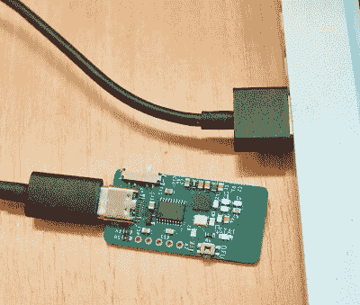

# 激光绊线隐藏了你正在(不)工作的东西

> 原文：<https://hackaday.com/2019/08/09/laser-trip-wire-hides-what-youre-not-working-on/>

我们假设你的办公室政策允许在工作时间阅读黑客杂志。但是漫游 reddit，或者玩通用回形针呢？当试图一只眼睛盯着你的显示器，另一只眼睛盯着门口时，会有一种特殊的压力；一直坚信老板会大摇大摆地走进房间，对你彻底失望。

 但不用担心，因为[【德库努克姆】已经和日游者](https://hackaday.io/project/166996-daytripper-hide-my-windows-laser-tripwire)找到了解决办法。这种无线激光绊网使用 NRF 24(ISM 频段为 2.4 Ghz)与您的计算机进行通信，可用于无形地封锁门或走廊，并在光束中断时在您的计算机上启动脚本操作。名义上，这是用来发送隐藏所有打开的窗口的键盘命令，但我们确信 Hackaday 的富有想象力的读者可以想出这种功能的各种替代用法。

日行发射器[使用激光飞行时间传感器](https://hackaday.com/2017/08/11/testing-distance-sensors/)，在这种情况下是由意法半导体公司生产的非常小的 VL53L0X。它的位置最好能让激光直接射向它。它的范围约为 4 英尺，非常适合覆盖一扇门，尽管宽阔的走廊可能会给它带来一些麻烦。[dekuNukem]承认，5 赫兹的扫描速率意味着一个足够快速移动的对手可能会躲过传感器，但如果他们这么努力地想看看你的显示器上有什么，他们可能值得一瞥。

在接收器一侧，有一个小板子可以插入你的电脑，模仿 USB 键盘。它的侧面有一个选择器开关，允许用户设置一旦系统跳闸，将“键入”什么键序列。它内置了对最小化所有窗口或锁定计算机的支持，或者你可以设置它发送`ALT + Pause`，你可以监听并按照你认为合适的方式行动。

如果你想建立自己的日游程序，固件和硬件都可以在 GitHub 上获得，并有麻省理工学院的许可。对于那些喜欢即时满足的人来说，[【德库努克姆】正在做一个小制作，并在 Tindie](https://www.tindie.com/products/dekuNukem/daytripper-hide-my-windows-laser-tripwire/) 上提供给他们。